# 04 — Access Control & Card Management

> Parent: [00-overview.md](00-overview.md)

## 1. Lenel OnGuard Integration

### Current State

| Aspect | Status |
|---|---|
| Version | OnGuard 8.0 (upgrade planned, target TBD) |
| Deployment | Separate instance per physical site |
| API | OpenAccess REST API **not currently enabled** |
| Administration | Thick client on dedicated management workstations (Lock VLAN) |
| Access zones | Per-room granularity, many zones and areas defined |

### Target State

| Aspect | Target |
|---|---|
| API | OpenAccess REST API enabled, accessible from Visitor Core Service on Normal VLAN via firewall |
| Integration | Automated cardholder provisioning, access level assignment, badge activation/deactivation |
| Card technology | MIFARE DESFire EV3 (transitioning from legacy) |
| Cross-site | Same physical card used across sites via multi-application architecture |

### OnGuard OpenAccess API — Architecture

The OpenAccess REST API is served via NGINX as a reverse proxy to the OnGuard backend, with RabbitMQ for event queuing. All endpoints share a common base URL:

```
https://<onguard-host>/api/access/onguard/openaccess
```

The API uses a **generic, type-driven pattern** — most operations go through a single `/instances` endpoint differentiated by the `type_name` query parameter (e.g., `Lnl_Cardholder`, `Lnl_Badge`, `Lnl_Visitor`).

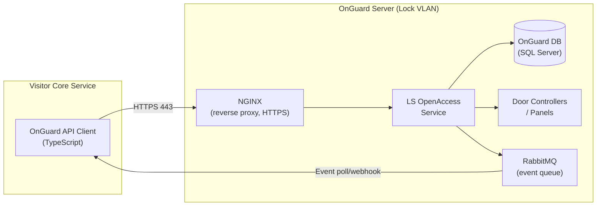

### Authentication

The API supports two authentication methods. **OAuth 2.0 client credentials** is preferred for service-to-service integration:

| Method | Endpoint | Use Case |
|---|---|---|
| **OAuth 2.0** (preferred) | `POST /oauth/token` with `grant_type=client_credentials` | Service-to-service. Returns bearer token. |
| **Session Token** (legacy) | `POST /authentication` | Interactive. Returns session token + requires `Application-Id` and `Session-Token` headers. Session idle timeout must be managed via `GET /keepalive`. |

**OAuth 2.0 flow:**
```
POST /api/access/onguard/openaccess/oauth/token
Content-Type: application/x-www-form-urlencoded

grant_type=client_credentials&client_id=visitor-vms&client_secret=<secret>
```

**Session token flow (fallback):**
```json
POST /api/access/onguard/openaccess/authentication?version=1.0

{
  "property_value_map": {
    "DIRECTORY": "OnGuard Internal",
    "USERNAME": "vms-service",
    "PASSWORD": "<service-password>"
  }
}
```

Every subsequent request must include:

| Header | Value |
|---|---|
| `Application-Id` | Registered integration app ID (configured in OnGuard System Administration) |
| `Session-Token` | Token from authentication response |

**Recommendation**: Use OAuth 2.0 if available on the installed version. Fall back to session token with a keepalive scheduler if OAuth is not supported. The service account should be created with **minimum required permissions** — no system admin.

### API Endpoints — Required Operations

All endpoints below are relative to the base URL. The `version=1.0` query parameter is **mandatory** on every request.

#### Cardholder & Visitor Management

OnGuard has both `Lnl_Cardholder` (permanent employees) and `Lnl_Visitor` (temporary visitors). We use `Lnl_Visitor` for external visitors and `Lnl_Cardholder` for in-house visitors who need a cross-registered record.

**Create a visitor:**
```
POST /instances?type_name=Lnl_Visitor&version=1.0

{
  "property_value_map": {
    "FIRSTNAME": "Jane",
    "LASTNAME": "Guest",
    "EMAIL": "jane.guest@contractor.no",
    "PRIMARYSEGMENTID": 1
  }
}
```

**Create a cardholder (for in-house cross-registration):**
```
POST /instances?type_name=Lnl_Cardholder&version=1.0

{
  "property_value_map": {
    "FIRSTNAME": "Ola",
    "LASTNAME": "Nordmann",
    "SSNO": "EMP-54321",
    "PRIMARYSEGMENTID": 1,
    "DEPT": "Unit-Alpha"
  }
}
```

**Search cardholders:**
```
GET /instances?type_name=Lnl_Cardholder&version=1.0&filter=LASTNAME%20%3D%20'Nordmann'&page_size=20&page_number=1
```

**Key `Lnl_Cardholder` / `Lnl_Visitor` properties:**

| Property | Type | Description | Read/Write |
|---|---|---|---|
| `ID` | Int32 | Internal ID (auto-generated) | Read-only |
| `FIRSTNAME` | String | First name | R/W |
| `LASTNAME` | String | Last name | R/W |
| `MIDNAME` | String | Middle name | R/W |
| `EMAIL` | String | Email address | R/W |
| `SSNO` | String | Employee ID / reference number | R/W |
| `PRIMARYSEGMENTID` | Int32 | Primary segment (site/partition) | R/W |
| `DEPT` | String | Department / unit | R/W |
| `TITLE` | String | Title / role | R/W |
| `BUILDING` | String | Building | R/W |
| `FLOOR` | String | Floor | R/W |
| `PHONE` | String | Phone number | R/W |
| `LASTCHANGED` | DateTime | Last modification timestamp | Read-only |
| *UDF fields* | Various | User-defined fields (configured in OnGuard) | R/W |

#### Badge Management

Badges are linked to cardholders/visitors via the `PERSONID` field. A person can have multiple badges.

**Create a badge:**
```
POST /instances?type_name=Lnl_Badge&version=1.0

{
  "property_value_map": {
    "ID": 1000042,
    "PERSONID": 12345,
    "TYPE": 3,
    "STATUS": 1,
    "ACTIVATE": "2026-02-24T08:00:00",
    "DEACTIVATE": "2026-02-24T18:00:00",
    "USELIMIT": 0
  }
}
```

**Deactivate a badge:**
```
PUT /instances?type_name=Lnl_Badge&version=1.0

{
  "property_value_map": {
    "BADGEKEY": 5678,
    "STATUS": 0,
    "DEACTIVATE": "2026-02-24T14:30:00"
  }
}
```

**Key `Lnl_Badge` properties:**

| Property | Type | Description | Notes |
|---|---|---|---|
| `BADGEKEY` | Int32 | Internal badge key (primary key) | Read-only, auto-generated |
| `ID` | Int64 | Badge ID (number encoded on card) | Set at creation |
| `PERSONID` | Int32 | FK to cardholder/visitor ID | Links badge to person |
| `TYPE` | Int32 | FK to `Lnl_BadgeType` | Determines card format (DESFire, etc.) |
| `STATUS` | Int32 | 1=Active, 0=Inactive | Set to 0 to deactivate |
| `ACTIVATE` | DateTime | Activation date/time | Time-bounded access start |
| `DEACTIVATE` | DateTime | Deactivation date/time | Time-bounded access end |
| `USELIMIT` | Int32 | Max uses (0=unlimited) | For single-use visitor badges |
| `ISSUECODE` | Int32 | Issue code | Incremented on re-issue |
| `LASTCHANGED` | DateTime | Last modification | Read-only |

**Important**: OnGuard cannot disable a cardholder account directly — you **must deactivate the badge(s)** to revoke access. This is the designed pattern.

#### Access Level Assignment

Access levels are assigned **to badges** (not directly to cardholders). A badge can have multiple access levels.

**List available access levels:**
```
GET /instances?type_name=Lnl_AccessLevel&version=1.0
```

**Assign an access level to a badge:**
```
POST /instances?type_name=Lnl_AccessLevelAssignment&version=1.0

{
  "property_value_map": {
    "BADGEKEY": 5678,
    "ACCESSLEVELID": 42,
    "ACTIVATE": "2026-02-24T08:00:00",
    "DEACTIVATE": "2026-02-24T18:00:00"
  }
}
```

**Remove an access level from a badge:**
```
DELETE /instances?type_name=Lnl_AccessLevelAssignment&version=1.0

{
  "property_value_map": {
    "BADGEKEY": 5678,
    "ACCESSLEVELID": 42
  }
}
```

**Note**: Access level assignments support their own `ACTIVATE`/`DEACTIVATE` windows, independent of the badge-level activation. Both must overlap for access to be granted.

#### Event Monitoring

OnGuard events are delivered via RabbitMQ internally. The OpenAccess API exposes event subscriptions with webhook or polling.

**Create an event subscription:**
```
POST /event_subscriptions?version=1.0

{
  "property_value_map": {
    "DESCRIPTION": "VMS Access Events",
    "EVENT_TYPE": "Lnl_IncomingEvent"
  }
}
```

**Poll for events:**
```
GET /events?version=1.0&subscription_id=1
```

**Key event types:**

| Type | Description | VMS Use |
|---|---|---|
| `Lnl_AccessEvent` | Access granted / denied at readers | Audit trail, anomaly detection |
| `Lnl_IncomingEvent` | General incoming events | Catch-all for monitoring |
| `Lnl_SecurityEvent` | Security-related events | Alert triggers |

#### Lookup / Reference Data

```
GET /instances?type_name=Lnl_BadgeType&version=1.0     # Badge types (DESFire, prox, etc.)
GET /instances?type_name=Lnl_Segment&version=1.0        # Segments (site partitions)
GET /instances?type_name=Lnl_Reader&version=1.0         # Readers
GET /instances?type_name=Lnl_Panel&version=1.0          # Panels (door controllers)
GET /directories?version=1.0                             # Authentication directories
```

### Complete API Flow — Visitor Badge Issuance

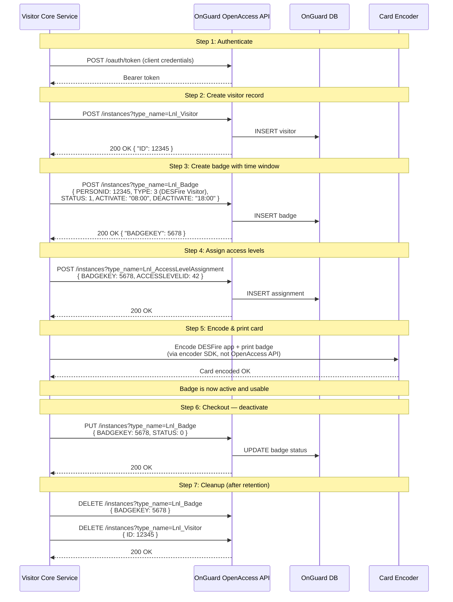

### DESFire Credential Handling via OnGuard

**Important architectural note**: The OpenAccess API manages the **logical badge record** (person link, status, activation window, access levels). It does **not** handle DESFire encoding or cryptographic operations directly.

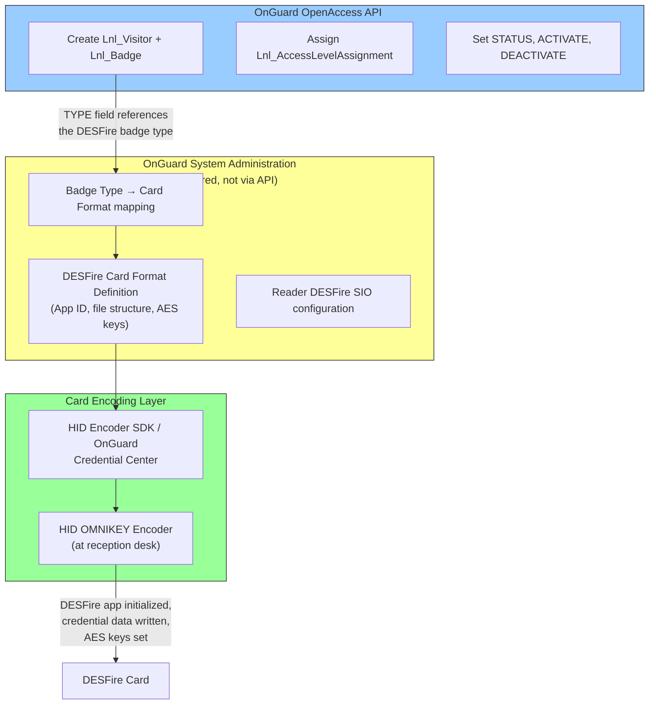

**What this means for our integration:**

| Concern | Where It's Handled |
|---|---|
| Visitor record lifecycle | OpenAccess API (`Lnl_Visitor`, `Lnl_Badge`) |
| Access level assignment | OpenAccess API (`Lnl_AccessLevelAssignment`) |
| Time-bounded activation | OpenAccess API (badge `ACTIVATE`/`DEACTIVATE` fields) |
| DESFire card format definition | OnGuard System Administration (pre-configured per site) |
| DESFire AES key configuration | OnGuard System Administration + HID Credential Management |
| Physical card encoding | HID encoder SDK or OnGuard Credential Center at the reception desk |
| Reader SIO profiles | OnGuard System Administration (reader configuration) |

**Pre-configuration required per site** (one-time, during Phase 0):
1. Define DESFire card format in OnGuard (application ID, file layout, keys)
2. Create a `Lnl_BadgeType` for "DESFire Visitor" linked to the card format
3. Configure reader SIO profiles to accept the DESFire format
4. Install and configure encoder SDK at reception desks
5. Create the VMS service account with API permissions

### Operational Constraints & Known Limitations (OnGuard 8.0)

| Constraint | Impact | Mitigation |
|---|---|---|
| **Request pool: 32 concurrent requests** (default) | Under load, API may reject requests | Increase to 128 via INI file at `C:\ProgramData\Lnl\` (`request_pool_size=128`), restart LS OpenAccess service |
| **Session token idle timeout** | Tokens expire after inactivity (default ~20 min) | Use OAuth 2.0 (preferred) or implement keepalive scheduler (`GET /keepalive` every 5 min) |
| **No bulk operations** (added in 8.3) | Large batch operations (e.g., importing 50 visitors) must paginate one-by-one | Accept slower batch operations in 8.0. Plan to leverage bulk API if/when upgrade to 8.3+ happens |
| **Cannot disable cardholder directly** | Must deactivate badges to revoke access | Badge service always deactivates badges, never tries to disable the person record |
| **Filter expressions limited** | SQL-like syntax but complex nested filters may not work | Keep filters simple. Use application-side filtering for complex queries. |
| **version parameter mandatory** | Omitting causes errors | Hard-code `version=1.0` in all API calls |
| **Pagination is 1-based** | Off-by-one risk | API client wrapper handles this |
| **DESFire encoding not via API** | Must use encoder SDK separately | Badge service coordinates: API for logical record, encoder SDK for physical card |

### Network Path (Updated)

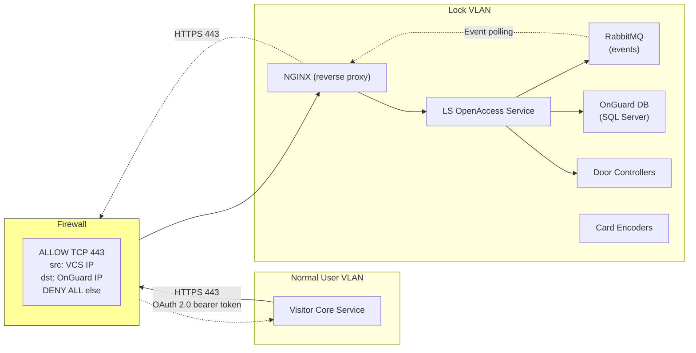

**Security**:
- HTTPS with TLS 1.2+ between Visitor Core Service and OnGuard NGINX
- OAuth 2.0 client credentials (or session token with keepalive)
- Service account with **minimum permissions**: Visitor CRUD, Badge CRUD, AccessLevelAssignment CRUD, Event read. No system admin, no hardware control.
- `Application-Id` registered in OnGuard System Administration identifies the VMS integration
- RabbitMQ management interface (`port 15672`) must **not** be exposed outside Lock VLAN

### OpenAccess vs DataConduIT

OnGuard offers two integration APIs. OpenAccess is the strategic direction.

| Aspect | OpenAccess API | DataConduIT |
|---|---|---|
| Protocol | REST/HTTPS (JSON) | WMI (Windows-only) |
| Platform | Any (HTTP client) | Windows only |
| Auth | OAuth 2.0 or session token | Windows integrated auth |
| Events | Subscription (webhook/poll via RabbitMQ) | WMI event subscriptions |
| Status | **Active development, recommended** | Legacy, maintained |
| Our choice | **Yes** — cross-platform, K8s-friendly | No — Windows dependency unacceptable |

## 2. MIFARE DESFire EV3 — Card Architecture

### Benefits and Drawbacks

**Benefits:**

| Capability | Relevance |
|---|---|
| Multi-application (up to 28 apps per card) | One card, multiple sites. Each site manages its own application independently. |
| AES-128 mutual authentication | Card and reader authenticate each other. Prevents cloning. |
| Encrypted communication | Data encrypted on the RF channel. No eavesdropping. |
| Diversified keys | Each card has unique derived keys. Compromising one card doesn't compromise others. |
| Per-application access control | Site A cannot read or modify Site B's application data. Cryptographic isolation. |
| Transaction MAC (EV3) | Tamper-evident audit trail at the card level. |
| Anti-tearing | Write operations are atomic — power loss mid-write doesn't corrupt the card. |
| Lenel native support | OnGuard 7.5+ supports DESFire via HID iCLASS SE / SIGNO readers. |

**Drawbacks:**

| Concern | Mitigation |
|---|---|
| Reader replacement required | Legacy 125kHz/iCLASS readers must be upgraded to HID SIGNO or iCLASS SE with DESFire SIO. Budget for site-wide reader replacement. |
| Key management complexity | Each site needs secure key storage. Recommend HSM or HID Credential Management. Key ceremony documentation required. |
| Encoding infrastructure | OMNIKEY encoders needed at each site for card provisioning. Part of printer/encoder procurement. |
| Slower transaction (~100-200ms more) | Acceptable for door access. Not an issue in practice. |
| Dual-tech transition period | During migration, readers run dual profiles (legacy + DESFire). Increased attack surface until legacy is fully retired. |

### Multi-Application Layout

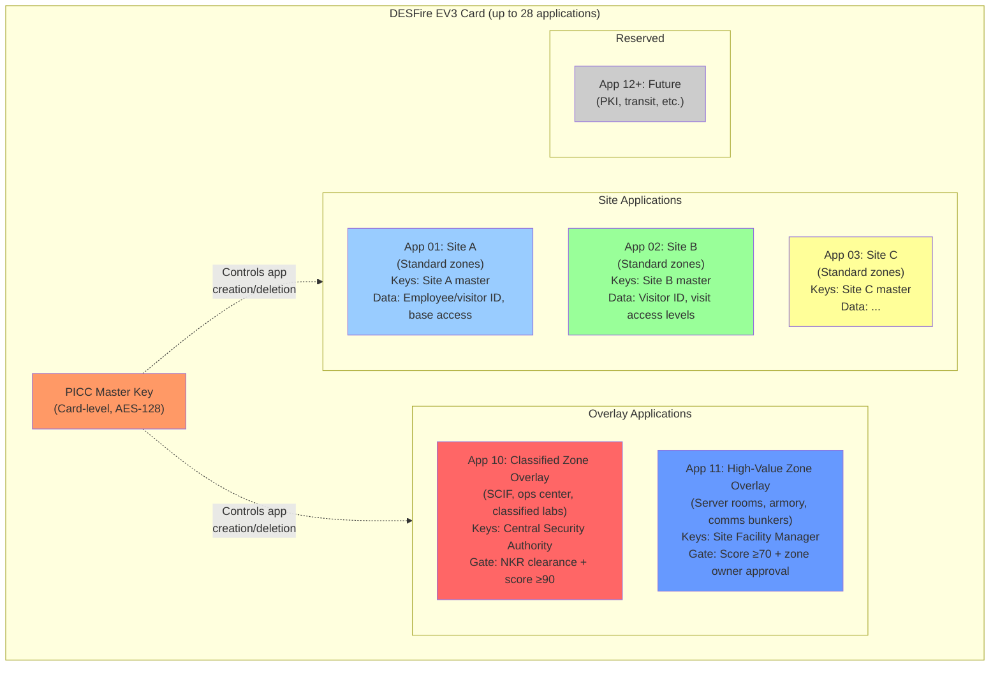

### PICC Master Key Ownership — Delegated Model

**Decision**: Delegated model, optimized for site independence.

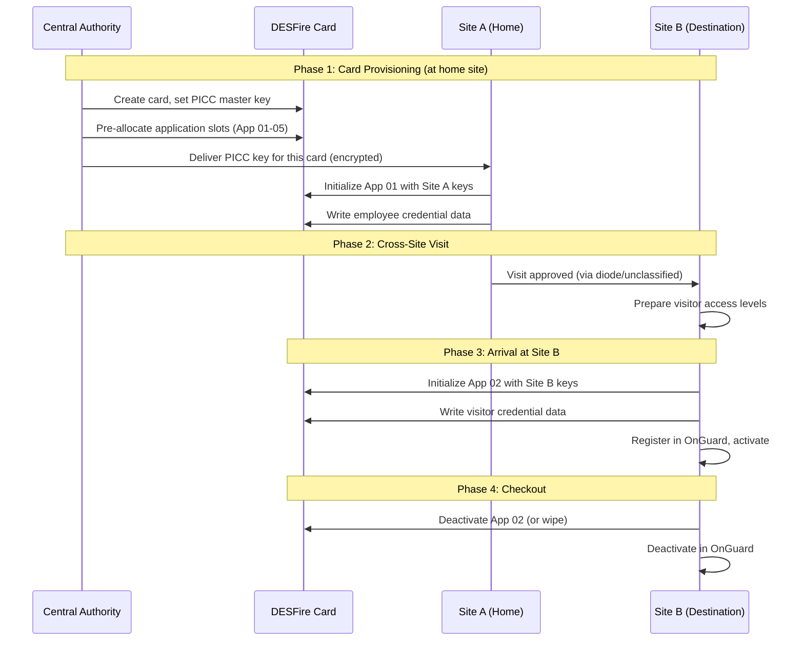

**Central Authority responsibilities:**
- PICC master key generation and distribution (key ceremony with HSM)
- Application slot allocation policy
- Key recovery procedures

**Site responsibilities:**
- Own application keys (AES-128, site-specific)
- Application initialization and data management
- Operate independently — no need to contact central authority for daily operations

### Key Management

| Key Type | Owner | Storage | Rotation |
|---|---|---|---|
| PICC master key | Central Authority | HSM | On compromise or policy (annual) |
| Site application master key | Site Security Admin | HSM or secure key store | On compromise or policy |
| Diversified card keys | Derived per card | Computed from master + card UID | Automatic (follows master rotation) |

**Critical**: Loss of a site application master key means loss of ability to manage that application on all cards. HSM backup and key escrow procedures are mandatory.

## 3. Badge Lifecycle

### External Visitor Badge

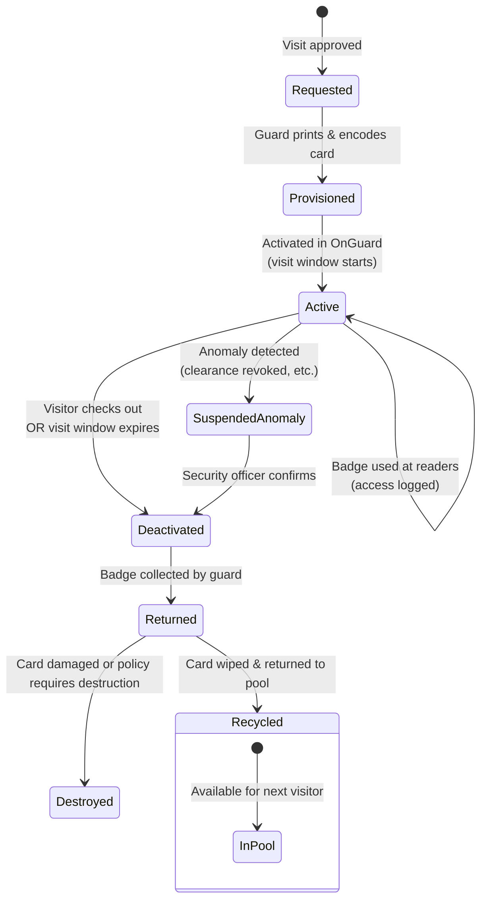

### In-House Visitor (Existing Card)

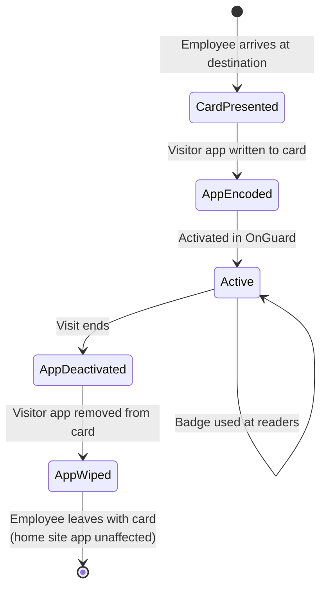

### Overlay App Lifecycle (App 10 / App 11)

> **Note**: Overlay applications (App 10 — Classified Zone, App 11 — High-Value Zone) follow an independent lifecycle from site applications. An overlay app can be added or wiped without affecting any site app, and vice versa. Key points:
>
> - **App 10/11 are provisioned separately** from site apps, with their own approval chain (security officer for App 10, zone owner for App 11).
> - **Wiping a site app does not affect overlay apps.** If a visitor checks out of Site B and App 02 is wiped, any App 10 or App 11 on the card remains valid until independently deactivated.
> - **Wiping an overlay app does not affect site apps.** If classified zone access expires, App 10 is wiped but App 01/02 continue to work at standard doors.
> - **Card reprinting is required** when overlay apps are added after initial card issuance, because the visual indicator (color stripe + hologram) must be updated. See [Section 10: Visual Indicators](#10-visual-indicators-for-manual-fallback).

## 4. Access Level Design

### Principles

- Access levels in OnGuard map to **physical zones** (rooms, floors, wings, buildings)
- Visitor access levels are **pre-defined templates** (not ad-hoc per visitor)
- Templates are configured per site by the Site Administrator
- Sponsor/security officer selects from templates when approving a visit

### Example Access Level Templates

| Template | Zones Included | Escort Required | Typical Use |
|---|---|---|---|
| `VISITOR-LOBBY` | Main entrance, lobby, meeting rooms on ground floor | Yes | Standard escorted day visit |
| `VISITOR-OFFICE-WING-A` | Lobby + Office wing A common areas | Yes | Visiting specific department |
| `VISITOR-UNESCORTED-GENERAL` | Lobby + cafeteria + common meeting rooms | No | Batch-approved frequent visitor |
| `VISITOR-WORKSHOP` | Lobby + workshop/lab areas | Yes | Contractor technical work |
| `VISITOR-HIGH-SECURITY` | Restricted zones (per security officer) | Yes | Cleared visitor with authorization |
| `VISITOR-FULL-SITE` | All non-classified zones | No | Long-term embedded contractor |

### Time Bounding

| Level | Activation | Deactivation |
|---|---|---|
| Single day visit | Visit date, start time | Visit date, end time (or 18:00 default) |
| Multi-day visit | First day start | Last day end time |
| Batch-approved | Per visit within batch | Per visit within batch |
| Long-term contractor | Contract start date | Contract end date, with periodic renewal check |

OnGuard handles time-bounded activation natively via badge activate/deactivate datetime fields.

## 5. Card Pool Management (External Visitors)

Sites maintain a pool of pre-provisioned blank DESFire cards for external visitors.

| Metric | Recommendation |
|---|---|
| Pool size | 2x average daily visitors + buffer for peaks |
| Replenishment | Automated alert when pool drops below threshold |
| Card tracking | Each card has a unique serial logged in the system |
| Wipe policy | Full application wipe before returning to pool |
| Physical security | Pool cards stored in locked cabinet at reception |
| Damaged cards | Destroy and log; replace from stock |

## 6. Reader Infrastructure Requirements

| Reader Type | Model Family | Location | DESFire Support |
|---|---|---|---|
| Door readers | HID SIGNO 40 | All access-controlled doors | DESFire EV1/EV2/EV3 + legacy |
| Turnstile readers | HID SIGNO 40 | Building entrances with turnstiles | DESFire EV1/EV2/EV3 + legacy |
| Desktop encoders | HID OMNIKEY 5427 CK | Reception desk / guard station | DESFire encoding + printing |
| Long-range readers | HID SIGNO 70 | Vehicle gates (if applicable) | DESFire EV1/EV2/EV3 |

**Transition period**: Readers configured with dual secure identity object (SIO) profiles — legacy format + DESFire. Legacy profile removed site-by-site as migration completes.

## 7. Multi-Site Standard Access

> Source: [DESFire Card Architecture Design](../plans/2026-03-10-desfire-card-architecture-design.md)

### How One Card Works Across Multiple Sites

Each site manages its own DESFire application (App 01, App 02, etc.) with site-specific AES-128 keys. When a person has approved access at a site, that site's guard encodes the corresponding app onto the card. The card accumulates apps as the person visits more sites.

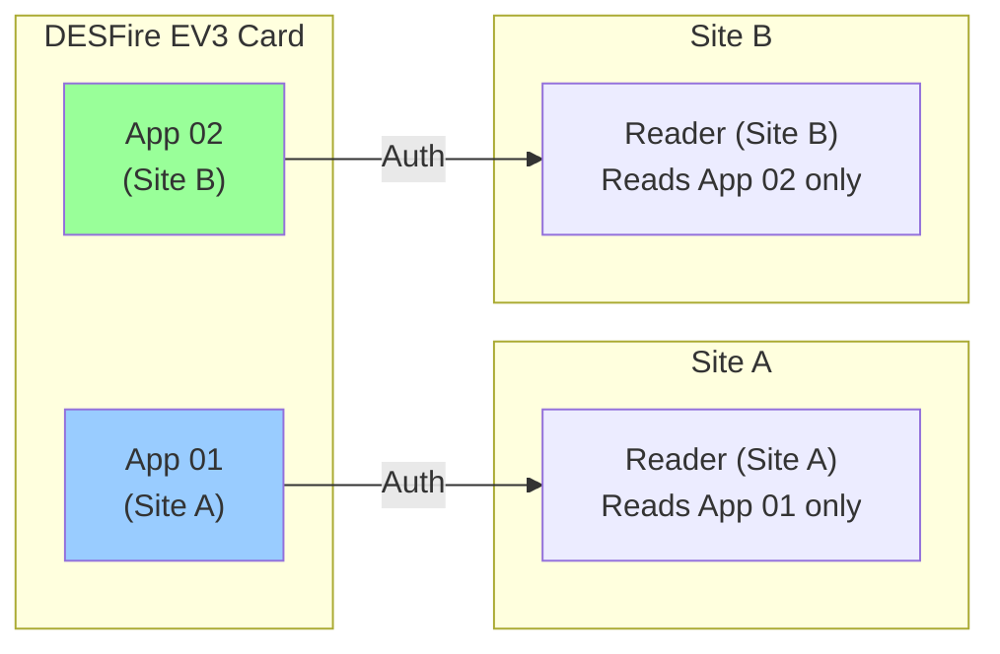

- Reader at Site A reads App 01 only — it cannot read or interact with App 02
- Reader at Site B reads App 02 only — it cannot read or interact with App 01
- A person with both apps can tap at standard doors at either site
- If the person only has App 01, Site B readers find no valid app and deny access

### App Lifecycle by Access Pattern

**Permanent access:**
- App stays on card permanently
- OnGuard access levels renewed periodically (annual review)
- Card does not need re-encoding on each visit
- If access is revoked at one site, only that site's app is deactivated — other apps are unaffected

**Occasional / time-bounded access:**
- App written at arrival by destination site guard
- Time-bounded via OnGuard `ACTIVATE`/`DEACTIVATE` (e.g., 08:00-18:00)
- App wiped or deactivated at checkout
- On next visit, app is re-written with a new time window

**Denied:**
- Visit request crosses the diode to the destination site
- RESTRICTED side runs verification (identity score, NKR status, flags from other sites)
- If denied, no app is ever written to the card

### Reference Persona Scenarios

| Persona | Site A | Site B | Card state |
|---|---|---|---|
| **Marte Haugen** (FD internal) | Permanent, checked in | Permanent access | App 01 + App 02 always present, renewed annually |
| **Anna Lindqvist** (Kongsberg) | Day visit, completed | Occasional, time-bounded | App 01 (active during Site A visit) + App 02 (written at Site B arrival, wiped at checkout) |
| **Thomas Müller** (Rheinmetall) | Flagged, under review | Requests access → denied | App 01 only (if approved at Site A). Site B runs verification, denies based on flagged status + low score |

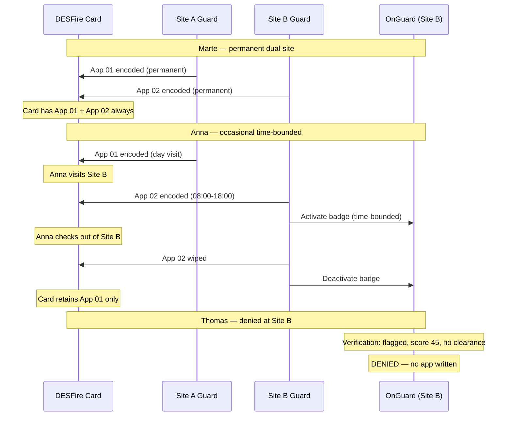

## 8. Special Area Overlay Applications

> Source: [DESFire Card Architecture Design](../plans/2026-03-10-desfire-card-architecture-design.md)

Overlay applications provide access to restricted physical areas that require authorization beyond standard site access. Readers at these zones perform **dual-app authentication** — the person must have both the standard site app and the relevant overlay app.

### Case 1: Classified Zones (App 10)

**Areas:** SCIFs, ops centers, classified labs.

**Requirements:**
- NKR active security clearance
- `high_security` access tier (identity score ≥90)
- Separate approval from the security officer (distinct from standard visit approval)

**Key characteristics:**
- App 10 has its own AES-128 key hierarchy, completely isolated from site apps
- Managed by the **Central Security Authority** (not individual sites) — classified zone readers may exist at multiple sites but share the same trust domain
- App 10 works at classified zones at both Site A and Site B — same keys, same trust domain
- A stolen App 10 credential without a valid site app is useless (dual-app auth)

**Provisioning flow:**

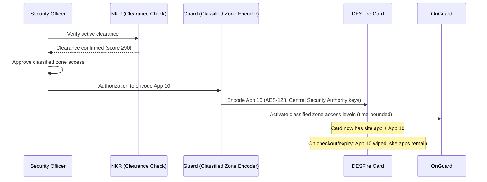

### Case 2: High-Value Physical Zones (App 11)

**Areas:** Server rooms, armory, comms bunkers, generator rooms.

**Requirements:**
- `unescorted` access tier (identity score ≥70)
- Explicit zone owner authorization (e.g., IT manager for server rooms)

**Key characteristics:**
- App 11 has a separate key hierarchy from both site apps and classified apps
- Managed **per-site by the facility manager** (not the central security authority)
- Each site's App 11 is independent — Site A's server room keys differ from Site B's
- Access levels within App 11 specify which high-value zones (not all — only approved ones)

**Provisioning flow:**

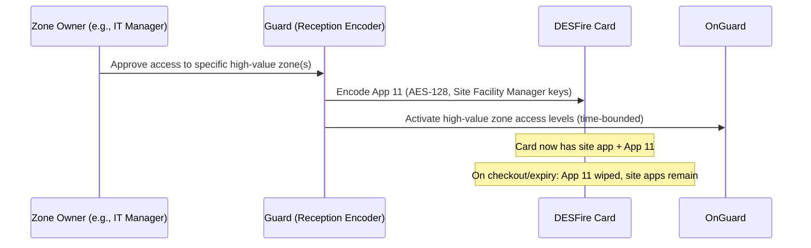

### Comparison Table

| Aspect | Classified (App 10) | High-Value (App 11) |
|---|---|---|
| Gate | NKR active clearance | Zone owner approval |
| Access tier | `high_security` (≥90) | `unescorted` (≥70) or above |
| Key authority | Central Security Authority | Site Facility Manager |
| Approval flow | Security officer | Zone owner + standard approval chain |
| Spans sites | Yes (same App 10 at all sites) | No (each site's App 11 is independent) |
| Reader config | Site app + App 10 (dual-app) | Site app + App 11 (dual-app) |
| Use case examples | SCIF, ops center, classified lab | Server room, armory, comms bunker |

### Reader Configuration by Zone Type

| Zone type | Reader requires | Example |
|---|---|---|
| Standard (lobby, offices) | Site app only (App 01 or App 02) | Office wing A door at Site A reads App 01 |
| Classified | Site app AND App 10 (dual-app auth) | SCIF door at Site A reads App 01 + App 10 |
| High-value physical | Site app AND App 11 (dual-app auth) | Server room at Site B reads App 02 + App 11 |

## 9. Pool-Issued Cards for Non-Permanent Personnel

> Source: [DESFire Card Architecture Design](../plans/2026-03-10-desfire-card-architecture-design.md)

### Who Gets a Pool Card

| Category | Card lifecycle | Typical duration |
|---|---|---|
| Short-term contractor | Issued at first visit, returned at contract end | Weeks to months |
| Long-term contractor | Issued, kept for duration, returned at contract end | Months to years |
| Family member (family day, housing area) | Issued per event or season, returned after | Hours to days |
| Retired personnel (veterans' events, alumni access) | Issued per visit, returned after | Hours to days |

### How Pool Cards Accumulate Apps Across Sites

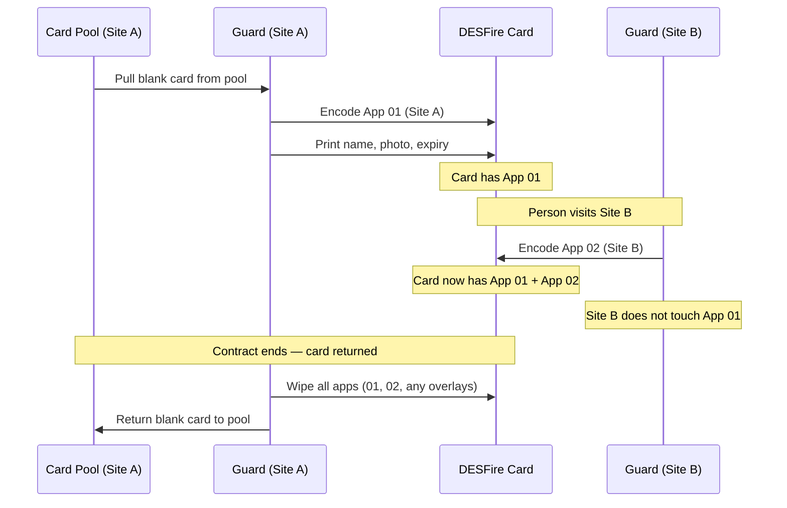

### Differences from Employee Cards

| Aspect | Employee (permanent) | Pool-issued (non-permanent) |
|---|---|---|
| PICC master key | Central Authority provisions | Central Authority provisions (same) |
| Card storage | Person keeps it permanently | Person keeps during contract/event, returns after |
| Card tracking | Linked to employee ID | Linked to pool serial + visitor/contractor ID |
| Loss procedure | Report, revoke all apps, issue new | Report, revoke all apps, issue new from pool |
| Expiry | Annual renewal | Contract end date or event end |
| Overlay eligibility | All overlays based on clearance/approval | App 11 possible for long-term contractors; App 10 rare |
| Return requirement | No (unless leaving employment) | Yes — must return to issuing site's pool |

### Contractor-Specific Rules

- `long_term_contractor` access tier (≥100 points: FREG positive + NKR no flags + Brønnøysund valid) can receive high-value overlay (App 11) if zone owner approves
- Short-term contractors typically get `escorted_day` or `escorted_recurring` — no overlay apps
- Contractor's company is validated via **Brønnøysund on every visit** (not just first issuance)
- If Brønnøysund revalidation fails (company dissolved, flagged), all apps are deactivated pending review

### Card Pool Tracking — Data Model

New table: `cardPool` (RESTRICTED side)

| Field | Type | Description |
|---|---|---|
| `cardSerial` | string | DESFire card UID (read from card) |
| `issuedTo` | string? | Visitor/contractor ID (null when in pool) |
| `issuedToName` | string? | Person name (for quick lookup) |
| `issuingSiteId` | string | Site that owns this card |
| `encodedApps` | string[] | App IDs currently on card (e.g., `["01", "02", "10"]`) |
| `issuedAt` | number? | Timestamp of issuance |
| `expectedReturnDate` | string? | Contract end or event end date (ISO date) |
| `status` | enum | `in_pool` / `issued` / `reported_lost` / `destroyed` |

Indexes: `by_serial` (cardSerial), `by_status_site` (status + issuingSiteId), `by_issued_to` (issuedTo).

## 10. Visual Indicators for Manual Fallback

> Source: [DESFire Card Architecture Design](../plans/2026-03-10-desfire-card-architecture-design.md)

### Design Decision

When electronic readers fail (power outage, system failure), guards must visually identify a card's authorization level. The chosen approach combines two layers: **color stripe** (instant recognition) and **holographic overlay** (forge resistance).

### Color Scheme

| Stripe | Hologram | Meaning | DESFire App |
|---|---|---|---|
| None | None | Standard access only (escorted/unescorted) | Site apps only |
| **Red** | Red hologram | Classified zone access | App 10 |
| **Blue** | Blue hologram | High-value zone access | App 11 |
| **Red + Blue** | Dual hologram | Both overlays (rare, highest trust) | App 10 + App 11 |

### Operational Procedures

**Rush / emergency (stripe check):**
1. Guard at classified zone door sees person approaching
2. Red stripe visible at arm's length → allow entry, log manually
3. No stripe → deny, redirect to standard entrance

**Power outage / reader failure (full hologram check):**
1. Guard verifies color stripe matches the zone type
2. Guard inspects holographic overlay — confirms it matches stripe color and is not a forgery
3. Guard checks name and photo on card
4. Guard logs the manual entry for later audit reconciliation

### Card Printing Integration

The color stripe and holographic overlay are applied during card encoding at the reception desk:

1. Card pulled from pool (blank white)
2. DESFire apps encoded (site app + overlay apps if approved)
3. Name, photo, and expiry date printed on card face
4. Color stripe printed based on which overlay apps are encoded
5. Holographic overlay applied (from pre-procured hologram stock matching the stripe color)

**Reprinting requirement**: If overlay apps are added after initial card issuance (e.g., person later gains classified zone approval), the card must be **reprinted** with the updated stripe and hologram. The DESFire apps do not need re-encoding — only the physical card face changes.

### Trade-Off Summary

| Option | Instant recognition | Forge resistance | Rush scenario | Cost |
|---|---|---|---|---|
| Color stripe only | Excellent | Low | Excellent | Low |
| Holographic only | Poor (needs inspection) | High | Poor | Medium |
| UV-reactive | Poor (needs UV torch) | High | Very poor | Medium |
| QR + digital signature | Poor (needs scanner) | Very high | Very poor | Low |
| **Stripe + hologram (chosen)** | **Excellent** | **High** | **Excellent** | **Medium** |

## 11. Key Management (Extended)

> Source: [DESFire Card Architecture Design](../plans/2026-03-10-desfire-card-architecture-design.md)

This section extends the key management overview in [Section 2](#2-mifare-desfire-ev3--card-architecture) to include the overlay application keys.

| Key | Owner | Scope | Storage | Rotation Policy |
|---|---|---|---|---|
| PICC master key | Central Authority | Per-card (card-level control) | HSM | Annual or on compromise |
| Site app master key | Site Security Admin | Per-site (standard zones) | HSM | Annual or on compromise |
| App 10 master key | Central Security Authority | All classified zones, all sites | HSM (highest security) | On compromise only |
| App 11 master key | Site Facility Manager | Per-site high-value zones | HSM or secure key store | Annual or on compromise |
| Diversified card keys | Derived per card | Per-card-per-app | Computed from master + card UID | Follows master rotation |

**Key isolation guarantees:**
- Site A's keys cannot read or modify Site B's application data
- App 10 keys are independent of all site app keys — compromising a site app key does not expose classified zone credentials
- App 11 keys are independent per site — compromising Site A's App 11 key does not affect Site B's high-value zones
- The PICC master key controls application creation/deletion but cannot read application data without the application's own keys

**Critical**: Loss of any master key means loss of ability to manage that application on all affected cards. HSM backup and key escrow procedures are mandatory. The App 10 key ceremony should involve the Central Security Authority plus at least 2 witnesses, documented in operational procedures.
