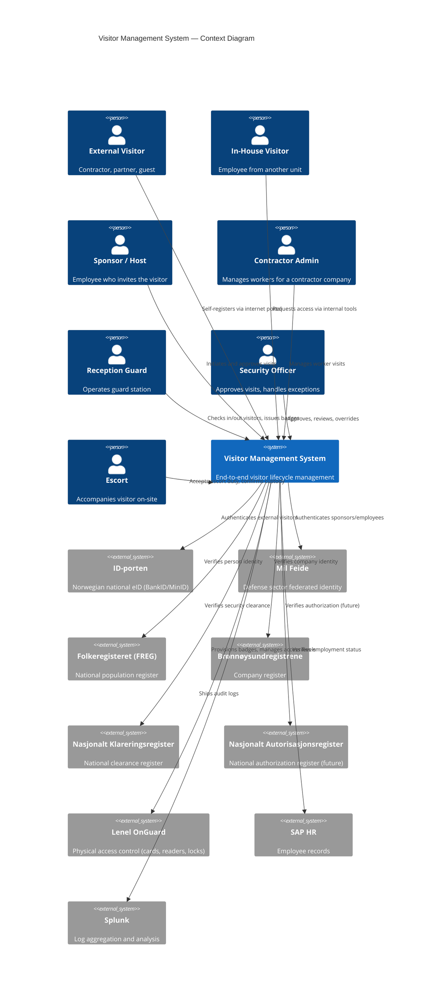
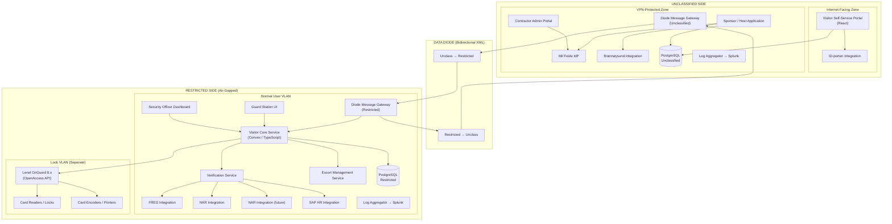

# Visitor Management System — Plan Overview

> **Status**: Draft — living document
> **Version**: 0.1
> **Date**: 2026-02-24
> **Classification**: UNCLASSIFIED (this document)

## 1. Purpose

This document set defines the plan and requirements for a Visitor Management System (VMS) serving a defense/government organization with air-gapped (RESTRICTED) infrastructure. The system manages the full lifecycle of visitor access — from pre-registration through identity verification, approval, badge issuance, escort management, and checkout — across multiple physical sites.

## 2. Problem Statement

Current visitor management relies on manual processes, disconnected systems, and paper-based protocols. This creates:

- Slow onboarding of visitors, especially external contractors
- Inconsistent identity verification across sites
- Limited audit trail for security incidents
- No centralized view of visitor activity across the organization
- Manual badge management that doesn't scale

## 3. System Context

## 4. High-Level Architecture

## 5. Document Index

| Document | Description |
|---|---|
| [00-overview.md](00-overview.md) | This document — executive summary and system context |
| [01-network-architecture.md](01-network-architecture.md) | Network topology, diode, VLANs, NTP, security zones |
| [02-visitor-workflow.md](02-visitor-workflow.md) | Core visitor processes (BPMN), visitor types, approval tiers |
| [03-identity-verification.md](03-identity-verification.md) | Identity scoring model, register integrations, verification timing |
| [04-access-control.md](04-access-control.md) | Lenel OnGuard integration, DESFire card architecture, badge lifecycle |
| [05-diode-messaging.md](05-diode-messaging.md) | Cross-boundary messaging, XML envelope, assumptions, reliability |
| [06-unclassified-services.md](06-unclassified-services.md) | Internet portal, VPN app, authentication, tech stack |
| [07-restricted-services.md](07-restricted-services.md) | Core services, roles, guard station, escort management |
| [08-audit-compliance.md](08-audit-compliance.md) | Compliance framework, logging architecture, incident scenarios |
| [09-open-questions.md](09-open-questions.md) | Remaining gaps, workshop topics, future decisions |
| [10-risk-analysis.md](10-risk-analysis.md) | Comprehensive risk analysis — methodology, 28-item risk register, treatment plans |
| [11-swot-analysis.md](11-swot-analysis.md) | SWOT analysis — strategic positioning, strengths/weaknesses/opportunities/threats |
| [12-mock-infrastructure.md](12-mock-infrastructure.md) | Local K8s mock environment — namespace layout, mock services, demo scenarios, build order |

## 6. Key Design Principles

1. **Data minimization across the diode** — Only the minimum necessary data crosses between UNCLASSIFIED and RESTRICTED
2. **RESTRICTED is the authority** — All access decisions are made on the RESTRICTED side
3. **Site independence** — Each site operates autonomously; loss of inter-site communication does not cripple local operations
4. **Defense in depth** — Identity scoring, verification at multiple stages, escort enforcement, time-bounded access
5. **Diode-agnostic messaging** — The system is decoupled from specific diode hardware through a message gateway abstraction
6. **Greenfield where possible, integrate where necessary** — New services on both sides; integrate with OnGuard, SAP HR, and national registers
7. **Design for accreditation** — Architecture supports formal security review and external penetration testing from day one

## 7. Constraints

| Constraint | Impact |
|---|---|
| Air gap between UNCLASSIFIED and RESTRICTED | All cross-boundary communication via XML messages through data diodes |
| Multiple diode systems with varying capabilities | Message gateway abstraction required; design for lowest common denominator |
| Lenel OnGuard is the only constant | All physical access control goes through OnGuard; OpenAccess API must be enabled |
| OnGuard instances are per-site, not federated | Cross-site visitor access requires cross-registration, not federation |
| RESTRICTED network hosts sensitive registers (FREG, NKR) | Verification logic lives on RESTRICTED side |
| DESFire transition in progress | Must support transition period; design for DESFire EV3 as target |
| High-security visitor protocol remains paper-based | Digital protocol is out of scope for this project |

## 8. Stakeholders

| Stakeholder | Interest |
|---|---|
| Security Department | Policy compliance, approval workflows, audit trail |
| Facility Management | Physical access, badge operations, reader infrastructure |
| IT / Infrastructure | Network architecture, Kubernetes hosting, diode integration |
| HR | Employee verification, sponsor validation |
| External Visitors / Contractors | Self-service registration, clear process, timely access |
| Legal / Compliance | GDPR, sikkerhetsloven, data retention |
| Site Reception / Guards | Efficient check-in/out, clear visitor lists, badge management |
