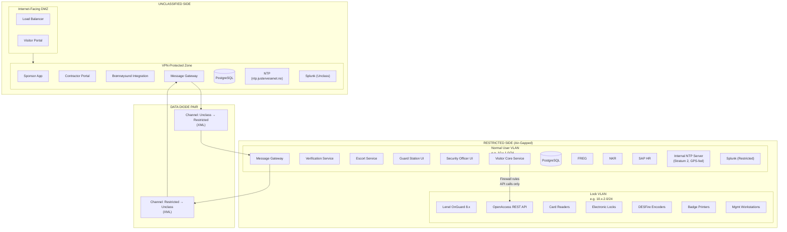
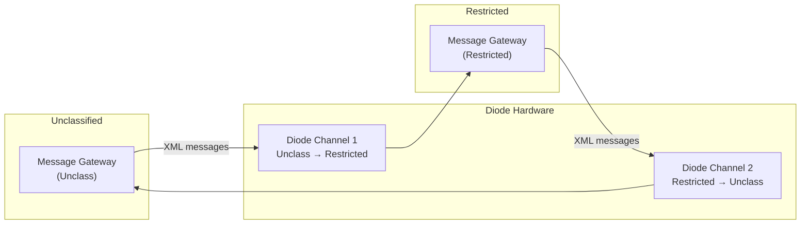
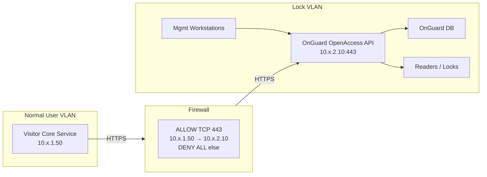
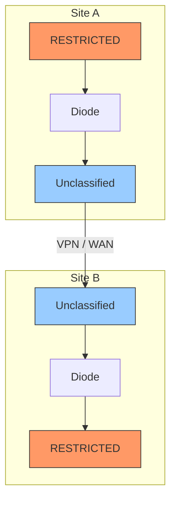

# 01 — Network Architecture

> Parent: [00-overview.md](00-overview.md)

## 1. Network Topology

## 2. Security Zones

| Zone | Classification | Access | Purpose |
|---|---|---|---|
| Internet-Facing DMZ | UNCLASSIFIED | Public internet | External visitor self-service portal |
| VPN-Protected Zone | UNCLASSIFIED | Organizational VPN only | Sponsor/host app, contractor admin, message gateway |
| Normal User VLAN (RESTRICTED) | RESTRICTED | Air-gapped, authorized users | Visitor core services, verification, guard/security UI |
| Lock VLAN (RESTRICTED) | RESTRICTED | Isolated VLAN, firewall-controlled | Lenel OnGuard, card readers, locks, encoders, printers |

## 3. Diode Configuration

The diode system provides bidirectional XML message transfer using two separate unidirectional channels.

**Key properties** (see [05-diode-messaging.md](05-diode-messaging.md) for full specification):

- Two independent channels, not a bidirectional pipe
- Request/response modeled as two independent messages with correlation IDs
- Message gateway on each side abstracts diode-specific transport
- Multiple diode products may be in use across sites — gateway adapts

## 4. VLAN Separation — Lock VLAN

The Lock VLAN is separated from the Normal User VLAN at Layer 2. Communication between VLANs is controlled by firewall rules.

### Current State
- OnGuard accessible only from dedicated management workstations on the Lock VLAN
- No programmatic access from Normal VLAN

### Target State
- Enable OnGuard **OpenAccess REST API**
- Firewall rule: allow HTTPS (443) from Visitor Core Service (Normal VLAN) → OnGuard API (Lock VLAN)
- No other traffic permitted between VLANs
- Management workstations remain on Lock VLAN for direct OnGuard administration

## 5. NTP Strategy

### Recommendation: Stratum 2, GPS-fed on RESTRICTED

| Side | Source | Target Accuracy | Implementation |
|---|---|---|---|
| Unclassified | Public NTP pool (`ntp.justervesenet.no` or org corporate NTP) | ±100ms | Standard chrony/ntpd configuration |
| RESTRICTED | Dedicated internal NTP server, fed from GPS receiver (e.g., Meinberg, Galleon) | ±1ms | Single NTP VM/appliance, all RESTRICTED hosts sync to it |

### Why GPS on RESTRICTED?
- Air-gapped network cannot reach internet NTP pools
- GPS signal is unclassified and available indoors with appropriate antenna
- Provides independent, accurate time source
- Critical for: audit log correlation across diode, OnGuard event timestamps, time-bounded badge activation/deactivation

### Minimum Viable
If GPS is not immediately available, a manual time-set NTP server is acceptable during initial deployment, with drift monitoring. Plan GPS feed as a fast follow.

## 6. Cross-Site Networking

- No RESTRICTED-to-RESTRICTED path between sites
- Cross-site visitor messages route: Site A RESTRICTED → Diode → Unclassified WAN → Diode → Site B RESTRICTED
- Each site operates independently; cross-site communication is asynchronous and may be slow
- Loss of WAN between unclassified sides does not affect local site operations

## 7. DNS

| Side | Approach |
|---|---|
| Unclassified | Standard corporate DNS + public DNS for external services (ID-porten, Brønnøysund APIs) |
| RESTRICTED | Internal DNS server. Serves names for all RESTRICTED services, OnGuard, SAP, registers. No external resolution. |
