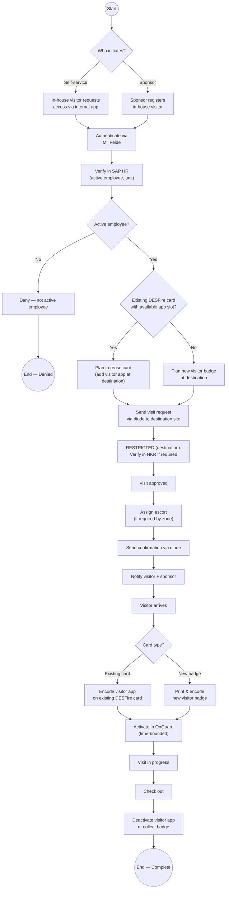
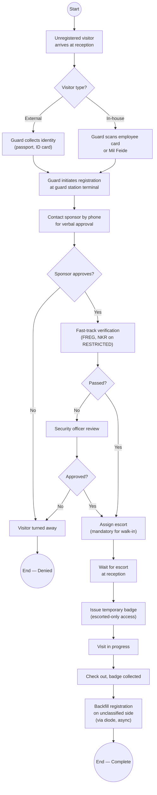
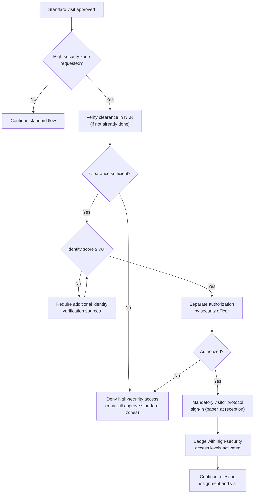
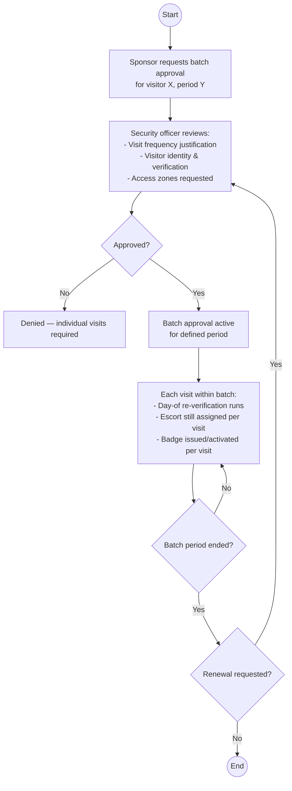

# 02 — Visitor Workflow

> Parent: [00-overview.md](00-overview.md)

## 1. Visitor Types

| Type | Description | Identity Sources | Typical Path |
|---|---|---|---|
| **External Visitor** | Person from outside the organization (contractor, partner, guest) | ID-porten, passport, authenticator, in-person | Internet portal or sponsor-initiated |
| **In-House Visitor** | Employee from another unit within the organization | Mil Feide, existing employee card, HR record | Internal app or sponsor-initiated |

## 2. Entry Paths

| Path | Initiated By | Available To | Channel |
|---|---|---|---|
| **Self-service (Internet)** | External visitor | External visitors | Internet portal with ID-porten |
| **Self-service (Internal)** | In-house visitor | Employees via Mil Feide | VPN-protected app |
| **Sponsor-initiated** | Host/sponsor employee | Both visitor types | VPN-protected app via Mil Feide |
| **Contractor admin** | Contractor company admin | External visitors (batch) | Internet portal or VPN app |

## 3. Approval Tiers

| Tier | Trigger | Approval Process | Additional Requirements |
|---|---|---|---|
| **Standard** | Default for escorted day visits | Single sponsor approval + security officer review | Escort must be assigned |
| **Batch-approved** | Frequent recurring visitors | Sponsor requests batch approval for a time period; security officer approves once | Periodic re-verification |
| **High-Security** | Access to sensitive zones or extended unescorted access | Separate authorization process + mandatory physical visitor protocol sign-in | Clearance verification in NKR, higher identity score threshold |

## 4. Core Process — External Visitor (Pre-Registered)

```mermaid
graph TD
    START((Start)) --> REG{Who initiates?}

    REG -->|Self-service| SELF_REG["External visitor registers<br/>via internet portal"]
    REG -->|Sponsor| SPONSOR_REG["Sponsor registers visitor<br/>via VPN app"]
    REG -->|Contractor admin| CONTR_REG["Contractor admin registers<br/>worker via portal"]

    SELF_REG --> IDENTITY["Identity verification<br/>(ID-porten / passport)"]
    SPONSOR_REG --> IDENTITY
    CONTR_REG --> IDENTITY

    IDENTITY --> SCORE{"Identity score<br/>sufficient?"}
    SCORE -->|No| MORE_ID["Request additional<br/>identity sources"]
    MORE_ID --> IDENTITY
    SCORE -->|Yes| COMPANY_CHECK["Company verification<br/>(Brønnøysund)"]

    COMPANY_CHECK --> COMPANY_OK{Company valid?}
    COMPANY_OK -->|No| MANUAL_REVIEW["Flag for manual review<br/>by security officer"]
    COMPANY_OK -->|Yes| DIODE_SEND["Send visitor request<br/>via diode to RESTRICTED"]

    MANUAL_REVIEW --> SEC_DECISION{Security officer<br/>decision}
    SEC_DECISION -->|Approve with exception| DIODE_SEND
    SEC_DECISION -->|Deny| NOTIFY_DENY["Notify visitor/sponsor<br/>of denial"]
    NOTIFY_DENY --> END_DENY((End — Denied))

    DIODE_SEND --> R_VERIFY["RESTRICTED: Verify in<br/>FREG, NKR, SAP HR"]

    R_VERIFY --> R_OK{Verification<br/>passed?}
    R_OK -->|No| R_MANUAL["Security officer<br/>manual review"]
    R_MANUAL --> R_DECISION{Decision}
    R_DECISION -->|Deny| R_DENY["Send denial via diode"]
    R_DENY --> NOTIFY_DENY
    R_DECISION -->|Approve with exception| R_APPROVE

    R_OK -->|Yes| R_APPROVE["Visit approved"]
    R_APPROVE --> ASSIGN_ESCORT["Assign escort<br/>(mandatory)"]
    ASSIGN_ESCORT --> DIODE_CONFIRM["Send confirmation via diode"]
    DIODE_CONFIRM --> NOTIFY_APPROVE["Notify visitor + sponsor<br/>(email/SMS)"]
    NOTIFY_APPROVE --> WAIT_ARRIVAL["Wait for visit day"]

    WAIT_ARRIVAL --> REVERIFY["Day-of re-verification<br/>(FREG, NKR)"]
    REVERIFY --> REVERIFY_OK{Still valid?}
    REVERIFY_OK -->|No| R_MANUAL
    REVERIFY_OK -->|Yes| ARRIVAL["Visitor arrives<br/>at reception"]

    ARRIVAL --> FACE_CHECK["Guard verifies identity<br/>(face vs photo)"]
    FACE_CHECK --> ESCORT_NOTIFY["Notify assigned escort"]
    ESCORT_NOTIFY --> ESCORT_CONFIRM{Escort confirms<br/>or delegates}
    ESCORT_CONFIRM -->|Confirms| BADGE_ISSUE["Print & encode<br/>DESFire badge"]
    ESCORT_CONFIRM -->|Delegates| ESCORT_DELEGATE["New escort assigned<br/>and notified"]
    ESCORT_DELEGATE --> ESCORT_CONFIRM
    ESCORT_CONFIRM -->|No response| ESCALATE["Escalate to unit manager<br/>then security officer"]
    ESCALATE --> ESCORT_CONFIRM

    BADGE_ISSUE --> ACTIVATE["Activate badge in OnGuard<br/>(time-bounded)"]
    ACTIVATE --> VISIT["Visit in progress<br/>(escort responsible)"]

    VISIT --> CHECKOUT["Visitor checks out<br/>at reception"]
    CHECKOUT --> COLLECT_BADGE["Badge collected<br/>& deactivated in OnGuard"]
    COLLECT_BADGE --> LOG_COMPLETE["Audit log: visit complete"]
    LOG_COMPLETE --> END_OK((End — Complete))
```

## 5. Core Process — In-House Visitor (Pre-Registered)

## 6. Walk-In / Ad-Hoc Process

**Walk-in notes:**
- Walk-ins always get **escorted-only** access level — no unescorted walk-ins
- Sponsor verbal approval is recorded by guard (who, when, via what channel)
- Registration is backfilled on the unclassified side after the fact for audit completeness
- Pre-registration is encouraged: system should make it easier to register ahead than to walk in

## 7. High-Security Visit Addendum

For visits requiring high-security zone access, the following additional steps apply **on top of** the standard process:

**Note**: Digital visitor protocol is out of scope for this project. The paper-based sign-in process remains.

## 8. Batch Approval for Frequent Visitors

**Batch approval rules:**
- Security officer defines maximum batch period (e.g., 3 months)
- Day-of re-verification still runs for each individual visit
- Escort assignment is still per-visit, not blanket
- Batch can be revoked at any time by security officer
- Audit log records each individual visit within the batch
