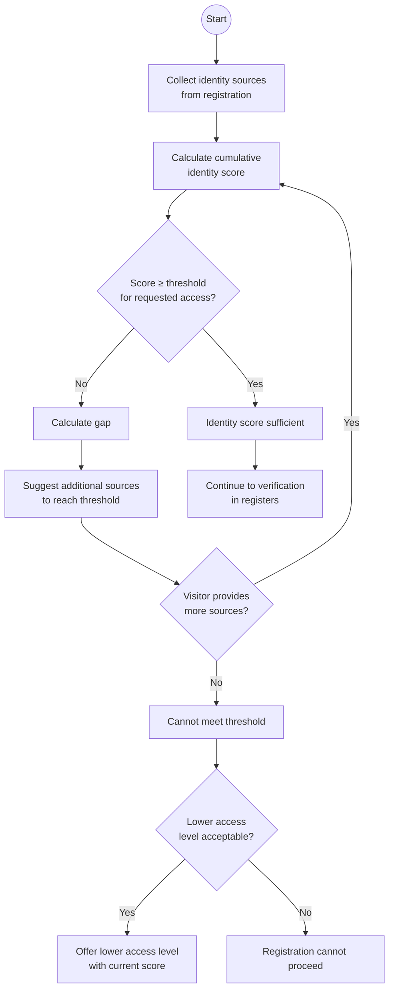
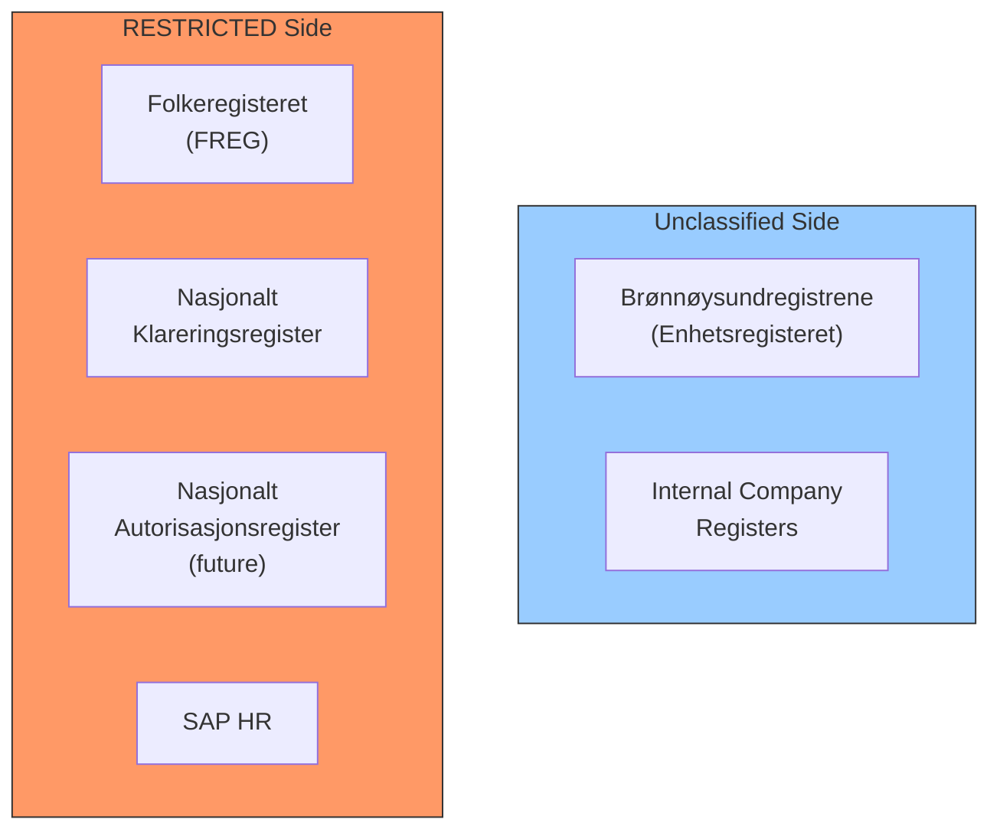
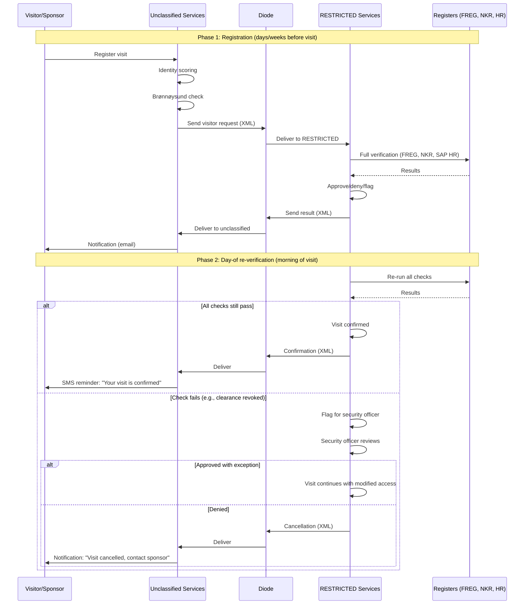
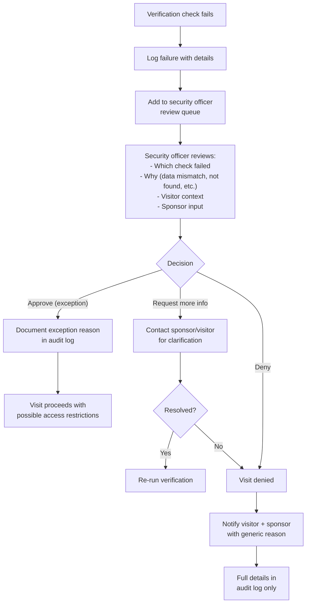

# 03 — Identity Verification

> Parent: [00-overview.md](00-overview.md)

## 1. Identity Scoring Model

Inspired by Australia's 100-point identity check. The system assigns an **identity score** based on the number and strength of identity sources provided. Different security levels require different minimum scores.

### Score Sources

| Source | Points | Where Verified | Notes |
|---|---|---|---|
| **Mil Feide** (defense sector IdP) | 50 | Unclassified (VPN) | Pre-vetted, strong. Only available to defense sector employees. |
| **ID-porten** (BankID / MinID) | 40 | Unclassified (Internet) | Norwegian national eID. Strong identity binding. |
| **Valid passport** (scanned / NFC chip read) | 35 | Reception (RESTRICTED) | Physical document, machine-readable. NFC chip provides anti-forgery. |
| **In-person verification** | 30 | Reception (RESTRICTED) | Face-to-face identity check by trained guard. |
| **Authenticator app** (TOTP / FIDO2) | 20 | Unclassified | Second-factor possession proof. FIDO2 preferred over TOTP. |
| **SMS verification** | 10 | Unclassified | Weak due to SIM-swap risk. Supplementary only. |
| **Email verification** | 5 | Unclassified | Weakest source. Confirms contact info, not identity. |

### Threshold Matrix

| Access Type | Minimum Score | Additional Requirements |
|---|---|---|
| Single escorted day visit | 40 | Escort assigned |
| Recurring escorted visits (batch) | 50 | Batch approval by security officer |
| Unescorted within restricted zone | 70 | Security officer authorization |
| High-security zone access | 90 | Clearance in NKR + separate authorization + visitor protocol |
| Long-term contractor badge | 100 | Clearance + authorization + periodic re-verification |

### Score Calculation Flow



### Foreign Visitors (No Norwegian eID)

Foreign visitors cannot use ID-porten or Mil Feide. Their path to sufficient score:

| Combination | Score | Sufficient For |
|---|---|---|
| Passport (35) + In-person (30) | 65 | Escorted day visit ✓ |
| Passport (35) + In-person (30) + Authenticator (20) | 85 | Recurring unescorted ✓ |
| Passport (35) + In-person (30) + Authenticator (20) + SMS (10) | 95 | High-security (with NKR + auth) ✓ |

## 2. Register Integrations

### Register Landscape



### 2.1 Brønnøysundregistrene (Unclassified Side)

**Purpose**: Verify that a company exists, is active, and matches claims made during visitor registration.

| Check | API | What it returns |
|---|---|---|
| Company exists | Enhetsregisteret REST API | Organization number, name, status |
| Company active | Enhetsregisteret | Not dissolved, not bankrupt |
| Company type | Enhetsregisteret | AS, ENK, NUF, etc. |
| Signaturberettiget | Enhetsregisteret | Authorized signatories (for contractor admin verification) |

**Correlation with internal registers**: Cross-reference company org number with internal approved-vendor lists or contract databases.

### 2.2 Folkeregisteret — FREG (RESTRICTED Side)

**Purpose**: Verify that a person exists and their identity data matches registration.

| Check | What it verifies |
|---|---|
| Person exists | Fødselsnummer or D-nummer is valid and registered |
| Name match | Registered name matches visitor-provided name |
| Status | Person is alive, not emigrated (where relevant) |
| Address | Registered address (for correlation, not display) |

**Access**: Already available on RESTRICTED. Uses existing FREG integration.

**Data handling**: FREG data stays on RESTRICTED. Never transmitted across the diode.

### 2.3 Nasjonalt Klareringsregister — NKR (RESTRICTED Side)

**Purpose**: Verify security clearance level for visitors requiring access to classified areas.

| Check | What it verifies |
|---|---|
| Clearance exists | Person has an active security clearance |
| Clearance level | Sufficient for requested access zone |
| Clearance validity | Not expired or revoked |
| Issuing authority | Which organization granted the clearance |

**Access**: Available on RESTRICTED.

**Critical rule**: Clearance data never crosses the diode. The unclassified side only sees "verification passed" or "verification requires review" — never the clearance level itself.

### 2.4 Nasjonalt Autorisasjonsregister — NAR (RESTRICTED Side, Future)

**Purpose**: Verify that a person holds a valid authorization for the specific information or activity they will access.

**Status**: Under development. This project participates in the NAR development.

**Design approach**: Build an adapter interface now. The system calls `AuthorizationVerifier.verify(personId, requiredAuthorization)`. Current implementation returns "not available." Swap in real NAR integration when ready.

```typescript
// convex/lib/verification/authorizationVerifier.ts

type PersonId = string;
type AuthorizationType = "HEMMELIG" | "KONFIDENSIELT" | "BEGRENSET";

type VerificationResult =
  | { status: "passed"; details: string }
  | { status: "failed"; reason: string }
  | { status: "not_available"; reason: string };

// Adapter interface — swap implementation when NAR is ready
export type AuthorizationVerifier = (
  personId: PersonId,
  requiredAuth: AuthorizationType
) => Promise<VerificationResult>;

// Current implementation (stub)
export const stubAuthorizationVerifier: AuthorizationVerifier = async (
  _personId,
  _requiredAuth
) => ({
  status: "not_available",
  reason: "NAR integration not yet available",
});

// Future implementation
export const narAuthorizationVerifier = (
  narClient: NarClient
): AuthorizationVerifier => async (personId, requiredAuth) => {
  // Real NAR API call via Convex action
  const result = await narClient.verify(personId, requiredAuth);
  return result;
};
```

### 2.5 SAP HR (RESTRICTED Side)

**Purpose**: Verify employment status and organizational unit for sponsors and in-house visitors.

| Check | What it verifies |
|---|---|
| Active employee | Person is currently employed |
| Organizational unit | Which unit/department they belong to |
| Position | Job role (for authorization/escort eligibility) |
| Site assignment | Which physical site(s) they are assigned to |

## 3. Verification Timing

### Dual Verification: At Registration + Day-Of



### Why dual verification?

- **Registration-time**: Catches issues early, gives time to resolve
- **Day-of**: Catches changes since registration (clearance revoked, employment terminated, company dissolved)
- **Gap can be days or weeks**: Significant life changes can happen between registration and visit

## 4. Failed Verification — Exception Process

All verification failures route to **manual review**, never automatic denial.



**Principle**: Generic denial reasons to visitors ("your visit could not be approved at this time"). Detailed reasons only in the internal audit log on RESTRICTED.
