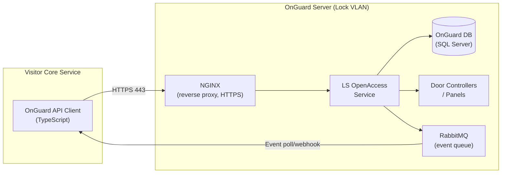
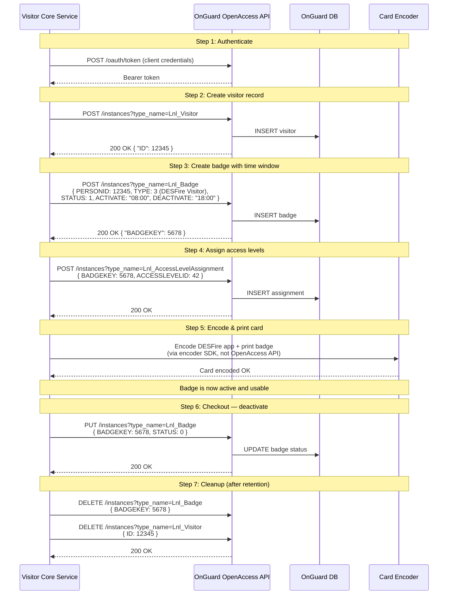
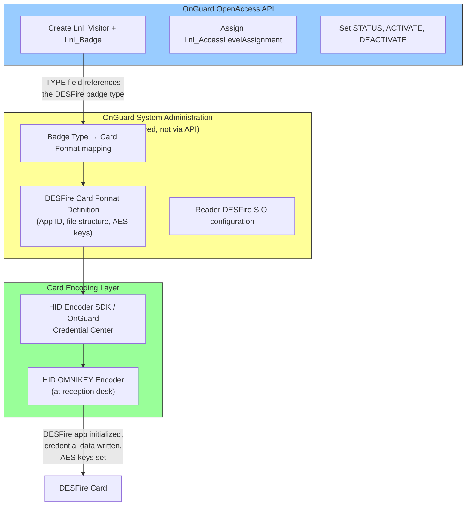
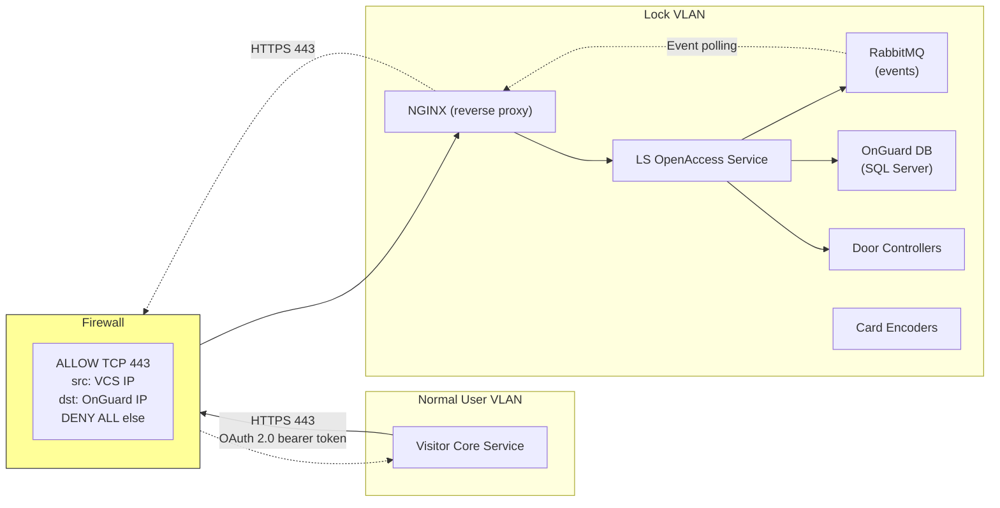
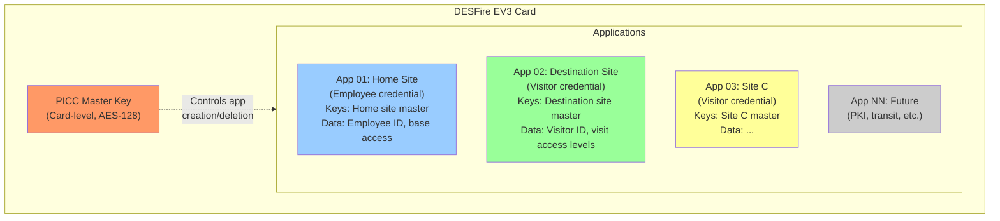
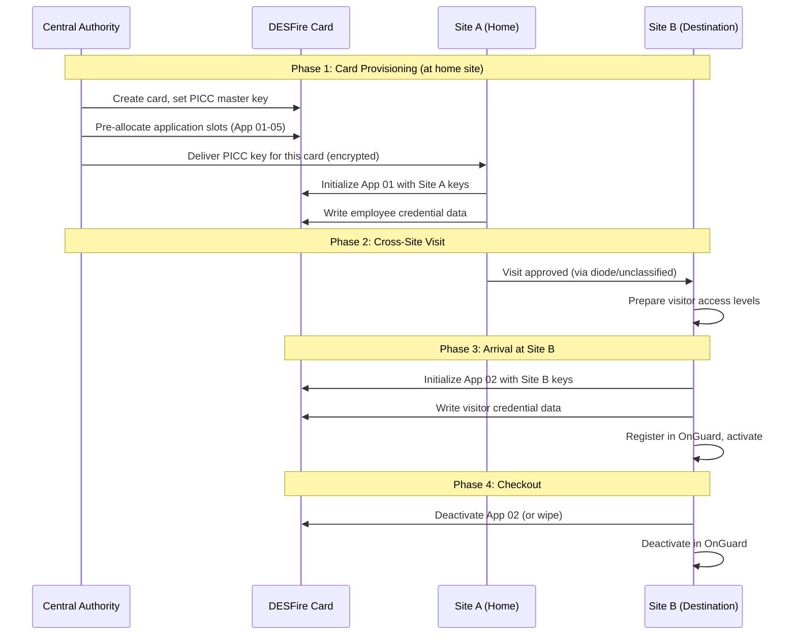
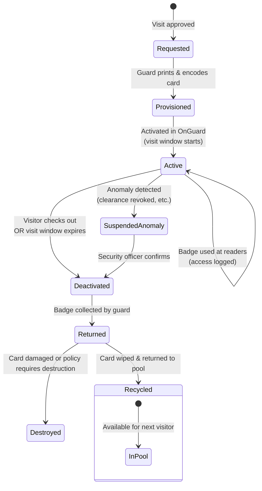
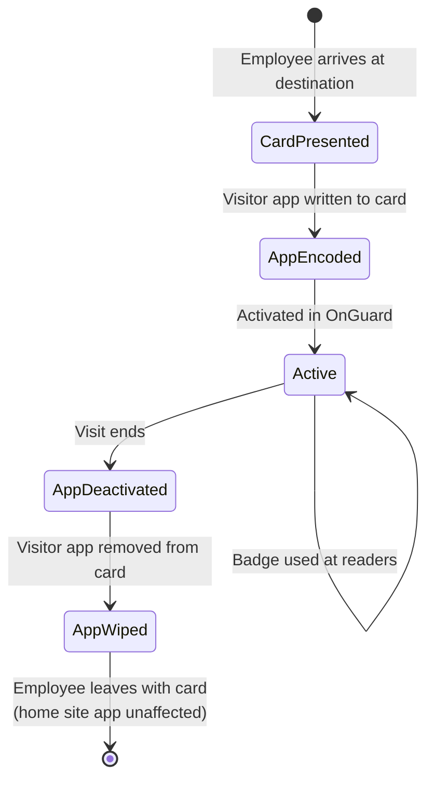

# 04 — Access Control & Card Management

> Parent: [00-overview.md](00-overview.md)

## 1. Lenel OnGuard Integration

### Current State

| Aspect | Status |
|---|---|
| Version | OnGuard 8.0 (upgrade planned, target TBD) |
| Deployment | Separate instance per physical site |
| API | OpenAccess REST API **not currently enabled** |
| Administration | Thick client on dedicated management workstations (Lock VLAN) |
| Access zones | Per-room granularity, many zones and areas defined |

### Target State

| Aspect | Target |
|---|---|
| API | OpenAccess REST API enabled, accessible from Visitor Core Service on Normal VLAN via firewall |
| Integration | Automated cardholder provisioning, access level assignment, badge activation/deactivation |
| Card technology | MIFARE DESFire EV3 (transitioning from legacy) |
| Cross-site | Same physical card used across sites via multi-application architecture |

### OnGuard OpenAccess API — Architecture

The OpenAccess REST API is served via NGINX as a reverse proxy to the OnGuard backend, with RabbitMQ for event queuing. All endpoints share a common base URL:

```
https://<onguard-host>/api/access/onguard/openaccess
```

The API uses a **generic, type-driven pattern** — most operations go through a single `/instances` endpoint differentiated by the `type_name` query parameter (e.g., `Lnl_Cardholder`, `Lnl_Badge`, `Lnl_Visitor`).



### Authentication

The API supports two authentication methods. **OAuth 2.0 client credentials** is preferred for service-to-service integration:

| Method | Endpoint | Use Case |
|---|---|---|
| **OAuth 2.0** (preferred) | `POST /oauth/token` with `grant_type=client_credentials` | Service-to-service. Returns bearer token. |
| **Session Token** (legacy) | `POST /authentication` | Interactive. Returns session token + requires `Application-Id` and `Session-Token` headers. Session idle timeout must be managed via `GET /keepalive`. |

**OAuth 2.0 flow:**
```
POST /api/access/onguard/openaccess/oauth/token
Content-Type: application/x-www-form-urlencoded

grant_type=client_credentials&client_id=visitor-vms&client_secret=<secret>
```

**Session token flow (fallback):**
```json
POST /api/access/onguard/openaccess/authentication?version=1.0

{
  "property_value_map": {
    "DIRECTORY": "OnGuard Internal",
    "USERNAME": "vms-service",
    "PASSWORD": "<service-password>"
  }
}
```

Every subsequent request must include:

| Header | Value |
|---|---|
| `Application-Id` | Registered integration app ID (configured in OnGuard System Administration) |
| `Session-Token` | Token from authentication response |

**Recommendation**: Use OAuth 2.0 if available on the installed version. Fall back to session token with a keepalive scheduler if OAuth is not supported. The service account should be created with **minimum required permissions** — no system admin.

### API Endpoints — Required Operations

All endpoints below are relative to the base URL. The `version=1.0` query parameter is **mandatory** on every request.

#### Cardholder & Visitor Management

OnGuard has both `Lnl_Cardholder` (permanent employees) and `Lnl_Visitor` (temporary visitors). We use `Lnl_Visitor` for external visitors and `Lnl_Cardholder` for in-house visitors who need a cross-registered record.

**Create a visitor:**
```
POST /instances?type_name=Lnl_Visitor&version=1.0

{
  "property_value_map": {
    "FIRSTNAME": "Jane",
    "LASTNAME": "Guest",
    "EMAIL": "jane.guest@contractor.no",
    "PRIMARYSEGMENTID": 1
  }
}
```

**Create a cardholder (for in-house cross-registration):**
```
POST /instances?type_name=Lnl_Cardholder&version=1.0

{
  "property_value_map": {
    "FIRSTNAME": "Ola",
    "LASTNAME": "Nordmann",
    "SSNO": "EMP-54321",
    "PRIMARYSEGMENTID": 1,
    "DEPT": "Unit-Alpha"
  }
}
```

**Search cardholders:**
```
GET /instances?type_name=Lnl_Cardholder&version=1.0&filter=LASTNAME%20%3D%20'Nordmann'&page_size=20&page_number=1
```

**Key `Lnl_Cardholder` / `Lnl_Visitor` properties:**

| Property | Type | Description | Read/Write |
|---|---|---|---|
| `ID` | Int32 | Internal ID (auto-generated) | Read-only |
| `FIRSTNAME` | String | First name | R/W |
| `LASTNAME` | String | Last name | R/W |
| `MIDNAME` | String | Middle name | R/W |
| `EMAIL` | String | Email address | R/W |
| `SSNO` | String | Employee ID / reference number | R/W |
| `PRIMARYSEGMENTID` | Int32 | Primary segment (site/partition) | R/W |
| `DEPT` | String | Department / unit | R/W |
| `TITLE` | String | Title / role | R/W |
| `BUILDING` | String | Building | R/W |
| `FLOOR` | String | Floor | R/W |
| `PHONE` | String | Phone number | R/W |
| `LASTCHANGED` | DateTime | Last modification timestamp | Read-only |
| *UDF fields* | Various | User-defined fields (configured in OnGuard) | R/W |

#### Badge Management

Badges are linked to cardholders/visitors via the `PERSONID` field. A person can have multiple badges.

**Create a badge:**
```
POST /instances?type_name=Lnl_Badge&version=1.0

{
  "property_value_map": {
    "ID": 1000042,
    "PERSONID": 12345,
    "TYPE": 3,
    "STATUS": 1,
    "ACTIVATE": "2026-02-24T08:00:00",
    "DEACTIVATE": "2026-02-24T18:00:00",
    "USELIMIT": 0
  }
}
```

**Deactivate a badge:**
```
PUT /instances?type_name=Lnl_Badge&version=1.0

{
  "property_value_map": {
    "BADGEKEY": 5678,
    "STATUS": 0,
    "DEACTIVATE": "2026-02-24T14:30:00"
  }
}
```

**Key `Lnl_Badge` properties:**

| Property | Type | Description | Notes |
|---|---|---|---|
| `BADGEKEY` | Int32 | Internal badge key (primary key) | Read-only, auto-generated |
| `ID` | Int64 | Badge ID (number encoded on card) | Set at creation |
| `PERSONID` | Int32 | FK to cardholder/visitor ID | Links badge to person |
| `TYPE` | Int32 | FK to `Lnl_BadgeType` | Determines card format (DESFire, etc.) |
| `STATUS` | Int32 | 1=Active, 0=Inactive | Set to 0 to deactivate |
| `ACTIVATE` | DateTime | Activation date/time | Time-bounded access start |
| `DEACTIVATE` | DateTime | Deactivation date/time | Time-bounded access end |
| `USELIMIT` | Int32 | Max uses (0=unlimited) | For single-use visitor badges |
| `ISSUECODE` | Int32 | Issue code | Incremented on re-issue |
| `LASTCHANGED` | DateTime | Last modification | Read-only |

**Important**: OnGuard cannot disable a cardholder account directly — you **must deactivate the badge(s)** to revoke access. This is the designed pattern.

#### Access Level Assignment

Access levels are assigned **to badges** (not directly to cardholders). A badge can have multiple access levels.

**List available access levels:**
```
GET /instances?type_name=Lnl_AccessLevel&version=1.0
```

**Assign an access level to a badge:**
```
POST /instances?type_name=Lnl_AccessLevelAssignment&version=1.0

{
  "property_value_map": {
    "BADGEKEY": 5678,
    "ACCESSLEVELID": 42,
    "ACTIVATE": "2026-02-24T08:00:00",
    "DEACTIVATE": "2026-02-24T18:00:00"
  }
}
```

**Remove an access level from a badge:**
```
DELETE /instances?type_name=Lnl_AccessLevelAssignment&version=1.0

{
  "property_value_map": {
    "BADGEKEY": 5678,
    "ACCESSLEVELID": 42
  }
}
```

**Note**: Access level assignments support their own `ACTIVATE`/`DEACTIVATE` windows, independent of the badge-level activation. Both must overlap for access to be granted.

#### Event Monitoring

OnGuard events are delivered via RabbitMQ internally. The OpenAccess API exposes event subscriptions with webhook or polling.

**Create an event subscription:**
```
POST /event_subscriptions?version=1.0

{
  "property_value_map": {
    "DESCRIPTION": "VMS Access Events",
    "EVENT_TYPE": "Lnl_IncomingEvent"
  }
}
```

**Poll for events:**
```
GET /events?version=1.0&subscription_id=1
```

**Key event types:**

| Type | Description | VMS Use |
|---|---|---|
| `Lnl_AccessEvent` | Access granted / denied at readers | Audit trail, anomaly detection |
| `Lnl_IncomingEvent` | General incoming events | Catch-all for monitoring |
| `Lnl_SecurityEvent` | Security-related events | Alert triggers |

#### Lookup / Reference Data

```
GET /instances?type_name=Lnl_BadgeType&version=1.0     # Badge types (DESFire, prox, etc.)
GET /instances?type_name=Lnl_Segment&version=1.0        # Segments (site partitions)
GET /instances?type_name=Lnl_Reader&version=1.0         # Readers
GET /instances?type_name=Lnl_Panel&version=1.0          # Panels (door controllers)
GET /directories?version=1.0                             # Authentication directories
```

### Complete API Flow — Visitor Badge Issuance



### DESFire Credential Handling via OnGuard

**Important architectural note**: The OpenAccess API manages the **logical badge record** (person link, status, activation window, access levels). It does **not** handle DESFire encoding or cryptographic operations directly.



**What this means for our integration:**

| Concern | Where It's Handled |
|---|---|
| Visitor record lifecycle | OpenAccess API (`Lnl_Visitor`, `Lnl_Badge`) |
| Access level assignment | OpenAccess API (`Lnl_AccessLevelAssignment`) |
| Time-bounded activation | OpenAccess API (badge `ACTIVATE`/`DEACTIVATE` fields) |
| DESFire card format definition | OnGuard System Administration (pre-configured per site) |
| DESFire AES key configuration | OnGuard System Administration + HID Credential Management |
| Physical card encoding | HID encoder SDK or OnGuard Credential Center at the reception desk |
| Reader SIO profiles | OnGuard System Administration (reader configuration) |

**Pre-configuration required per site** (one-time, during Phase 0):
1. Define DESFire card format in OnGuard (application ID, file layout, keys)
2. Create a `Lnl_BadgeType` for "DESFire Visitor" linked to the card format
3. Configure reader SIO profiles to accept the DESFire format
4. Install and configure encoder SDK at reception desks
5. Create the VMS service account with API permissions

### Operational Constraints & Known Limitations (OnGuard 8.0)

| Constraint | Impact | Mitigation |
|---|---|---|
| **Request pool: 32 concurrent requests** (default) | Under load, API may reject requests | Increase to 128 via INI file at `C:\ProgramData\Lnl\` (`request_pool_size=128`), restart LS OpenAccess service |
| **Session token idle timeout** | Tokens expire after inactivity (default ~20 min) | Use OAuth 2.0 (preferred) or implement keepalive scheduler (`GET /keepalive` every 5 min) |
| **No bulk operations** (added in 8.3) | Large batch operations (e.g., importing 50 visitors) must paginate one-by-one | Accept slower batch operations in 8.0. Plan to leverage bulk API if/when upgrade to 8.3+ happens |
| **Cannot disable cardholder directly** | Must deactivate badges to revoke access | Badge service always deactivates badges, never tries to disable the person record |
| **Filter expressions limited** | SQL-like syntax but complex nested filters may not work | Keep filters simple. Use application-side filtering for complex queries. |
| **version parameter mandatory** | Omitting causes errors | Hard-code `version=1.0` in all API calls |
| **Pagination is 1-based** | Off-by-one risk | API client wrapper handles this |
| **DESFire encoding not via API** | Must use encoder SDK separately | Badge service coordinates: API for logical record, encoder SDK for physical card |

### Network Path (Updated)



**Security**:
- HTTPS with TLS 1.2+ between Visitor Core Service and OnGuard NGINX
- OAuth 2.0 client credentials (or session token with keepalive)
- Service account with **minimum permissions**: Visitor CRUD, Badge CRUD, AccessLevelAssignment CRUD, Event read. No system admin, no hardware control.
- `Application-Id` registered in OnGuard System Administration identifies the VMS integration
- RabbitMQ management interface (`port 15672`) must **not** be exposed outside Lock VLAN

### OpenAccess vs DataConduIT

OnGuard offers two integration APIs. OpenAccess is the strategic direction.

| Aspect | OpenAccess API | DataConduIT |
|---|---|---|
| Protocol | REST/HTTPS (JSON) | WMI (Windows-only) |
| Platform | Any (HTTP client) | Windows only |
| Auth | OAuth 2.0 or session token | Windows integrated auth |
| Events | Subscription (webhook/poll via RabbitMQ) | WMI event subscriptions |
| Status | **Active development, recommended** | Legacy, maintained |
| Our choice | **Yes** — cross-platform, K8s-friendly | No — Windows dependency unacceptable |

## 2. MIFARE DESFire EV3 — Card Architecture

### Benefits and Drawbacks

**Benefits:**

| Capability | Relevance |
|---|---|
| Multi-application (up to 28 apps per card) | One card, multiple sites. Each site manages its own application independently. |
| AES-128 mutual authentication | Card and reader authenticate each other. Prevents cloning. |
| Encrypted communication | Data encrypted on the RF channel. No eavesdropping. |
| Diversified keys | Each card has unique derived keys. Compromising one card doesn't compromise others. |
| Per-application access control | Site A cannot read or modify Site B's application data. Cryptographic isolation. |
| Transaction MAC (EV3) | Tamper-evident audit trail at the card level. |
| Anti-tearing | Write operations are atomic — power loss mid-write doesn't corrupt the card. |
| Lenel native support | OnGuard 7.5+ supports DESFire via HID iCLASS SE / SIGNO readers. |

**Drawbacks:**

| Concern | Mitigation |
|---|---|
| Reader replacement required | Legacy 125kHz/iCLASS readers must be upgraded to HID SIGNO or iCLASS SE with DESFire SIO. Budget for site-wide reader replacement. |
| Key management complexity | Each site needs secure key storage. Recommend HSM or HID Credential Management. Key ceremony documentation required. |
| Encoding infrastructure | OMNIKEY encoders needed at each site for card provisioning. Part of printer/encoder procurement. |
| Slower transaction (~100-200ms more) | Acceptable for door access. Not an issue in practice. |
| Dual-tech transition period | During migration, readers run dual profiles (legacy + DESFire). Increased attack surface until legacy is fully retired. |

### Multi-Application Layout



### PICC Master Key Ownership — Delegated Model

**Decision**: Delegated model, optimized for site independence.



**Central Authority responsibilities:**
- PICC master key generation and distribution (key ceremony with HSM)
- Application slot allocation policy
- Key recovery procedures

**Site responsibilities:**
- Own application keys (AES-128, site-specific)
- Application initialization and data management
- Operate independently — no need to contact central authority for daily operations

### Key Management

| Key Type | Owner | Storage | Rotation |
|---|---|---|---|
| PICC master key | Central Authority | HSM | On compromise or policy (annual) |
| Site application master key | Site Security Admin | HSM or secure key store | On compromise or policy |
| Diversified card keys | Derived per card | Computed from master + card UID | Automatic (follows master rotation) |

**Critical**: Loss of a site application master key means loss of ability to manage that application on all cards. HSM backup and key escrow procedures are mandatory.

## 3. Badge Lifecycle

### External Visitor Badge



### In-House Visitor (Existing Card)



## 4. Access Level Design

### Principles

- Access levels in OnGuard map to **physical zones** (rooms, floors, wings, buildings)
- Visitor access levels are **pre-defined templates** (not ad-hoc per visitor)
- Templates are configured per site by the Site Administrator
- Sponsor/security officer selects from templates when approving a visit

### Example Access Level Templates

| Template | Zones Included | Escort Required | Typical Use |
|---|---|---|---|
| `VISITOR-LOBBY` | Main entrance, lobby, meeting rooms on ground floor | Yes | Standard escorted day visit |
| `VISITOR-OFFICE-WING-A` | Lobby + Office wing A common areas | Yes | Visiting specific department |
| `VISITOR-UNESCORTED-GENERAL` | Lobby + cafeteria + common meeting rooms | No | Batch-approved frequent visitor |
| `VISITOR-WORKSHOP` | Lobby + workshop/lab areas | Yes | Contractor technical work |
| `VISITOR-HIGH-SECURITY` | Restricted zones (per security officer) | Yes | Cleared visitor with authorization |
| `VISITOR-FULL-SITE` | All non-classified zones | No | Long-term embedded contractor |

### Time Bounding

| Level | Activation | Deactivation |
|---|---|---|
| Single day visit | Visit date, start time | Visit date, end time (or 18:00 default) |
| Multi-day visit | First day start | Last day end time |
| Batch-approved | Per visit within batch | Per visit within batch |
| Long-term contractor | Contract start date | Contract end date, with periodic renewal check |

OnGuard handles time-bounded activation natively via badge activate/deactivate datetime fields.

## 5. Card Pool Management (External Visitors)

Sites maintain a pool of pre-provisioned blank DESFire cards for external visitors.

| Metric | Recommendation |
|---|---|
| Pool size | 2x average daily visitors + buffer for peaks |
| Replenishment | Automated alert when pool drops below threshold |
| Card tracking | Each card has a unique serial logged in the system |
| Wipe policy | Full application wipe before returning to pool |
| Physical security | Pool cards stored in locked cabinet at reception |
| Damaged cards | Destroy and log; replace from stock |

## 6. Reader Infrastructure Requirements

| Reader Type | Model Family | Location | DESFire Support |
|---|---|---|---|
| Door readers | HID SIGNO 40 | All access-controlled doors | DESFire EV1/EV2/EV3 + legacy |
| Turnstile readers | HID SIGNO 40 | Building entrances with turnstiles | DESFire EV1/EV2/EV3 + legacy |
| Desktop encoders | HID OMNIKEY 5427 CK | Reception desk / guard station | DESFire encoding + printing |
| Long-range readers | HID SIGNO 70 | Vehicle gates (if applicable) | DESFire EV1/EV2/EV3 |

**Transition period**: Readers configured with dual secure identity object (SIO) profiles — legacy format + DESFire. Legacy profile removed site-by-site as migration completes.
