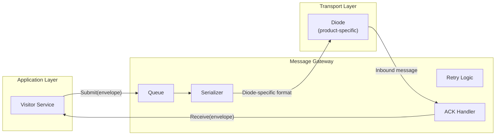
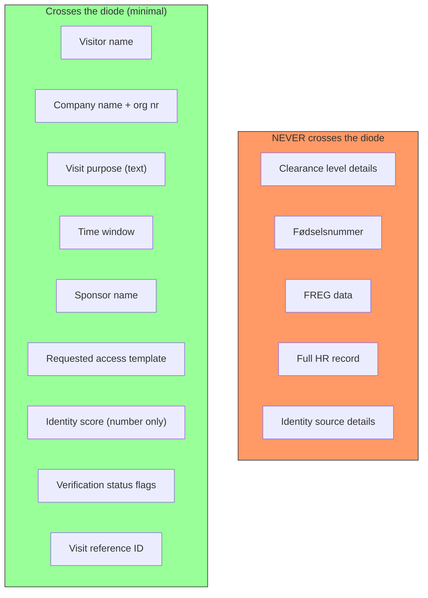
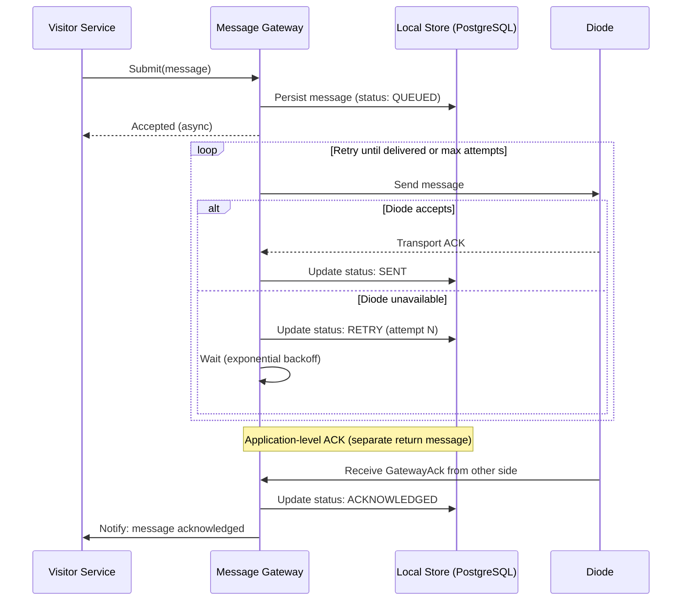
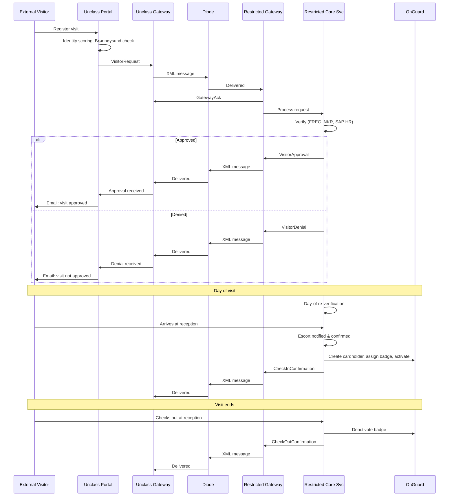

# 05 — Diode Messaging & Cross-Boundary Data Flow

> Parent: [00-overview.md](00-overview.md)

## 1. Design Principle

The visitor system does not interact with diode hardware directly. A **message gateway** on each side of the diode handles serialization, transport, retry, and acknowledgement. The gateway exposes a clean interface to the visitor services.

This allows different diode products at different sites without changing application code.



## 2. Working Assumptions

These assumptions cover the range of diode systems that may be in use. The design targets the **lowest common denominator** to ensure compatibility.

| Parameter | Assumption | Design Impact |
|---|---|---|
| Delivery guarantee | At-least-once (messages may be duplicated) | Messages carry idempotency keys. Receiver deduplicates by message UUID. |
| Ordering | Not guaranteed | Application logic does not depend on message order. State machines handle out-of-order arrival. |
| Latency | 5–60 seconds typical, up to 5 minutes degraded | UX shows processing state. Pre-registered visits are unaffected. Walk-ins need "please wait" pattern. |
| Message size | Max 1 MB per message | Photos compressed to <100KB JPEG. No large file attachments. |
| Reliability | Messages can be lost | Store-and-forward with retry at gateway level. Application-level ACK messages for confirmation. |
| Bidirectional | Two separate unidirectional channels | Request and response are independent messages with correlation IDs. Not synchronous RPC. |
| Signing | XML-DSig on every message | Non-repudiation. Diode treated as untrusted transport. |

## 3. Message Envelope Schema

```xml
<?xml version="1.0" encoding="UTF-8"?>
<VisitorMessage
    xmlns="urn:visitor-system:msg:v1"
    messageId="550e8400-e29b-41d4-a716-446655440000"
    correlationId="550e8400-e29b-41d4-a716-446655440001"
    timestamp="2026-02-24T09:15:32+01:00"
    source="site-alpha-unclass"
    destination="site-alpha-restricted"
    messageType="VisitorRequest"
    schemaVersion="1.0"
    idempotencyKey="550e8400-e29b-41d4-a716-446655440000"
    priority="NORMAL">

    <Payload>
        <!-- Message-type-specific content -->
        <!-- See Section 4 for payload definitions -->
    </Payload>

    <Signature>
        <!-- XML-DSig (enveloped signature) -->
    </Signature>
</VisitorMessage>
```

### Envelope Fields

| Field | Type | Required | Description |
|---|---|---|---|
| `messageId` | UUID | Yes | Unique identifier for this message |
| `correlationId` | UUID | No | Links response to original request |
| `timestamp` | ISO 8601 | Yes | When the message was created |
| `source` | String | Yes | Identifier of sending system (e.g., `site-alpha-unclass`) |
| `destination` | String | Yes | Identifier of receiving system |
| `messageType` | Enum | Yes | Type of payload (see Section 4) |
| `schemaVersion` | SemVer | Yes | Schema version for forward compatibility |
| `idempotencyKey` | UUID | Yes | For deduplication (usually same as messageId) |
| `priority` | Enum | No | `NORMAL` or `URGENT` (for walk-in fast-track) |

## 4. Message Types

### 4.1 Unclassified → RESTRICTED

| Message Type | Purpose | Payload Fields |
|---|---|---|
| `VisitorRequest` | New visit registration | Visitor name, company (if external), visit purpose, time window, sponsor name, requested access template, identity score achieved, identity sources used |
| `VisitorUpdate` | Modify existing request | Visit reference, changed fields only |
| `VisitorCancellation` | Cancel a visit | Visit reference, reason code |
| `GatewayAck` | Acknowledge receipt of a RESTRICTED→Unclass message | Original message ID, receipt timestamp |

### 4.2 RESTRICTED → Unclassified

| Message Type | Purpose | Payload Fields |
|---|---|---|
| `VisitorApproval` | Visit approved | Visit reference, approved time window, approved access template, escort assignment status |
| `VisitorDenial` | Visit denied | Visit reference, generic reason code (no sensitive details) |
| `VisitorModification` | RESTRICTED-side changes | Visit reference, modified fields (e.g., changed time window) |
| `CheckInConfirmation` | Visitor has checked in | Visit reference, check-in timestamp |
| `CheckOutConfirmation` | Visitor has checked out | Visit reference, check-out timestamp |
| `GatewayAck` | Acknowledge receipt of an Unclass→RESTRICTED message | Original message ID, receipt timestamp |

### 4.3 Cross-Site Messages

Cross-site messages follow the same envelope but route through unclassified infrastructure:

```
Site A RESTRICTED → Site A Diode → Unclassified WAN → Site B Diode → Site B RESTRICTED
```

| Message Type | Purpose | Route |
|---|---|---|
| `CrossSiteVisitorRequest` | In-house visitor from Site A wants to visit Site B | A(R) → A(U) → B(U) → B(R) |
| `CrossSiteVisitorApproval` | Site B approves the visit | B(R) → B(U) → A(U) → A(R) |
| `CrossSiteCardInfo` | Card application details for the visitor's existing DESFire card | A(R) → A(U) → B(U) → B(R) |

## 5. Data Minimization

### Principle: Only send what the receiving side needs to act on.



### What each side knows

| Data | Unclassified | RESTRICTED |
|---|---|---|
| Visitor name | Yes | Yes |
| Company | Yes | Yes (via diode message) |
| Fødselsnummer | No (ID-porten handles, not stored) | Yes (FREG lookup) |
| Clearance level | Never | Yes (NKR lookup) |
| Identity score | Yes (calculated here) | Yes (received in message) |
| Identity sources used | Yes (list of source types) | Yes (received in message, types only) |
| Visit approval status | Yes (received back) | Yes (decided here) |
| Badge number | No | Yes (OnGuard) |
| Access zones granted | No (only template name) | Yes (full zone details) |

## 6. Reliability & Retry

### Gateway Store-and-Forward



### Retry Policy

| Parameter | Value |
|---|---|
| Max retry attempts | 10 |
| Initial delay | 30 seconds |
| Backoff multiplier | 2x |
| Max delay | 5 minutes |
| Dead-letter after | 10 failed attempts → alert system admin |

### Deduplication

Receiving gateway maintains a **processed message log** (message UUID + timestamp). Messages with a known UUID are acknowledged but not re-processed. Log is retained for 7 days (longer than any reasonable retry window).

## 7. Message Flow — Complete Visit Lifecycle


