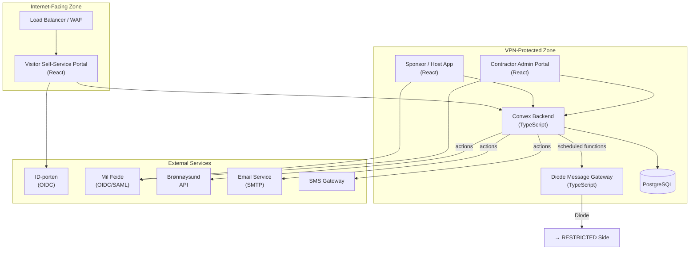
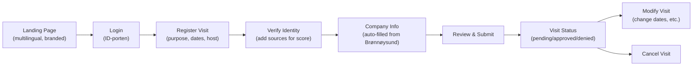
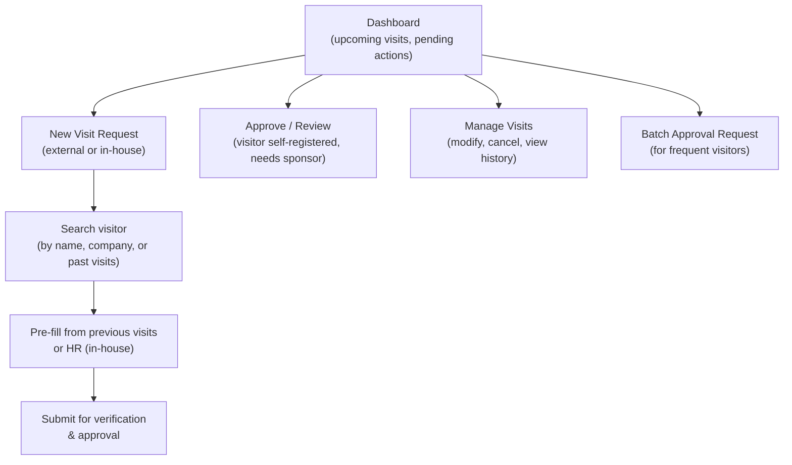

# 06 — Unclassified Side Services

> Parent: [00-overview.md](00-overview.md)

## 1. Application Architecture

## 2. Authentication

### 2.1 Mil Feide (Defense Sector Federation)

**Used by**: Sponsors, hosts, contractor admins (VPN-protected apps)

| Aspect | Details |
|---|---|
| Protocol | OIDC (preferred) or SAML 2.0 |
| IdP | Mil Feide federation |
| Claims/attributes | Name, employee ID, organizational unit, role, email |
| Session | JWT-based, short-lived access tokens + refresh tokens |
| MFA | Enforced by Mil Feide (not our responsibility) |

### 2.2 ID-porten (Norwegian National eID)

**Used by**: External visitors (internet portal)

| Aspect | Details |
|---|---|
| Protocol | OIDC (via Digdir integration) |
| IdP | ID-porten (BankID, MinID, BuypassID, Commfides) |
| Claims | `pid` (fødselsnummer), name, security level |
| Session | Short-lived, one-time verification. PID is used for identity scoring only, not stored long-term. |
| MFA | Built into BankID/MinID |

### 2.3 Identity Score Sources (Beyond IdP)

Additional identity sources collected during registration:

| Source | Collection Method | When |
|---|---|---|
| Passport | Photo upload or NFC scan (future) | During registration |
| Authenticator (FIDO2/TOTP) | Enroll during registration, verify at each login | Registration + each visit |
| SMS verification | Send OTP to registered phone | Registration |
| Email verification | Send confirmation link | Registration |
| In-person verification | Guard confirms face matches photo at reception | Day of visit (RESTRICTED side) |

## 3. Internet-Facing Portal

### Purpose
Allow external visitors to self-register for upcoming visits.

### Key Screens

### Functional Requirements

| Requirement | Details |
|---|---|
| Self-registration | Visitor fills in: purpose, desired dates, host/sponsor name or unit, company |
| Identity scoring | Real-time score display: "Your current identity score is X. You need Y for the requested access. Add [sources] to increase." |
| Company auto-fill | When org number is entered, auto-fill from Brønnøysund API |
| Visit status | Dashboard showing all visits: pending, approved, denied, completed |
| Multilingual | Norwegian (bokmål) + English. Architecture supports adding more. |
| Accessible | WCAG 2.1 AA compliant |
| Branding | Official, trustworthy appearance. Organizational color scheme. Clear indication this is a legitimate government/defense service. |
| Responsive | Works on mobile (visitors may register from phone) |

## 4. VPN-Protected Sponsor App

### Purpose
Allow sponsors/hosts to initiate and manage visits, and approve pending requests.

### Key Screens

### Functional Requirements

| Requirement | Details |
|---|---|
| Initiate visit | Sponsor creates visit on behalf of visitor (external or in-house) |
| Approve self-registered | When external visitor names a sponsor, sponsor gets approval task |
| Escort assignment | Sponsor assigns escort (self or delegate) during approval |
| Batch approval | Request recurring access for a frequent visitor |
| Visit history | All visits the sponsor has initiated or approved |
| Notifications | In-app + email for pending actions |

## 5. Contractor Admin Portal

### Purpose
Allow contractor company administrators to manage visits for their workers.

### Functional Requirements

| Requirement | Details |
|---|---|
| Worker roster | Add/remove workers associated with the company |
| Bulk registration | Register multiple workers for the same time period / project |
| Task assignment | Assign which worker does what task, when |
| Status overview | See status of all pending/approved/denied visits for the company's workers |
| Worker identity management | Track identity scores for workers; prompt for additional verification when needed |
| Company profile | Manage company details, linked to Brønnøysund org number |

## 6. Tech Stack

| Component | Technology | Rationale |
|---|---|---|
| Frontend | **React** | Component-based, large ecosystem, first-class Convex integration via `convex/react` hooks |
| Backend | **Convex** (TypeScript) | Unified backend: reactive queries, mutations, actions (HTTP calls), scheduled functions (cron + delayed), file storage. Replaces separate API server + message queue + background worker. |
| Language | **TypeScript** (end-to-end) | Single language across frontend and backend. Strong typing via Convex schema validators. |
| Database | **Convex** (built-in reactive DB) + **PostgreSQL** | Convex for real-time application state (visits, approvals, notifications). PostgreSQL for OnGuard mock, audit logs, and structured relational data. |
| External API calls | **Convex actions** | Actions run in Node.js and can call external HTTP APIs (Brønnøysund, email, SMS). Automatically retried on failure. |
| Background processing | **Convex scheduled functions** | Replace message queue + worker. Cron jobs for periodic tasks (day-of re-verification, badge expiry). Delayed functions for notifications and diode gateway integration. |
| Search (if needed) | PostgreSQL full-text search (initially) | Avoid adding Elasticsearch unless scale demands it |
| Cache | **Convex reactive queries** | Real-time subscriptions replace polling + cache. Redis only if needed for rate limiting. |
| Container runtime | **Kubernetes** (on-prem) | Standard container orchestration. Convex self-hosted in K8s. |
| CI/CD | TBD (GitLab CI, Jenkins, or equivalent) | Must support air-gapped builds for RESTRICTED side |
| Monitoring | **Prometheus** + **Grafana** | Metrics and alerting |
| Logging | **Fluentd** or **Vector** → **Splunk** | Log aggregation to existing Splunk |

## 7. Notifications

| Channel | Use Case | Trigger |
|---|---|---|
| **Portal** | All status updates | Always (primary channel) |
| **Email** | Confirmations, approvals, denials | On state change (not real-time) |
| **SMS** | Just-in-time alerts | Visit day reminder, escort needed, schedule change, approval for urgent requests |

### Notification Templates (Examples)

| Event | Channel | Recipient | Content |
|---|---|---|---|
| Visit approved | Email | Visitor, sponsor | "Your visit to [site] on [date] has been approved. Reference: [ref]" |
| Visit denied | Email | Visitor, sponsor | "Your visit request could not be approved at this time. Contact your host for details." |
| Day-of reminder | SMS | Visitor | "Reminder: your visit to [site] is today. Please bring valid ID. Reference: [ref]" |
| Escort needed | SMS | Escort | "Visitor [name] has arrived at [site] reception. Please proceed to collect." |
| Escort not responding | SMS | Unit manager | "Escort for visitor [name] has not responded. Please assign alternative." |

## 8. Data Stored on Unclassified Side

| Data | Stored | Retention | Notes |
|---|---|---|---|
| Visitor name | Yes | Until visit completed + retention period | Needed for portal functionality |
| Company name + org nr | Yes | Same | Brønnøysund correlation |
| Visit purpose | Yes | Same | Submitted by visitor/sponsor |
| Time window | Yes | Same | Scheduling |
| Sponsor name | Yes | Same | Approval tracking |
| Identity score | Yes | Same | Score number only |
| Identity source types used | Yes | Same | "passport, authenticator" — not the actual documents |
| Fødselsnummer | **No** | Not stored | Used transiently during ID-porten auth, not persisted |
| Clearance data | **Never** | N/A | Only exists on RESTRICTED |
| Badge/card data | **Never** | N/A | Only exists on RESTRICTED |

## 9. Security Considerations (Unclassified Side)

| Concern | Mitigation |
|---|---|
| Internet-exposed portal | WAF, rate limiting, CAPTCHA for registration, DDoS protection |
| Session hijacking | Short-lived JWTs, secure cookies, CSRF protection |
| Data leakage | No sensitive data stored; portal shows visit status, not security details |
| API abuse | Rate limiting, OAuth 2.0 scopes, input validation |
| Supply chain | Pin dependencies, audit third-party packages, SRI for CDN assets |
| Injection | Parameterized queries, input sanitization, CSP headers |
