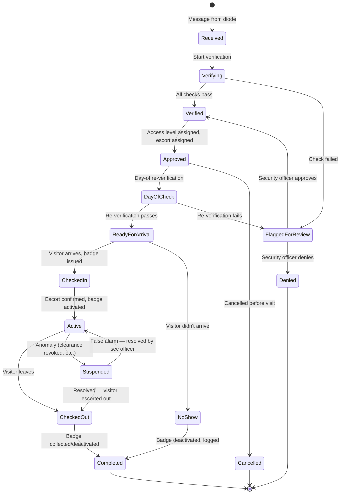
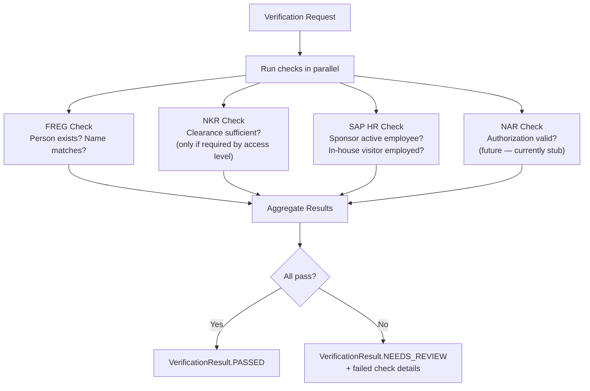
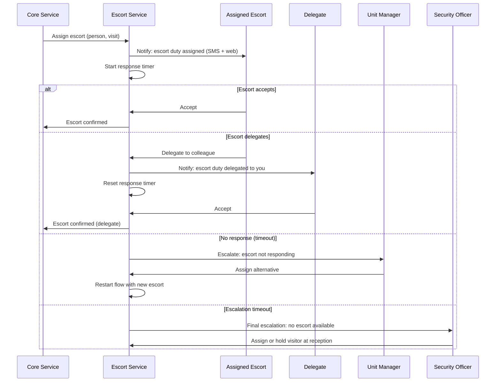
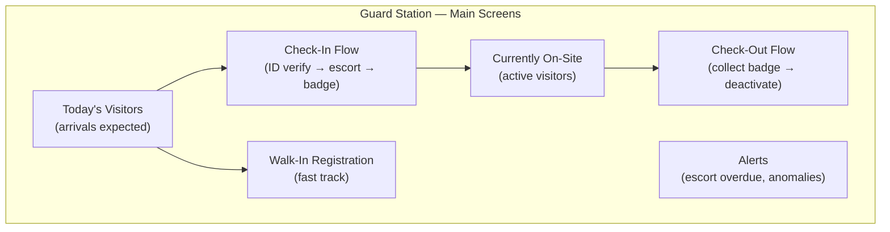
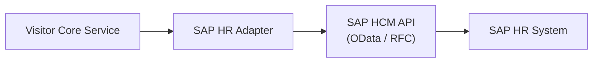

# 07 — RESTRICTED Side Services

> Parent: [00-overview.md](00-overview.md)

## 1. Service Architecture

```mermaid
graph TB
    subgraph RESTRICTED["RESTRICTED Side — Normal User VLAN"]
        GW["Diode Message Gateway<br/>(TypeScript)"]
        CONVEX["Convex Backend<br/>(TypeScript)"]
        DB[("PostgreSQL<br/>(audit log + OnGuard mock)")]
        CONVEX_DB[("Convex DB<br/>(reactive application state)")]
    end

    subgraph UIS["User Interfaces"]
        GUARD_UI["Guard Station UI<br/>(reception terminal)"]
        SEC_UI["Security Officer Dashboard"]
        ESCORT_UI["Escort Mobile Web"]
        MANAGER_UI["Unit Manager Dashboard"]
        ADMIN_UI["Site Admin Panel"]
        AUDIT_UI["Auditor Dashboard<br/>(read-only)"]
    end

    subgraph INTEGRATIONS["Register & System Integrations"]
        FREG["FREG"]
        NKR["NKR"]
        NAR["NAR (future)"]
        SAP["SAP HR"]
    end

    subgraph LOCK["Lock VLAN"]
        OG["OnGuard<br/>(OpenAccess API)"]
        ENCODER["Card Encoders"]
        PRINTER["Badge Printers"]
    end

    GW --> CONVEX
    CONVEX --> CONVEX_DB
    CONVEX --> DB

    CONVEX -->|"actions"| FREG
    CONVEX -->|"actions"| NKR
    CONVEX -->|"actions"| NAR
    CONVEX -->|"actions"| SAP

    CONVEX -->|"actions (mTLS via firewall)"| OG
    CONVEX --> ENCODER
    CONVEX --> PRINTER

    GUARD_UI --> CONVEX
    SEC_UI --> CONVEX
    ESCORT_UI --> CONVEX
    MANAGER_UI --> CONVEX
    ADMIN_UI --> CONVEX
    AUDIT_UI --> DB
```

## 2. Core Services

### 2.1 Visitor Core Service

The central orchestrator for all visitor operations on RESTRICTED.

**Responsibilities:**
- Process incoming visit requests from diode gateway
- Orchestrate verification workflow
- Manage visit state machine
- Coordinate with badge service and escort service
- Emit audit events for all state changes

### Visit State Machine

### 2.2 Verification Service

Orchestrates identity and authorization checks across all registers.

### 2.3 Escort Management Service

Handles escort assignment, notification, delegation, and confirmation.

**Escort rules:**
- Escort must be confirmed **before** badge is activated
- Walk-in visitors always require escort (no exceptions)
- Escort can delegate, but delegation chain is logged
- Escort is responsible until check-out is completed
- Multiple visitors can share an escort (if site policy allows)

### 2.4 Badge Service

Interfaces with OnGuard and physical card infrastructure.

**Operations:**

| Operation | Flow |
|---|---|
| **Issue new badge** (external visitor) | Select card from pool → Create cardholder in OnGuard → Assign access levels → Encode DESFire app → Print photo badge → Activate |
| **Encode existing card** (in-house visitor) | Read card UID → Create visitor cardholder in OnGuard → Assign access levels → Encode visitor app on existing DESFire → Activate |
| **Deactivate** | Deactivate badge in OnGuard → Wipe visitor app (if existing card) or collect card (if pool card) |
| **Emergency revoke** | Immediately deactivate in OnGuard → Alert guard station → Alert escort |

## 3. User Interfaces & Roles

### 3.1 Role Matrix

| Role | Guard Station | Sec Officer Dashboard | Escort Mobile | Unit Manager | Site Admin | Auditor |
|---|---|---|---|---|---|---|
| **Reception Guard** | Full access | — | — | — | — | — |
| **Security Officer** | View only | Full access | — | View only | — | View only |
| **Escort** | — | — | Full access | — | — | — |
| **Unit Manager** | — | — | — | Full access | — | — |
| **Site Administrator** | — | View only | — | — | Full access | — |
| **System Auditor** | — | — | — | — | — | Full access |

### 3.2 Guard Station UI

**Context**: Optimized for speed and usability at a busy reception desk. Touch-friendly. Large text and buttons.

**Key requirements:**
- List of expected visitors for today, sorted by arrival time
- One-click check-in: verify face, confirm escort, trigger badge print
- Badge printer integration: print and encode in one operation
- Walk-in mode: streamlined registration with verbal sponsor confirmation
- Loud/visible alerts for overdue escorts or security anomalies
- Works offline for 30 minutes (cache today's data, queue actions)

### 3.3 Security Officer Dashboard

**Context**: Desktop application for complex decision-making and policy management.

**Key screens:**
- **Approval queue**: Pending visit requests needing manual review (sorted by priority)
- **Exception log**: Previously approved exceptions with rationale
- **Active alerts**: Anomalies requiring attention (clearance revoked mid-visit, etc.)
- **Visitor search**: Search all visitor records by name, company, date range, status
- **Audit trail**: Full event history for any visit, with cryptographic chain verification
- **Reports**: Daily/weekly/monthly visitor statistics, denial rates, exception rates
- **Batch approvals**: Review and approve/deny batch access requests

### 3.4 Escort Mobile Web

**Context**: Mobile-optimized web application. Escorts use their phone.

**Key screens:**
- **My duties**: Upcoming escort assignments
- **Accept / Delegate**: Accept escort duty or delegate to a colleague
- **Active escort**: Currently escorting (visitor name, access areas, time remaining)
- **Complete**: Confirm visitor returned to reception

### 3.5 Unit Manager Dashboard

**Context**: Desktop application for area managers.

**Key screens:**
- **Upcoming visitors**: Calendar view of visitors coming to the unit
- **Escort roster**: Authorized escorts for the unit; manage who can be assigned
- **Batch approvals**: Pre-approve frequent visitors
- **Statistics**: Visit frequency, common visitors, peak times

### 3.6 Site Administrator Panel

**Context**: Configuration and system management.

**Key functions:**
- Manage access level templates (zone combinations)
- Configure identity score thresholds per access template
- Manage OnGuard integration settings (API endpoint, credentials)
- User role assignment
- Site-specific policy configuration (batch approval max period, escort timeout, etc.)

### 3.7 Auditor Dashboard

**Context**: Read-only access for compliance and investigation.

**Key functions:**
- Search all visitor records (with advanced filters)
- View full audit trail for any visit (every state change, every action, who/when)
- Verify cryptographic chain integrity for access decisions
- Export reports (CSV, PDF) for compliance audits
- Data retention monitoring: what's due for deletion, what's been purged

## 4. Site Size Adaptations

The system adapts to different site sizes:

| Feature | Large Site | Medium Site | Small Site |
|---|---|---|---|
| Guard stations | Multiple (outer gate, inner reception, roving) | Single reception | None (card reader only) |
| Badge printing | On-site, multiple printers | On-site, single printer | Pre-issued badges required |
| Walk-in support | Full guard-assisted | Full guard-assisted | Not supported (pre-register only) |
| Escort management | Full (SMS, escalation, delegation) | Full | Simplified (sponsor meets at gate) |
| Security officer | On-site, dedicated | On-site or remote | Remote (covers multiple small sites) |
| OnGuard | Local instance | Local instance | May share instance with nearby large site |

## 5. Offline / Degraded Mode

The RESTRICTED side must remain functional even when components fail.

| Failure | Impact | Mitigation |
|---|---|---|
| Diode unavailable | No new visit requests arrive. No status updates to unclassified. | Local operations continue. Queue outbound messages. Process backlog when restored. |
| FREG unavailable | Cannot verify person identity | Security officer can approve with manual verification + exception logging |
| NKR unavailable | Cannot verify clearance | Block high-security access. Standard visits may proceed at security officer discretion. |
| SAP HR unavailable | Cannot verify sponsor/employee | Security officer can approve with manual confirmation |
| OnGuard unavailable | Cannot provision or activate badges | **Critical**: Issue temporary paper passes. Log manually. Backfill in OnGuard when restored. |
| PostgreSQL unavailable | Cannot process visits | **Critical**: Guard station falls back to offline cache (today's expected visitors). All actions queued for replay. |
| Guard station network | Terminal loses connection to core service | Offline mode: display cached visitor list. Queue check-in/out actions. Sync on reconnect. |

## 6. SAP HR Integration

### Integration Approach

### Required Queries

| Query | Input | Output | Used For |
|---|---|---|---|
| Is person employed? | Employee ID or name | Active/inactive, employment dates | Sponsor verification, in-house visitor |
| Which unit? | Employee ID | Organizational unit, department | Determining host unit, access scope |
| Which site? | Employee ID | Assigned physical site(s) | Cross-site visit detection |
| Is person escort-eligible? | Employee ID, site | Yes/no (based on role/training) | Escort assignment validation |

### Caching
- Employee data cached for 24 hours (Redis)
- Cache invalidated on day-of re-verification
- Stale cache acceptable for display; fresh data required for access decisions
