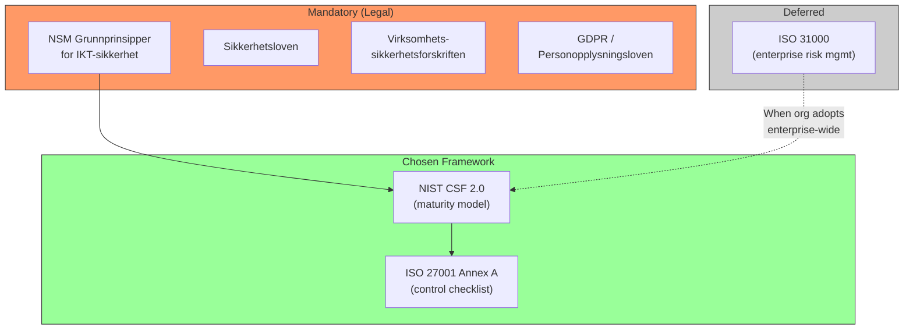
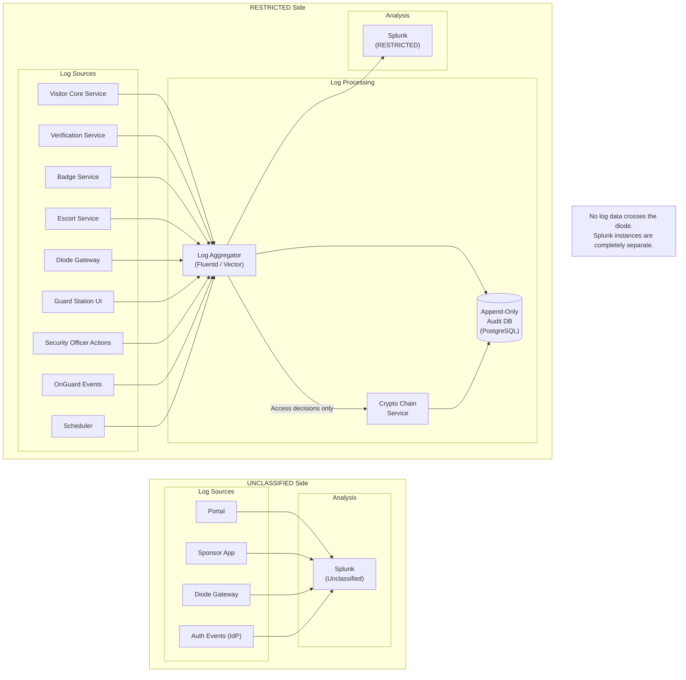
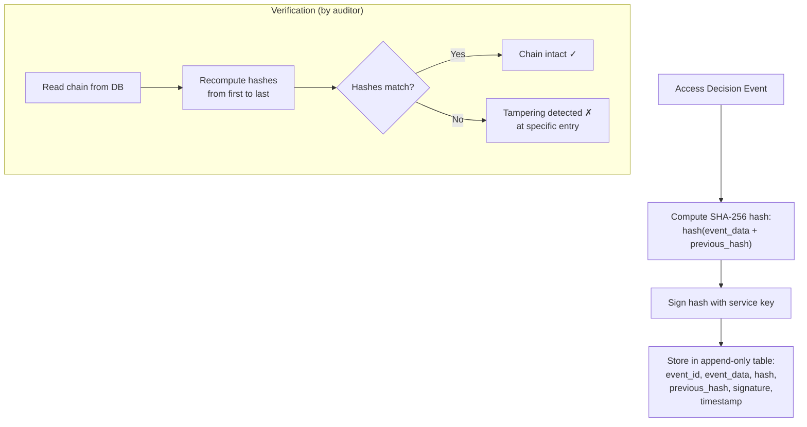
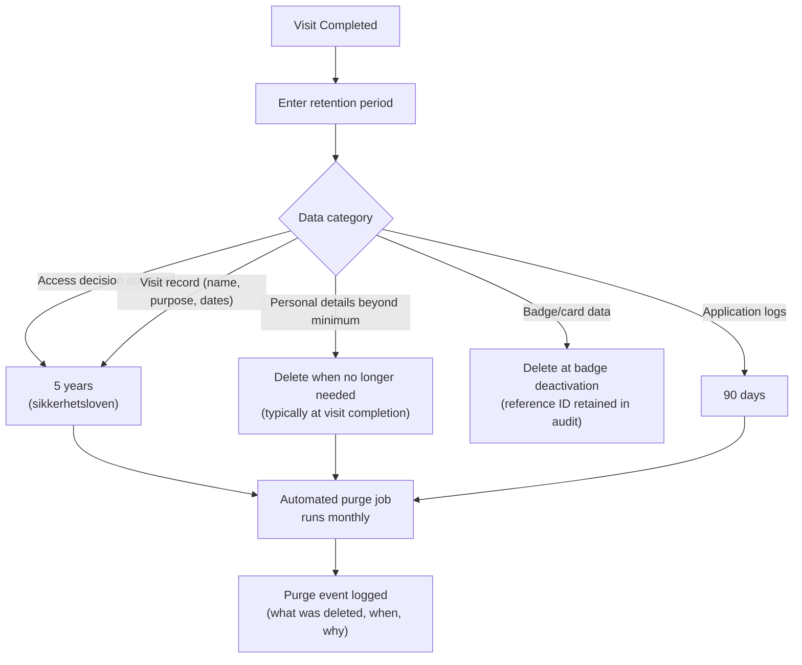
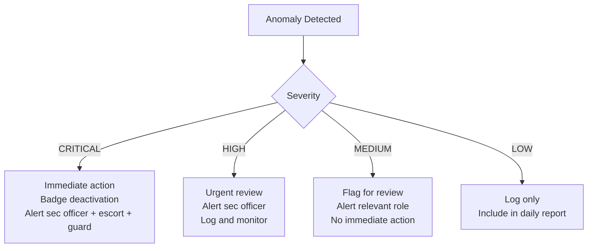

# 08 — Audit & Compliance

> Parent: [00-overview.md](00-overview.md)

## 1. Compliance Framework

### Recommendation: NSM + NIST CSF 2.0, with ISO 27001 Annex A as checklist



### Framework Comparison (For Decision Makers)

| Option | Components | Benefits | Drawbacks | Overhead |
|---|---|---|---|---|
| **A: NSM only** | NSM Grunnprinsipper | Legal minimum. Well understood in sector. | No international recognition. Less structured risk management. | Low |
| **B: NSM + ISO 27001** | NSM + full ISMS | Certifiable. International recognition. Structured controls. | Certification cost (100-300kNOK/year). Heavy documentation. 3-6 month overhead. | High |
| **C: NSM + ISO 27001 + ISO 31000** | Full stack | Formal risk management on top of ISMS. Enterprise consistency. | ISO 31000 is guidance, not certifiable. Overhead without org-wide adoption. | Very High |
| **D: NSM + NIST CSF 2.0** (**Recommended**) | NSM + NIST maturity + ISO 27001 checklist | Legal compliance + clear maturity model + practical controls. No certification cost. | US-centric terminology. No formal certification. | Medium |

### Why Option D?

- **NSM is non-negotiable** — it's the law for RESTRICTED systems
- **NIST CSF 2.0** provides clear maturity tiers (Govern/Identify/Protect/Detect/Respond/Recover) that map well to NSM's own structure
- **ISO 27001 Annex A** is used as a **checklist during design** (93 controls covering access, encryption, logging, etc.) without the overhead of formal ISMS certification
- **ISO 31000** deferred — only valuable if the organization adopts it enterprise-wide
- Survives external pentest scrutiny: every control can be mapped to NSM + NIST

### NIST CSF 2.0 Mapping to VMS

| NIST Function | VMS Application |
|---|---|
| **GOVERN** | Security policies, roles, compliance requirements documented |
| **IDENTIFY** | Asset inventory, data classification, risk assessment, threat model |
| **PROTECT** | Authentication (Mil Feide, ID-porten), encryption (mTLS, AES), access control (OnGuard), data minimization |
| **DETECT** | Anomaly detection (see Section 5), log monitoring (Splunk), day-of re-verification |
| **RESPOND** | Incident scenarios (see Section 5), escalation chains, badge revocation |
| **RECOVER** | Offline/degraded mode, backup/restore, diode message replay |

## 2. Logging Architecture

### Overview



### Structured Log Format

All log entries follow a consistent JSON structure:

```json
{
    "timestamp": "2026-02-24T09:15:32.456+01:00",
    "level": "INFO",
    "service": "visitor-core",
    "eventType": "VISIT_STATE_CHANGE",
    "correlationId": "550e8400-e29b-41d4-a716-446655440000",
    "visitId": "V-2026-001234",
    "actor": {
        "type": "USER",
        "id": "emp-5678",
        "role": "SECURITY_OFFICER",
        "ip": "10.x.1.42"
    },
    "action": "APPROVE_VISIT",
    "subject": {
        "type": "VISIT",
        "id": "V-2026-001234",
        "visitorName": "redacted-in-logs"
    },
    "result": "SUCCESS",
    "details": {
        "previousState": "FLAGGED_FOR_REVIEW",
        "newState": "APPROVED",
        "exceptionReason": "Manual override: company verification pending Brønnøysund update"
    }
}
```

### Log Categories

| Category | Content | Storage | Retention |
|---|---|---|---|
| **Access decisions** | Approve, deny, badge activate/deactivate, access level changes | Append-only DB + crypto chain + Splunk | 5 years (sikkerhetsloven) |
| **Security events** | Login attempts, privilege escalation, anomaly triggers | Append-only DB + Splunk | 5 years |
| **Operational events** | State changes, verification results, escort assignments | Append-only DB + Splunk | 5 years |
| **Application logs** | Debug info, performance metrics, errors | Splunk only | 90 days |
| **Personal data access** | Who accessed which personal data (GDPR audit) | Append-only DB | Until data subject's record is deleted |

## 3. Tamper-Evident Logging

### Approach: Append-Only DB + Cryptographic Chain for Access Decisions



### Append-Only Database Design

```sql
-- Audit events table: no UPDATE or DELETE grants
CREATE TABLE audit_events (
    event_id        BIGSERIAL PRIMARY KEY,
    event_timestamp TIMESTAMPTZ NOT NULL DEFAULT NOW(),
    event_type      TEXT NOT NULL,
    service         TEXT NOT NULL,
    correlation_id  UUID NOT NULL,
    actor_id        TEXT NOT NULL,
    actor_role      TEXT NOT NULL,
    action          TEXT NOT NULL,
    subject_type    TEXT NOT NULL,
    subject_id      TEXT NOT NULL,
    result          TEXT NOT NULL,
    details         JSONB,
    -- Crypto chain (access decisions only)
    chain_hash      TEXT,  -- SHA-256 hash including previous entry
    previous_hash   TEXT,  -- Reference to previous chain entry
    signature       TEXT   -- Digital signature of chain_hash
);

-- Service account: INSERT only
GRANT INSERT ON audit_events TO visitor_service;
-- No UPDATE, DELETE, or TRUNCATE granted

-- Auditor account: SELECT only
GRANT SELECT ON audit_events TO auditor;
```

**What gets chained** (access decisions only):
- Visit approved / denied
- Badge activated / deactivated
- Access level assigned / revoked
- Emergency revocation
- Security officer overrides / exceptions

**What is logged but not chained** (standard audit):
- State transitions, verification results, escort assignments, notification events

## 4. Data Retention

### Regulatory Basis

| Regulation | Requirement | Impact |
|---|---|---|
| **Sikkerhetsloven** | Security audit trail for classified systems | 5-year minimum retention for access-related events |
| **Virksomhetssikkerhetsforskriften** | Records of access to protected areas | Visit records, badge issuance, access events |
| **GDPR / Personopplysningsloven** | Data minimization, purpose limitation, storage limitation | Delete personal data when purpose is fulfilled; retain only what's legally required |

### Retention Policy



### Automated Retention Implementation

| Component | Mechanism |
|---|---|
| **Retention scheduler** | Kubernetes CronJob, runs monthly |
| **Category tagging** | Each record tagged with retention category at creation |
| **Purge job** | Deletes records past retention date; logs purge in audit trail |
| **Legal hold** | Override mechanism: security officer can place legal hold on specific records (e.g., ongoing investigation) |
| **Verification** | Auditor dashboard shows retention compliance: records approaching expiry, records past expiry not yet purged |

## 5. Incident & Anomaly Scenarios

### For Workshop Discussion

These scenarios are prepared as input for stakeholder workshops. Responses should be refined with security officers and operations teams.



| # | Scenario | Severity | Detection | Proposed Response | Alert To |
|---|---|---|---|---|---|
| 1 | Clearance revoked during active visit | CRITICAL | Day-of re-verification or pushed notification from NKR | Immediate badge deactivation. Escort instructed to accompany visitor to reception. | Security officer, escort, guard station |
| 2 | Badge used after visit window expired | HIGH | OnGuard event: access denied (time expired) | Door denies access (OnGuard handles). Log anomaly event. Investigate if badge should have been collected. | Security officer |
| 3 | Escort not confirmed within timeout | MEDIUM | Escort service timer | Escalate to unit manager. If no response, escalate to security officer. Visitor held at reception. | Unit manager → security officer |
| 4 | Same person has overlapping visits at different sites | LOW | Core service detects during approval | Flag for review. Could be legitimate (multi-day) or data inconsistency. | Security officer (informational) |
| 5 | Identity score drops (credential revoked) | MEDIUM | Re-verification detects | Flag pending visits for re-verification. Do not auto-cancel. | Security officer |
| 6 | Repeated failed badge reads at a reader | HIGH | OnGuard event pattern | Could indicate cloning attempt or faulty reader. Log pattern. Dispatch facilities check. | Security officer, facilities |
| 7 | Diode message delivery failure | HIGH | Gateway retry exhaustion | Alert system admin. Queued visits continue to wait. No auto-approve. Manual fallback. | System admin |
| 8 | Bulk visitor registrations from single source | MEDIUM | Portal rate monitoring | Flag for review. Could be legitimate project ramp-up or compromised account. | Security officer |
| 9 | Visit approved, visitor never arrived | LOW | Scheduler: visit window expired, no check-in | Auto-deactivate badge. Log no-show. Inform sponsor. | Sponsor (informational) |
| 10 | Sponsor no longer employed (HR reports) | HIGH | SAP HR integration detects | Flag all pending visits sponsored by this person. Require re-assignment to new sponsor. | Security officer, unit manager |

## 6. Pentest Readiness

The system is designed for formal security accreditation from day one.

### Pre-Pentest Deliverables

| Deliverable | Description | When |
|---|---|---|
| **Threat model** | STRIDE analysis of all components and data flows | Design phase |
| **Architecture security review** | Independent review of architecture diagrams and design decisions | Before implementation |
| **Attack surface map** | All exposed interfaces: APIs, UIs, diode messages, OnGuard integration | Before pentest |
| **Security controls matrix** | Mapping of controls to NSM/NIST requirements | Before pentest |
| **Data flow diagrams** | What data flows where, classification level, encryption status | Design phase |

### Security Controls Summary

| Control Area | Implementation |
|---|---|
| **Authentication** | Mil Feide (OIDC), ID-porten (OIDC), service-to-service mTLS |
| **Authorization** | RBAC with role matrix (see [07-restricted-services.md](07-restricted-services.md)) |
| **Encryption in transit** | TLS 1.3 for all internal services. mTLS between VLANs. |
| **Encryption at rest** | PostgreSQL transparent data encryption. Kubernetes secrets encrypted. |
| **Input validation** | Parameterized queries, input sanitization, schema validation on XML messages |
| **API security** | OAuth 2.0 + scoped tokens for OnGuard. Rate limiting. Request size limits. |
| **Secrets management** | HashiCorp Vault or Kubernetes secrets with encryption at rest |
| **Container security** | Pod security standards (restricted). No privileged containers. Image signing. Network policies. |
| **Logging** | Append-only audit log. Cryptographic chain for access decisions. Ship to Splunk. |
| **Message integrity** | XML-DSig on all diode messages |
| **OWASP Top 10** | Addressed in coding standards and security review checklist |
