# 09 — Open Questions & Workshop Topics

> Parent: [00-overview.md](00-overview.md)

## 1. Decisions Needed

These require stakeholder input before implementation can proceed.

| # | Question | Options | Blocked By | Impact Area |
|---|---|---|---|---|
| 1 | ~~**Frontend framework**~~ | ~~SvelteKit vs React~~ → **Decided: React** (Convex first-class integration) | ~~Team capability assessment~~ | All UIs |
| 2 | **OnGuard upgrade target** | 8.x stay vs upgrade to latest | Lenel vendor engagement | OpenAccess API features available |
| 3 | **DESFire PICC key ceremony** | When, who, HSM procurement | Central authority designation | Card provisioning start date |
| 4 | **Identity score thresholds** | Exact point values per access level | Security policy workshop | Identity verification |
| 5 | **Batch approval max period** | 1 month? 3 months? 6 months? | Security officer input | Recurring visitor workflow |
| 6 | **Escort timeout duration** | 5 min? 10 min? 15 min? | Operations team input | Escort management |
| 7 | **Walk-in access level** | Always escorted-only, or exceptions? | Security policy | Walk-in workflow |
| 8 | **Legal data retention exact periods** | Per data category | Legal counsel review | Data retention automation |
| 9 | **Diode product per site** | Which product, what constraints | Site-specific discovery | Message gateway adapters |
| 10 | **CI/CD tooling** | GitLab CI, Jenkins, other | Infrastructure team | Build pipeline, especially air-gapped builds |
| 11 | **Mil Feide readiness** | When available? What claims/attributes? | IdP project team | Authentication integration |
| 12 | **NAR integration timeline** | When will API be available? | NAR project team | Authorization verification |

## 2. Workshop Topics

These require facilitated discussions with multiple stakeholders.

### Workshop 1: Security Policies & Access Control

**Participants**: Security officers, facility managers, site commanders

**Agenda:**
- Review and refine identity score thresholds per access level
- Define access level templates per site (which zones, which combinations)
- Agree on approval tiers and escalation paths
- Walk-in policy: access level, escort requirements, documentation
- High-security visit process: what stays paper-based, what gets digitized (future)
- Batch approval policy: duration limits, review cadence, revocation triggers

### Workshop 2: Incident Response & Anomaly Handling

**Participants**: Security officers, operations team, IT security

**Agenda:**
- Review and refine the 10 anomaly scenarios (see [08-audit-compliance.md](08-audit-compliance.md))
- Define alert severity levels and response times
- Agree on escalation chains per severity
- Discuss automated vs manual responses
- Define what triggers emergency badge revocation
- Offline/degraded mode procedures: what does the guard do when OnGuard is down?

### Workshop 3: Diode Integration & Cross-Site Operations

**Participants**: IT infrastructure, network security, site IT admins

**Agenda:**
- Inventory of diode products per site, with capability matrix
- Message size limits, latency measurements, reliability testing plans
- XML schema review: is the proposed envelope sufficient?
- Cross-site message routing: how does unclassified WAN connectivity work between sites?
- Diode gateway deployment: containerized in K8s or standalone?
- Failover and message replay procedures

### Workshop 4: DESFire Card Architecture & Key Management

**Participants**: Physical security, Lenel administrators, IT security

**Agenda:**
- PICC master key ownership model (central vs delegated) — confirm delegated
- Number of application slots to pre-allocate per card
- Key management infrastructure: HSM procurement, key ceremony procedures
- Reader upgrade plan per site: timeline, budget, installation sequence
- Transition period: dual-tech reader configuration, legacy card sunset date
- Card pool management for external visitors: pool sizes, replenishment, physical security

### Workshop 5: User Experience & Branding

**Participants**: UX designer, communications, representative sponsors, representative visitors

**Agenda:**
- Portal branding: logo, colors, tone of voice
- Trust signals: how to make external visitors trust the portal is legitimate
- Visitor journey mapping: from first hearing about a visit to walking out the door
- Guard station UX: observed workflow at actual reception desks
- Accessibility requirements review (WCAG 2.1 AA)
- Language and tone: Norwegian vs English defaults, error messages, notification wording

### Workshop 6: Integration Architecture

**Participants**: Backend developers, integration specialists, SAP HR admin, Lenel admin

**Agenda:**
- SAP HR API: available endpoints, authentication, rate limits
- OnGuard OpenAccess API: enabling process, testing environment
- FREG integration: existing client libraries, authentication, error handling
- NKR integration: API capabilities, response times, availability SLA
- Brønnøysund API: rate limits, caching strategy, data freshness
- ID-porten integration: OIDC configuration, test environment (Ver2)

## 3. Technical Spikes Needed

Short investigations to reduce uncertainty before full implementation.

| # | Spike | Purpose | Duration | Output |
|---|---|---|---|---|
| 1 | **OnGuard OpenAccess API proof-of-concept** | Verify we can create cardholders, assign access, activate badges programmatically | 1-2 weeks | Working PoC + API capability report |
| 2 | **DESFire multi-app encoding** | Verify multi-application encoding works with OnGuard's credential format | 1-2 weeks | Working PoC: two apps on one card, both readable by OnGuard |
| 3 | **Diode message round-trip** | Verify XML message can be sent and received through actual diode | 1 week | Working message flow + latency measurements |
| 4 | **ID-porten OIDC integration** | Verify OIDC flow with ID-porten test environment | 3-5 days | Working auth flow in test app |
| 5 | **SAP HR API integration** | Verify we can query employment status and org unit | 3-5 days | Working API client + response format documentation |
| 6 | **Kubernetes on-prem for RESTRICTED** | Verify K8s deployment works in air-gapped environment (image registry, etc.) | 1-2 weeks | Deployment playbook for air-gapped K8s |
| 7 | **Cross-VLAN OnGuard API access** | Verify firewall rules allow API calls from Normal VLAN to Lock VLAN | 1-2 days | Network connectivity confirmed |

## 4. Risk Register

> **Initial risk register has been expanded into a comprehensive risk analysis.**
> See [10-risk-analysis.md](10-risk-analysis.md) for the full 28-item risk register with:
> - Likelihood × impact scoring methodology
> - Risk heatmap
> - Detailed treatment plans for all HIGH and CRITICAL risks
> - Residual risk assessment
> - Monitoring cadence and early warning indicators
>
> See [11-swot-analysis.md](11-swot-analysis.md) for strategic analysis of project positioning.

## 5. Suggested Phased Rollout

```mermaid
graph LR
    subgraph P0["Phase 0: Foundation<br/>(8-12 weeks)"]
        SPIKES["Technical spikes<br/>(all 7)"]
        WORKSHOPS["Workshops 1-6"]
        ARCH["Architecture review"]
        INFRA["K8s setup, CI/CD,<br/>DB, monitoring"]
    end

    subgraph P1["Phase 1: Core MVP<br/>(12-16 weeks)"]
        MSG["Diode messaging<br/>gateway"]
        VERIFY_SVC["Verification service<br/>(FREG, NKR, SAP)"]
        CORE_SVC["Visitor core service<br/>(state machine)"]
        GUARD["Guard station UI<br/>(basic)"]
        BADGE_SVC["Badge service<br/>(OnGuard integration)"]
    end

    subgraph P2["Phase 2: Unclassified + Escort<br/>(8-12 weeks)"]
        PORTAL_BUILD["Visitor portal<br/>(ID-porten)"]
        SPONSOR_BUILD["Sponsor app<br/>(Mil Feide)"]
        ESCORT_BUILD["Escort management"]
        NOTIF["Notifications<br/>(email + SMS)"]
    end

    subgraph P3["Phase 3: Advanced<br/>(8-12 weeks)"]
        CONTRACTOR_BUILD["Contractor admin<br/>portal"]
        BATCH["Batch approvals"]
        CROSS_SITE["Cross-site visits"]
        AUDIT_DASH["Auditor dashboard"]
        MULTI_SITE["Multi-site rollout"]
    end

    subgraph P4["Phase 4: Polish<br/>(ongoing)"]
        SCORE["Identity scoring<br/>refinement"]
        NAR_INT["NAR integration<br/>(when ready)"]
        ANALYTICS["Analytics &<br/>reporting"]
        DESFIRE_FULL["Full DESFire<br/>multi-site"]
    end

    P0 --> P1
    P1 --> P2
    P2 --> P3
    P3 --> P4
```

### Phase 0 Deliverables (Go/No-Go Gate)
Before committing to full implementation, Phase 0 must deliver:
1. All 7 technical spikes completed with positive results (or documented fallbacks)
2. Workshops completed, key decisions made
3. Architecture review passed
4. Infrastructure ready (K8s, CI/CD, databases, monitoring)
5. Development team staffed and onboarded

### Pilot Strategy
- **Pilot site**: Choose a medium-sized site with a cooperative security officer and guard team
- **Parallel run**: Run new system alongside existing process for 4-6 weeks
- **Success criteria**: Faster visitor processing, complete audit trail, no security incidents caused by the system
- **Rollout**: Site-by-site after pilot success, starting with similar-sized sites
