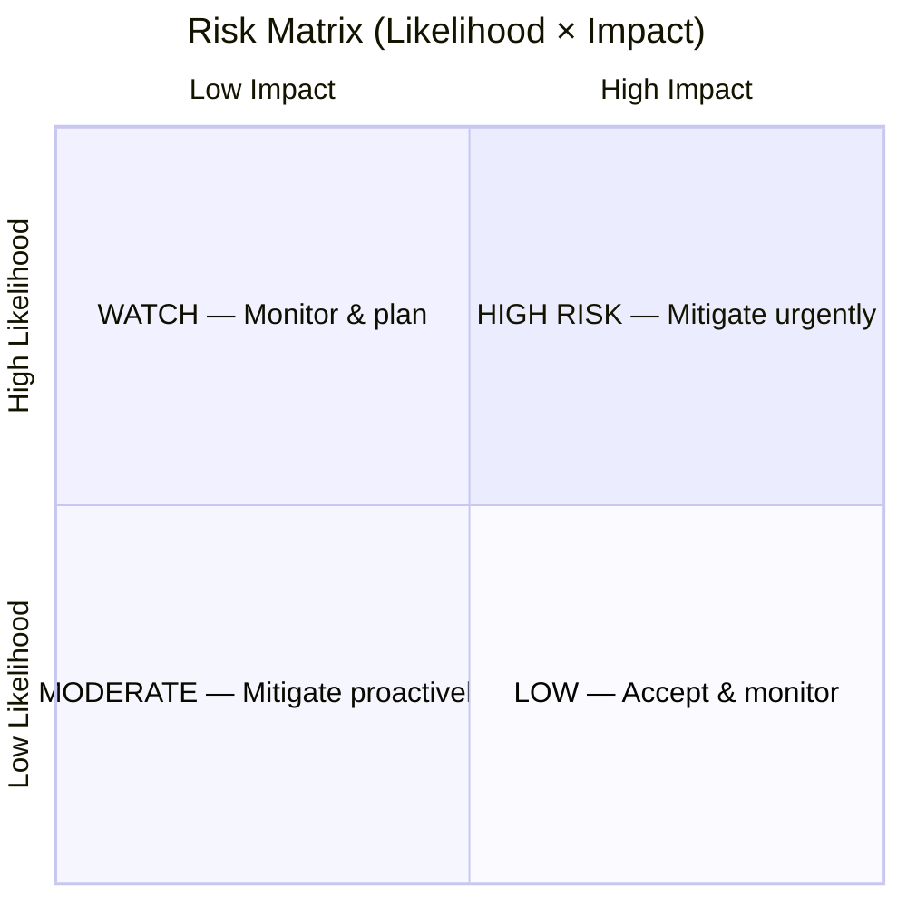
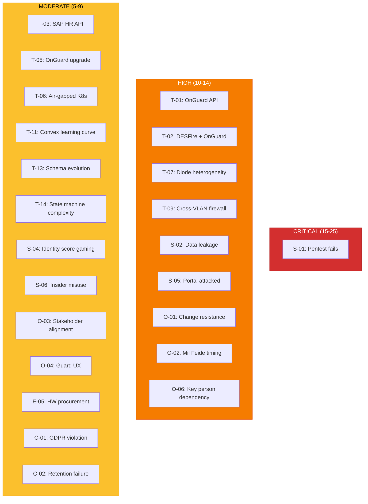
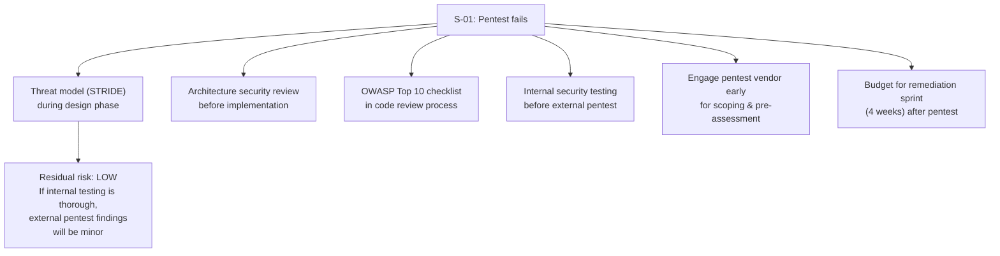
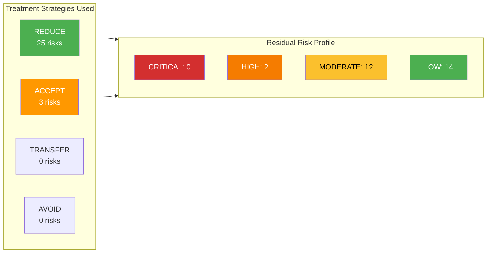

# 10 — Risk Analysis

> Parent: [00-overview.md](00-overview.md)
> Supersedes the initial risk register in [09-open-questions.md](09-open-questions.md)

## 1. Methodology

### Framework
This risk analysis follows **ISO 31000 principles** (without full ISO 31000 adoption) combined with **NSM's risikovurdering** approach for RESTRICTED systems. Risks are assessed qualitatively using a likelihood × impact matrix.

### Definitions

**Likelihood:**

| Level | Label | Description |
|---|---|---|
| 1 | Rare | Unlikely to occur within project lifetime. Requires exceptional circumstances. |
| 2 | Unlikely | Could occur but not expected. Has happened in similar projects. |
| 3 | Possible | Reasonable chance of occurring. Should be planned for. |
| 4 | Likely | Expected to occur at least once. Common in this domain. |
| 5 | Almost Certain | Will occur unless actively prevented. Known issue. |

**Impact:**

| Level | Label | Description |
|---|---|---|
| 1 | Insignificant | Minimal effect. Absorbed within normal operations. |
| 2 | Minor | Some rework needed. Schedule slip of days. No security impact. |
| 3 | Moderate | Significant rework. Schedule slip of weeks. Feature scope reduced. |
| 4 | Major | Fundamental redesign of a subsystem. Schedule slip of months. Potential security concern. |
| 5 | Critical | Project failure. Security breach. Regulatory non-compliance. Accreditation denied. |

### Risk Matrix

| Score (L × I) | Risk Level | Action |
|---|---|---|
| 15–25 | **CRITICAL** | Immediate mitigation required. Escalate to project steering. |
| 10–14 | **HIGH** | Active mitigation. Assign owner. Track weekly. |
| 5–9 | **MODERATE** | Planned mitigation. Track bi-weekly. |
| 1–4 | **LOW** | Accept and monitor. Review monthly. |

## 2. Risk Register

### Category: Technical — Integration

| ID | Risk | L | I | Score | Level | Owner |
|---|---|---|---|---|---|---|
| T-01 | **OnGuard OpenAccess API insufficient** — API does not support required operations (cardholder creation, access level assignment, time-bounded activation) or has undocumented limitations | 3 | 4 | 12 | HIGH | Tech Lead |
| T-02 | **DESFire multi-application incompatible with OnGuard credential format** — OnGuard may not support reading multiple independent applications on a single card, or requires proprietary format | 3 | 4 | 12 | HIGH | Physical Security Lead |
| T-03 | **SAP HR API limited or unreliable** — API may not expose required fields (unit, site, employment status) or may have low availability / high latency | 3 | 3 | 9 | MODERATE | Integration Lead |
| T-04 | **FREG/NKR integration dependencies** — Existing integrations may have rate limits, downtime windows, or data format changes that disrupt verification | 2 | 3 | 6 | MODERATE | Integration Lead |
| T-05 | **OnGuard version upgrade breaks API** — Planned but undefined upgrade could change API surface, credential format, or database schema | 3 | 3 | 9 | MODERATE | Tech Lead |

### Category: Technical — Infrastructure

| ID | Risk | L | I | Score | Level | Owner |
|---|---|---|---|---|---|---|
| T-06 | **Air-gapped Kubernetes deployment complexity** — Running K8s without internet access (image registry, Helm charts, operator updates) may be significantly harder than expected | 3 | 3 | 9 | MODERATE | Infrastructure Lead |
| T-07 | **Diode heterogeneity creates integration burden** — Multiple diode products across sites with different capabilities, message formats, and latency profiles | 4 | 3 | 12 | HIGH | Infrastructure Lead |
| T-08 | **Diode latency exceeds acceptable UX threshold** — If diode latency exceeds 5 minutes, walk-in registration becomes impractical and pre-registration confirmations feel unresponsive | 3 | 2 | 6 | MODERATE | Infrastructure Lead |
| T-09 | **Cross-VLAN firewall rules blocked by network policy** — Enabling API traffic from Normal VLAN to Lock VLAN may face resistance from network security teams or violate existing policies | 3 | 4 | 12 | HIGH | Network Security |
| T-10 | **NTP clock drift between sides** — Without GPS-fed NTP on RESTRICTED, clock drift could corrupt audit log correlation across the diode | 2 | 3 | 6 | MODERATE | Infrastructure Lead |

### Category: Technical — Development

| ID | Risk | L | I | Score | Level | Owner |
|---|---|---|---|---|---|---|
| T-11 | **Convex/TypeScript learning curve** — Team may need ramp-up time on Convex's reactive patterns and self-hosted deployment, causing initial velocity reduction | 2 | 2 | 4 | LOW | Tech Lead |
| T-12 | ~~**Frontend framework decision paralyzes start**~~ — **Resolved**: React selected (Convex first-class integration) | 1 | 1 | 1 | LOW | Tech Lead |
| T-13 | **XML message schema evolves mid-project** — Changing requirements cause repeated schema changes, breaking both sides of the diode integration | 3 | 3 | 9 | MODERATE | Tech Lead |
| T-14 | **State machine complexity leads to bugs** — Visit state machine (12+ states, many transitions) creates edge cases that are hard to test, especially around concurrent operations | 3 | 3 | 9 | MODERATE | Tech Lead |

### Category: Security

| ID | Risk | L | I | Score | Level | Owner |
|---|---|---|---|---|---|---|
| S-01 | **Pentest fails — accreditation denied** — External penetration test finds critical vulnerabilities that block go-live on RESTRICTED | 3 | 5 | 15 | CRITICAL | Security Lead |
| S-02 | **Data leakage across diode** — Sensitive data (clearance level, fødselsnummer) accidentally included in diode messages due to developer error or schema drift | 2 | 5 | 10 | HIGH | Security Lead |
| S-03 | **DESFire key compromise** — Site application master key is leaked or extracted, enabling badge cloning for that site | 1 | 5 | 5 | MODERATE | Physical Security Lead |
| S-04 | **Identity score gaming** — Attacker accumulates identity points through weak sources (email + SMS) to reach thresholds that should require strong sources | 2 | 4 | 8 | MODERATE | Security Lead |
| S-05 | **Internet portal attacked** — Public-facing portal is targeted by DDoS, credential stuffing, or injection attacks | 4 | 3 | 12 | HIGH | Security Lead |
| S-06 | **Insider misuse of security officer role** — Security officer approves visits without proper verification, or creates exceptions to bypass controls | 2 | 4 | 8 | MODERATE | Security Lead |
| S-07 | **Badge pool cards not properly wiped** — Returned visitor cards retain previous visitor's application data, allowing unauthorized access | 2 | 4 | 8 | MODERATE | Physical Security Lead |

### Category: Organizational & Change Management

| ID | Risk | L | I | Score | Level | Owner |
|---|---|---|---|---|---|---|
| O-01 | **Sites resist process change** — Guards, security officers, and sponsors resist new workflows, preferring current manual processes | 4 | 3 | 12 | HIGH | Project Manager |
| O-02 | **Mil Feide not ready in time** — Defense sector federated identity system is not available when the VMS needs it for sponsor authentication | 3 | 4 | 12 | HIGH | Project Manager |
| O-03 | **Stakeholder alignment failure** — Security department, facilities, and IT have conflicting priorities, causing scope disagreements and decision deadlocks | 3 | 3 | 9 | MODERATE | Project Manager |
| O-04 | **Guard station UX too complex** — Reception guards find the system slower than current paper/manual process, undermining adoption | 3 | 3 | 9 | MODERATE | UX Lead |
| O-05 | **Contractor admin role unclear** — External companies don't understand or trust the self-service system, falling back to phone calls and emails | 3 | 2 | 6 | MODERATE | Product Owner |
| O-06 | **Key personnel dependency** — Critical knowledge (OnGuard admin, DESFire key ceremony, diode configuration) concentrated in 1-2 people per site | 4 | 3 | 12 | HIGH | Project Manager |
| O-07 | **Multi-site rollout creates support burden** — Supporting different site sizes, different diode products, and different OnGuard instances simultaneously overwhelms the team | 3 | 3 | 9 | MODERATE | Project Manager |

### Category: External Dependencies

| ID | Risk | L | I | Score | Level | Owner |
|---|---|---|---|---|---|---|
| E-01 | **NAR project delays or fails** — Nasjonalt Autorisasjonsregister never delivers an API, leaving authorization verification as a permanent manual process | 3 | 2 | 6 | MODERATE | Project Manager |
| E-02 | **Lenel vendor uncooperative** — HID/Lenel does not provide adequate support for OpenAccess API customization or DESFire credential format questions | 2 | 3 | 6 | MODERATE | Tech Lead |
| E-03 | **Regulatory changes** — Changes to sikkerhetsloven, GDPR implementation, or NSM guidelines during project require rework | 2 | 3 | 6 | MODERATE | Legal/Compliance |
| E-04 | **ID-porten policy changes** — Digdir changes ID-porten integration requirements, security levels, or pricing model | 2 | 2 | 4 | LOW | Integration Lead |
| E-05 | **Supply chain delays on DESFire cards/readers** — Hardware procurement (SIGNO readers, DESFire cards, OMNIKEY encoders, HSMs) delayed by months | 3 | 3 | 9 | MODERATE | Procurement |

### Category: Compliance & Legal

| ID | Risk | L | I | Score | Level | Owner |
|---|---|---|---|---|---|---|
| C-01 | **GDPR data minimization violation** — System stores more personal data than legally justified, leading to regulatory finding or complaint | 2 | 4 | 8 | MODERATE | Legal/Compliance |
| C-02 | **Retention policy implementation failure** — Automated purge doesn't work correctly, keeping data beyond legal retention period or deleting it too early | 2 | 4 | 8 | MODERATE | Tech Lead |
| C-03 | **Cross-border data implications for foreign visitors** — Storing foreign nationals' data on RESTRICTED system may trigger additional GDPR requirements (data transfer, legal basis) | 2 | 3 | 6 | MODERATE | Legal/Compliance |
| C-04 | **Audit trail insufficient for investigation** — In a real security incident, the audit trail lacks critical information needed to reconstruct events | 2 | 4 | 8 | MODERATE | Security Lead |

## 3. Risk Heatmap

## 4. Risk Treatment Plans

### CRITICAL Risks

#### S-01: Pentest Fails — Accreditation Denied

| Attribute | Detail |
|---|---|
| Treatment | Reduce |
| Actions | 1. STRIDE threat model during design. 2. Architecture review by independent security resource. 3. OWASP in code review gates. 4. Internal pentest before external. 5. 4-week remediation buffer in schedule. |
| Residual Risk | LOW (score 5) — known unknowns will remain, but critical/high findings should be prevented |
| Trigger for escalation | Internal pentest finds >3 high-severity findings |

### HIGH Risks

#### T-01 & T-02: OnGuard API / DESFire Compatibility

| Attribute | Detail |
|---|---|
| Treatment | Reduce (early validation) |
| Actions | **Technical spike #1 and #2** (see [09-open-questions.md](09-open-questions.md)). Execute within Phase 0, before committing to full implementation. |
| Fallback (T-01) | If OpenAccess API is insufficient: explore OnGuard database integration (less clean, vendor-unsupported) or DataConduIT SDK. |
| Fallback (T-02) | If multi-app DESFire doesn't work with OnGuard: issue separate visitor cards per site (abandon single-card goal). Functional loss, not project failure. |
| Residual Risk | LOW after spike — either it works or we commit to the fallback early |

#### T-07: Diode Heterogeneity

| Attribute | Detail |
|---|---|
| Treatment | Reduce (architecture) |
| Actions | 1. Message gateway abstraction already designed (see [05-diode-messaging.md](05-diode-messaging.md)). 2. During Phase 0, inventory all diode products per site. 3. Build gateway adapter for the most common product first. 4. Budget adapter development time per additional product. |
| Residual Risk | MODERATE — each new diode product requires adapter work, but the core system is unaffected |

#### T-09: Cross-VLAN Firewall Rules

| Attribute | Detail |
|---|---|
| Treatment | Reduce (early engagement) |
| Actions | 1. Engage network security team in Phase 0. 2. Document exact traffic requirements (single TCP 443 rule, specific source/destination IPs). 3. Provide security justification. 4. Technical spike #7 to verify connectivity. |
| Fallback | If VLAN crossing is permanently blocked: deploy a proxy/relay service on the Lock VLAN that exposes a minimal API, reducing the cross-VLAN surface. |
| Residual Risk | LOW after approval — this is a policy decision, not a technical problem |

#### S-02: Data Leakage Across Diode

| Attribute | Detail |
|---|---|
| Treatment | Reduce (defense in depth) |
| Actions | 1. XML schema validation at gateway — reject messages with fields not in schema. 2. Allowlist approach: gateway strips everything except explicitly permitted fields. 3. Automated tests: assert no sensitive field patterns (fødselsnummer regex, clearance level enums) in outbound messages. 4. Code review gate: any change to diode message payloads requires security review. |
| Residual Risk | LOW — multiple layers prevent accidental leakage |

#### S-05: Internet Portal Attacked

| Attribute | Detail |
|---|---|
| Treatment | Reduce (standard web security) |
| Actions | 1. WAF in front of portal. 2. Rate limiting on all endpoints. 3. CAPTCHA on registration. 4. DDoS protection (if available). 5. CSP headers, input validation, parameterized queries. 6. Separate infrastructure from VPN-protected zone. 7. Penetration test scope includes the portal. |
| Residual Risk | MODERATE — public internet exposure always carries residual risk, but standard mitigations are well understood |

#### O-01: Sites Resist Process Change

| Attribute | Detail |
|---|---|
| Treatment | Reduce (change management) |
| Actions | 1. Involve guard and security officer representatives in Workshop 5 (UX). 2. Pilot at willing site with champions. 3. Demonstrate time savings ("registration that took 15 min now takes 3 min"). 4. Parallel run period — don't force cold cutover. 5. Training program with hands-on sessions. 6. Feedback loop: collect and act on guard/officer complaints during pilot. |
| Residual Risk | MODERATE — some resistance will persist, but early involvement reduces it |

#### O-02: Mil Feide Not Ready

| Attribute | Detail |
|---|---|
| Treatment | Reduce (decouple) |
| Actions | 1. Design authentication as **pluggable adapter** (same pattern as NAR). 2. Use alternative IdP during development (Azure AD, Keycloak, local OIDC provider). 3. Swap to Mil Feide when ready. 4. Ensure OIDC claims are generic enough to work with any OIDC provider. |
| Residual Risk | LOW — system works without Mil Feide; just uses a different IdP temporarily |

#### O-06: Key Personnel Dependency

| Attribute | Detail |
|---|---|
| Treatment | Reduce (knowledge distribution) |
| Actions | 1. Document all procedures (OnGuard admin, key ceremony, diode config). 2. Pair training: no single person holds exclusive knowledge. 3. Runbooks for all operational tasks. 4. Cross-train at least 2 people per critical function per site. |
| Residual Risk | MODERATE — documentation helps, but deep expertise takes time to build |

## 5. Risk Response Summary

### Accepted Risks (no treatment, monitor only)

| ID | Risk | Why Accept |
|---|---|---|
| T-12 | Frontend framework decision | Low impact. Both options work. Set a deadline and pick. |
| E-04 | ID-porten policy changes | Low likelihood, low impact. Standard integration. |
| E-01 | NAR project delays | Already designed with stub adapter. System functions without it. |

## 6. Risk Monitoring

### Review Cadence

| Risk Level | Review Frequency | Forum |
|---|---|---|
| CRITICAL | Weekly | Project steering committee |
| HIGH | Bi-weekly | Project team meeting |
| MODERATE | Monthly | Risk review meeting |
| LOW | Quarterly | Status report |

### Early Warning Indicators

| Indicator | What It Signals | Triggered By |
|---|---|---|
| Technical spike fails or is inconclusive | T-01, T-02 integration risks materializing | Phase 0 results |
| Network security team pushes back on firewall rules | T-09 may block OnGuard integration | Phase 0 engagement |
| No Mil Feide test environment available by Phase 1 end | O-02 is materializing | IdP project status |
| Guard feedback during pilot is predominantly negative | O-01, O-04 need stronger intervention | Pilot metrics |
| >5 defects found in state machine edge cases during testing | T-14 complexity is real | QA metrics |
| Diode adapter taking >2 weeks per product | T-07 heterogeneity is worse than expected | Phase 1 velocity |
