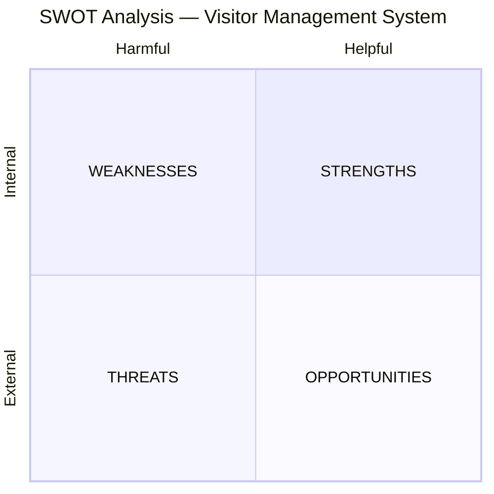
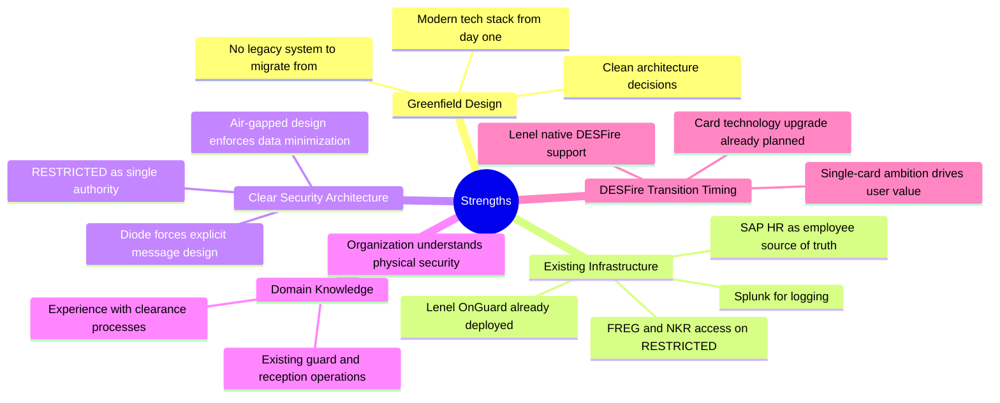
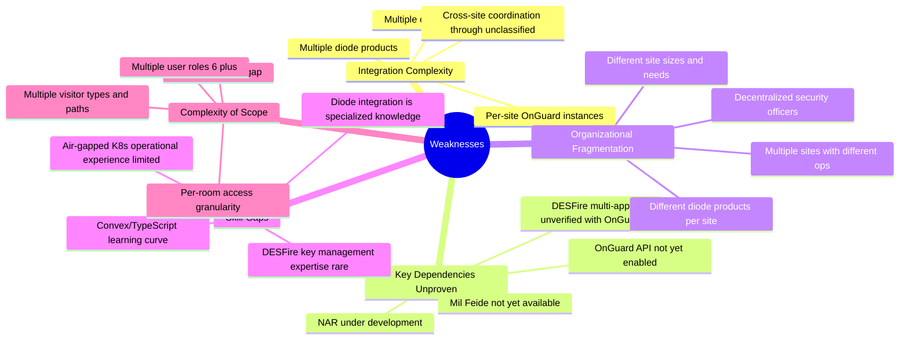
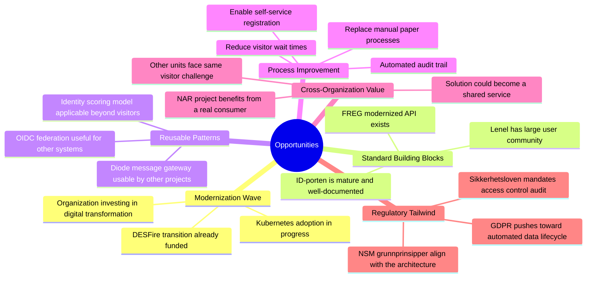
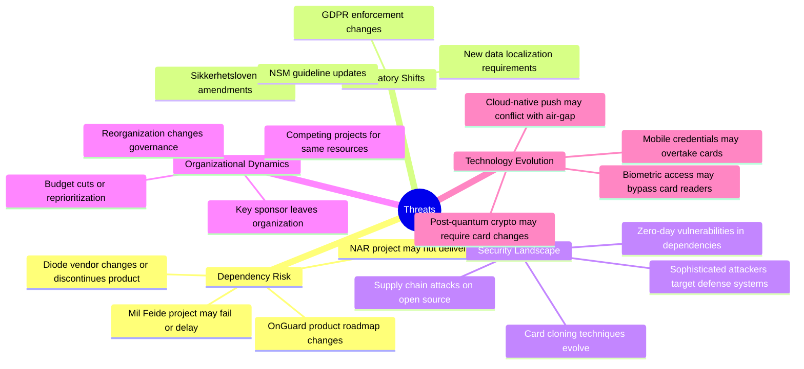

# 11 — SWOT Analysis

> Parent: [00-overview.md](00-overview.md)

## 1. Overview

This SWOT analysis examines the Visitor Management System project from a strategic perspective — what positions it for success, what may hold it back, and what external factors influence the outcome.

## 2. Strengths (Internal, Helpful)

### S1: Greenfield — No Legacy Migration

The system is being built from scratch. There is no existing visitor management software to migrate from, no data to convert, and no backward compatibility to maintain. This means:
- Architecture can be optimized for the actual requirements
- No technical debt from day one
- Modern patterns (event-driven, microservices, containerized) can be adopted without compromise
- Schema and API design can be done right the first time

### S2: Core Infrastructure Already In Place

Critical infrastructure already exists and is operational:
- **Lenel OnGuard 8.x** — the physical access control system is deployed and working
- **FREG and NKR access** — the most critical verification registers are already available on RESTRICTED
- **SAP HR** — employee data source is in production
- **Splunk** — log aggregation is operational
- **Data diodes** — bidirectional XML transfer capability exists
- **Kubernetes** — container orchestration capability on-prem

This reduces the "cold start" problem significantly. The project is building a new application layer, not new infrastructure.

### S3: Air Gap as Design Advantage

The air gap, while a constraint, is also a strength:
- **Forces data minimization** — you must explicitly decide what crosses the diode, preventing accidental over-sharing
- **Forces explicit message design** — no lazy REST API calls across the boundary; every message is deliberate
- **RESTRICTED as sole authority** — no ambiguity about where access decisions are made
- **Natural security boundary** — the architecture has defense in depth built into the topology

### S4: Organizational Domain Expertise

The organization has deep experience with:
- Physical security operations (guards, reception, escort procedures)
- Security clearance processes (NKR, authorization)
- Card-based access control (Lenel, readers, locks)
- Working within RESTRICTED environments

This domain knowledge de-risks requirements gathering and reduces the chance of building the wrong thing.

### S5: DESFire Transition Creates Natural Window

The planned transition to DESFire EV3 creates a natural opportunity:
- Card infrastructure is being upgraded anyway — visitor management can ride the wave
- Single-card goal (employee + visitor apps on one DESFire) delivers clear user value
- Reader replacements are already budgeted as part of the DESFire transition

## 3. Weaknesses (Internal, Harmful)

### W1: Integration Complexity Is High

The system integrates with a large number of external systems, each with its own API, availability characteristics, and data format:
- 5 register systems (FREG, NKR, NAR, Brønnøysund, SAP HR)
- Multiple diode products (varying per site)
- Per-site OnGuard instances (separate administration)
- 2 identity providers (Mil Feide, ID-porten)
- Email and SMS gateways

Each integration is a potential point of failure, requires its own error handling and degraded-mode behavior, and must be tested independently. The total integration surface area is large for a single project.

### W2: Critical Dependencies Are Unproven

Several key assumptions have not been validated:
- OnGuard OpenAccess API has never been enabled in this environment
- DESFire multi-application encoding has not been tested with OnGuard
- Mil Feide does not yet exist as a service
- Cross-VLAN API access has not been approved by network security
- Air-gapped Kubernetes has not been operated by this team

Any of these could cause significant rework if they fail to work as expected. This is why Phase 0 technical spikes are critical.

### W3: Multi-Site Fragmentation

No two sites are identical:
- Different physical sizes (full reception vs card-reader-only)
- Different diode products
- Separate OnGuard instances with separate configurations
- Different access zone layouts
- Different guard team sizes and workflows

This fragmentation means the system must be highly configurable, and rollout requires per-site customization. "One size fits all" will not work.

### W4: Specialized Skill Requirements

The project requires expertise across an unusually wide range of domains:
- Lenel OnGuard administration and API
- DESFire EV3 and HID credential management
- HSM and key ceremony procedures
- Data diode integration
- Air-gapped Kubernetes operations
- Norwegian register APIs (FREG, Brønnøysund, NKR)
- OIDC integration (ID-porten, Mil Feide)
- Defense sector security compliance (NSM, sikkerhetsloven)

Finding or training people who cover all these areas is a significant challenge.

### W5: Large Scope Spanning Both Sides of the Air Gap

The project builds applications on both sides of the diode simultaneously:
- Internet-facing portal + VPN app (unclassified)
- Core services + guard station + security officer dashboard + escort management (RESTRICTED)
- Message gateway (both sides)
- 6+ user roles with different interfaces

This is effectively two application platforms connected by an asynchronous message bus. The total scope is large.

## 4. Opportunities (External, Helpful)

### O1: Riding the Modernization Wave

The organization is already investing in infrastructure modernization:
- DESFire card transition is funded and planned
- Kubernetes is being adopted for on-prem workloads
- Digital transformation initiatives provide budget and executive backing

The VMS can leverage these investments rather than justifying them independently.

### O2: Mature Standard Components

Key external dependencies are mature, reducing integration risk:
- **ID-porten** is Norway's production national eID, well-documented with test environments
- **FREG modernized API** (Skatteetaten) is in production with established integration patterns
- **Brønnøysund API** is a well-known, stable public API
- **Lenel OnGuard** has a large global user community and documented API

These are not experimental technologies — they are proven systems with support ecosystems.

### O3: Reusable Patterns Beyond This Project

Several components being built have value beyond visitor management:
- **Diode message gateway** — any system needing cross-boundary communication can use the same gateway and adapter framework
- **Identity scoring model** — applicable to contractor onboarding, system access requests, and other identity-dependent processes
- **OIDC federation layer (Mil Feide)** — reusable by other applications in the organization
- **DESFire multi-app card architecture** — defines the card layout standard for all future card-based applications

This creates strategic value beyond the immediate project scope.

### O4: Significant Process Improvement

Current visitor management is manual and slow. The system offers measurable improvements:
- **Self-service registration** eliminates back-and-forth emails/phone calls
- **Pre-verification** means most issues are resolved before the visit day
- **Automated badge provisioning** reduces guard workload
- **Escort management** replaces informal phone calls with tracked assignments
- **Automated audit trail** replaces paper logs

These improvements create strong business case support and user buy-in.

### O5: Potential as a Shared Service

Other units in the organization face the same visitor management challenge. If the system is designed well:
- It could become a **shared service** deployed across the organization
- Each site gets its own configuration but shares the platform
- Economies of scale for development, maintenance, and operations
- Consistent visitor experience across all organizational sites

### O6: Regulatory Alignment

Current regulations actively support this project's goals:
- **Sikkerhetsloven** mandates access control audit trails — the system provides them automatically
- **GDPR** pushes toward automated data lifecycle management — built into the retention system
- **NSM grunnprinsipper** align with the architecture's defense-in-depth approach
- The system helps the organization demonstrate compliance, rather than being a compliance burden

## 5. Threats (External, Harmful)

### T1: External Project Dependencies

The VMS depends on external projects that it does not control:
- **Mil Feide**: If the defense sector federation is delayed or cancelled, the VMS needs an alternative IdP strategy. (Mitigated by pluggable adapter design.)
- **NAR**: If the authorization register never delivers, high-security authorization remains manual. (Mitigated by stub adapter.)
- **Lenel product roadmap**: If HID/Lenel deprecates OnGuard 8.x APIs or changes the DESFire credential format in an upgrade, significant rework may be needed. (Partially mitigated by abstraction layer over OnGuard API.)

### T2: Regulatory Changes

The regulatory landscape could shift:
- **Sikkerhetsloven** amendments could change audit requirements or classification rules
- **NSM** could issue new grunnprinsipper that conflict with current architecture decisions
- **GDPR** enforcement actions in the Nordic region could set new precedents for data minimization in security systems
- New **Schrems-style rulings** could affect how foreign visitor data is handled

**Impact**: Moderate. Regulatory changes typically come with transition periods, and the architecture's compliance-first design provides buffer.

### T3: Evolving Threat Landscape

The system is a high-value target:
- Visitor systems are attack vectors for physical access (social engineering + badge fraud)
- The internet-facing portal is a public attack surface
- DESFire, while strong, is not immune to future cryptanalytic advances
- Open-source dependencies (Convex, React, PostgreSQL, Node.js, etc.) may have undiscovered vulnerabilities

**Impact**: Ongoing. Standard mitigations (patching, pentesting, monitoring) apply. The air-gapped architecture provides natural containment.

### T4: Organizational Dynamics

Projects of this scope are vulnerable to organizational change:
- **Budget reallocation** — if a higher-priority project emerges, VMS funding could be reduced
- **Executive sponsor changes** — if the key sponsor leaves, project may lose political support
- **Reorganization** — if security governance changes, decision-making authority for the VMS may shift
- **Resource competition** — if other projects compete for the same TypeScript/K8s/security talent, VMS may be understaffed

**Impact**: High if it occurs. Mitigation is phased delivery — each phase delivers usable value, so a budget cut after Phase 2 still leaves a working system (just without advanced features).

### T5: Technology Evolution May Outpace the Project

Technology moves fast, and a multi-year project risks being overtaken:
- **Mobile credentials** (HID Mobile Access) may become preferred over physical cards
- **Biometric readers** (fingerprint, facial recognition) may supplement or replace card readers
- **Post-quantum cryptography** may eventually require card credential format changes
- **Cloud-native architectures** may push against the air-gapped, on-prem model

**Impact**: Low in the short term. The modular architecture (pluggable adapters, abstraction layers) provides flexibility. DESFire EV3 has a 10+ year expected lifetime. But the project should monitor these trends and design for adaptability.

## 6. Strategic Implications

### Play to Strengths

| Strength | Strategic Action |
|---|---|
| Greenfield design | Invest in architecture quality. No shortcuts — get the foundations right. |
| Existing infrastructure | Start integration spikes immediately. Validate assumptions in Phase 0. |
| Air gap as advantage | Lean into data minimization. Make it a feature, not a constraint. |
| Domain expertise | Involve operational staff (guards, security officers) deeply in design. |
| DESFire timing | Align VMS rollout with DESFire reader upgrades per site. |

### Address Weaknesses

| Weakness | Strategic Action |
|---|---|
| Integration complexity | Phase delivery to add integrations incrementally. Core service first, registers progressively. |
| Unproven dependencies | Phase 0 spikes are non-negotiable. Go/no-go gate before full commit. |
| Multi-site fragmentation | Design for configuration, not customization. One codebase, many configurations. |
| Skill gaps | Invest in training early. Hire specialist consultants for DESFire/OnGuard if needed. |
| Large scope | Phased delivery with working software at each phase end. Ruthless prioritization. |

### Seize Opportunities

| Opportunity | Strategic Action |
|---|---|
| Modernization wave | Align VMS milestones with organizational modernization roadmap. |
| Reusable patterns | Extract diode gateway and identity scoring as standalone components. |
| Process improvement | Measure and communicate time savings at pilot site. Build business case with data. |
| Shared service potential | Design multi-tenancy from the start (site configuration, not site-specific code). |
| Regulatory alignment | Frame the project as a compliance enabler, not just an IT system. |

### Mitigate Threats

| Threat | Strategic Action |
|---|---|
| External dependencies | Pluggable adapter pattern for all external integrations. No hard coupling. |
| Regulatory changes | Monitor NSM and Datatilsynet publications. Architecture review annually. |
| Security landscape | Continuous pentest cadence (not just pre-launch). Dependency scanning in CI/CD. |
| Organizational dynamics | Phased delivery = working software at each phase. Protect Phase 0 and Phase 1 budget. |
| Technology evolution | Design for adaptability. Monitor mobile credentials and biometrics as future phases. |

## 7. SWOT Summary Matrix

| | **Helpful** | **Harmful** |
|---|---|---|
| **Internal** | **STRENGTHS**: Greenfield design, existing infrastructure (OnGuard, FREG, NKR, Splunk), air gap as design advantage, deep domain expertise, DESFire transition timing | **WEAKNESSES**: High integration complexity (5+ registers, multiple diodes), unproven critical dependencies, multi-site fragmentation, specialized skill requirements, large scope spanning both sides of air gap |
| **External** | **OPPORTUNITIES**: Riding modernization wave, mature standard components, reusable patterns (gateway, identity scoring), significant process improvement, shared service potential, regulatory tailwind | **THREATS**: External project dependencies (Mil Feide, NAR), regulatory shifts, evolving threat landscape, organizational dynamics (budget, sponsors, reorgs), technology evolution may outpace |

### Key Takeaway

The project has a **strong strategic position**: greenfield on proven infrastructure, with regulatory tailwind and clear process improvement benefits. The primary risks are **integration complexity** and **unproven dependencies** — both addressable through disciplined Phase 0 validation and phased delivery. The biggest threat to success is not technical but **organizational**: maintaining momentum, stakeholder alignment, and funding across a multi-phase, multi-site rollout.

**The single most important action is executing Phase 0 (technical spikes + workshops) thoroughly before committing to full implementation.**
