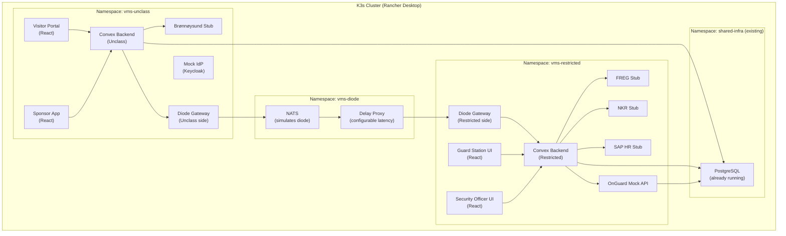
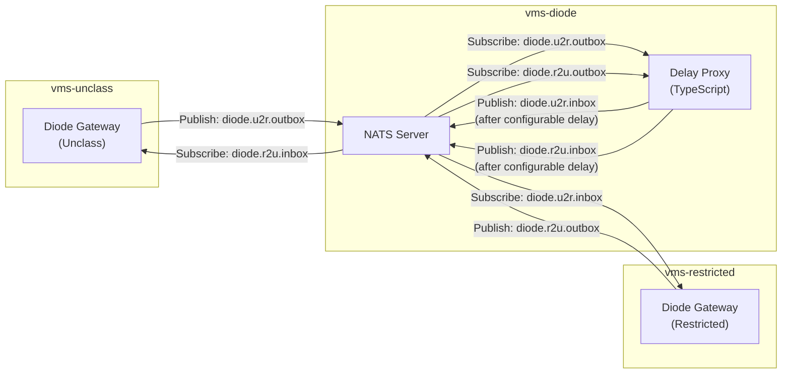
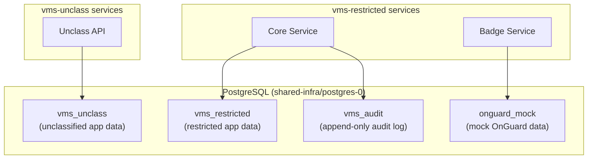
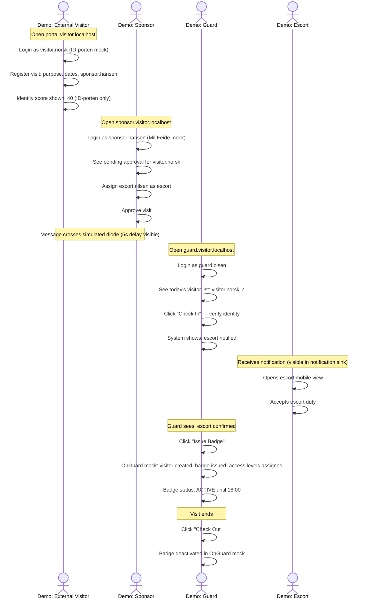

# 12 — Mock Infrastructure & Demo Environment

> Parent: [00-overview.md](00-overview.md)

## 1. Purpose

Build a local mock environment that:
- Demonstrates the full visitor lifecycle end-to-end
- Validates architecture decisions before committing to production implementation
- Provides a stakeholder demo ("this is how a visitor registers, gets approved, and receives a badge")
- Serves as a development platform for the real services
- Can be stood up on a single developer machine

## 2. Available Infrastructure

| Resource | Available | Notes |
|---|---|---|
| Machine | Apple M2 Max, 12 cores, 64GB RAM | More than sufficient |
| Kubernetes | Rancher Desktop, K3s v1.34 | Currently allocated 2 CPU / 6GB — **increase to 4 CPU / 12GB** |
| Container runtime | Docker 29.1 (via Rancher Desktop) | Docker Compose also available for local dev |
| Ingress | Traefik (bundled with K3s) | Already running in `kube-system` |
| PostgreSQL | Already running in `shared-infra` namespace | Can reuse for VMS databases |
| Helm | v3 via Rancher Desktop | For chart-based deployments |
| Docker Compose | v5.0.1 | Alternative for quick local iteration |

### Resource Adjustment Needed

```
rdctl set --virtual-machine.number-cpus 4 --virtual-machine.memory-in-gb 12
```

This gives enough headroom for all mock services alongside existing workloads (`ahlt-staging`, `neo4j`, `postgres`).

## 3. Architecture — Collapsing the Air Gap for Mock

In production, the air gap physically separates UNCLASSIFIED and RESTRICTED. In the mock, both sides run in the **same K3s cluster** but in separate namespaces, with a message broker simulating the diode.



### Namespace Isolation Rules

| From → To | Allowed? | Simulates |
|---|---|---|
| `vms-unclass` → `vms-restricted` | **Blocked** (NetworkPolicy) | Air gap |
| `vms-unclass` → `vms-diode` | Allowed (one NATS subject) | Unclass → diode |
| `vms-restricted` → `vms-diode` | Allowed (one NATS subject) | Restricted → diode |
| `vms-restricted` → `vms-unclass` | **Blocked** (NetworkPolicy) | Air gap |
| `vms-*` → `shared-infra` | Allowed (PostgreSQL port only) | Shared DB infra |

This gives us realistic separation — services on one "side" literally cannot call services on the other side, only communicate through the simulated diode.

## 4. Mock Services — What We Build vs What We Stub

### Real Services (actual VMS code)

These are the services we're developing. They run the same code that will eventually go to production.

| Service | Stack | Purpose | Namespace |
|---|---|---|---|
| **Visitor Portal** | React + Convex | External visitor self-service | `vms-unclass` |
| **Sponsor App** | React + Convex | Internal sponsor/host interface | `vms-unclass` |
| **Convex Backend (Unclass)** | Convex (TypeScript) | Backend for unclassified UIs, Brønnøysund integration, diode gateway client. Queries, mutations, actions, and scheduled functions. | `vms-unclass` |
| **Convex Backend (Restricted)** | Convex (TypeScript) | State machine, orchestration, approval logic, register checks, escort management, badge lifecycle. All RESTRICTED-side business logic in one Convex deployment. | `vms-restricted` |
| **Guard Station UI** | React + Convex | Reception terminal interface | `vms-restricted` |
| **Security Officer UI** | React + Convex | Approval dashboard | `vms-restricted` |
| **Diode Gateway** (x2) | TypeScript (Node.js) | Message gateway — one per side, connects to NATS | `vms-unclass`, `vms-restricted` |

### Mock / Stub Services

These simulate external systems that don't exist in our dev environment.

| Mock Service | Simulates | Implementation | Behavior |
|---|---|---|---|
| **OnGuard Mock API** | Lenel OnGuard OpenAccess | TypeScript (Express/Hono) | Implements `/instances` endpoint for `Lnl_Visitor`, `Lnl_Badge`, `Lnl_AccessLevel`, `Lnl_AccessLevelAssignment`. Stores in PostgreSQL. Returns realistic `property_value_map` responses. |
| **FREG Stub** | Folkeregisteret | TypeScript (Express/Hono) | Lookup by name/ID. Returns mock person records. Configurable: "found", "not found", "deceased". |
| **NKR Stub** | Nasjonalt Klareringsregister | TypeScript (Express/Hono) | Lookup by person ID. Returns clearance level. Configurable: "HEMMELIG", "KONFIDENSIELT", "BEGRENSET", "no clearance", "revoked". |
| **SAP HR Stub** | SAP HCM | TypeScript (Express/Hono) | Employee lookup. Returns: active/inactive, unit, site. Pre-loaded with test employees. |
| **Brønnøysund Stub** | Enhetsregisteret | TypeScript (Express/Hono) | Company lookup by org number. Returns: name, status, type. Pre-loaded with test companies. |
| **Mock IdP** | Mil Feide / ID-porten | Keycloak (containerized) | Full OIDC provider. Pre-configured realms for "Mil Feide" and "ID-porten". Test users with different roles. |
| **Diode Simulator** | Data diode | NATS + delay proxy | NATS message broker with configurable latency (0-300s) to simulate diode transfer time. Two subjects: `diode.unclass-to-restricted`, `diode.restricted-to-unclass`. |
| **Notification Sink** | Email + SMS | TypeScript (Express/Hono) | Captures all notifications. Web UI to view sent emails/SMS. No actual sending. |

### Mock Data — Pre-Loaded Test Fixtures

| Entity | Test Data |
|---|---|
| **Employees** (SAP HR + FREG) | 20 test employees across 3 units, 2 sites. Mix of active/inactive. |
| **External persons** (FREG) | 10 test external persons. Mix of Norwegian citizens and foreign nationals. |
| **Companies** (Brønnøysund) | 5 test companies. Mix of active AS, dissolved ENK, foreign NUF. |
| **Clearances** (NKR) | Clearance records for selected employees and externals. Mix of levels. One "revoked" for demo. |
| **Access levels** (OnGuard mock) | 6 pre-defined access level templates matching [04-access-control.md](04-access-control.md). |
| **Badge types** (OnGuard mock) | 2 types: "DESFire Employee", "DESFire Visitor". |
| **IdP users** (Keycloak) | Sponsors, guards, security officers, escorts, external visitors. Pre-assigned roles. |

## 5. OnGuard Mock API — Detailed Design

The OnGuard mock is critical for demonstrating the badge lifecycle. It implements the OpenAccess API surface we need.

### Endpoints Implemented

```
Base: /api/access/onguard/openaccess

POST   /oauth/token                          → Returns bearer token (always succeeds)
GET    /instances?type_name=Lnl_Visitor       → List/search visitors
POST   /instances?type_name=Lnl_Visitor       → Create visitor
PUT    /instances?type_name=Lnl_Visitor       → Update visitor
DELETE /instances?type_name=Lnl_Visitor       → Delete visitor

GET    /instances?type_name=Lnl_Cardholder    → List/search cardholders
POST   /instances?type_name=Lnl_Cardholder    → Create cardholder
PUT    /instances?type_name=Lnl_Cardholder    → Update cardholder
DELETE /instances?type_name=Lnl_Cardholder    → Delete cardholder

GET    /instances?type_name=Lnl_Badge         → List/search badges
POST   /instances?type_name=Lnl_Badge         → Create badge
PUT    /instances?type_name=Lnl_Badge         → Update badge (activate/deactivate)
DELETE /instances?type_name=Lnl_Badge         → Delete badge

GET    /instances?type_name=Lnl_AccessLevel   → List access levels (read-only)
POST   /instances?type_name=Lnl_AccessLevelAssignment → Assign access level
DELETE /instances?type_name=Lnl_AccessLevelAssignment → Remove access level

GET    /instances?type_name=Lnl_BadgeType     → List badge types (read-only)
GET    /instances?type_name=Lnl_Segment       → List segments (read-only)
GET    /instances?type_name=Lnl_Reader        → List readers (read-only)

POST   /event_subscriptions                   → Create event subscription
GET    /events?subscription_id=N              → Poll events
```

### Mock-Specific Extras (Not in Real OnGuard)

| Endpoint | Purpose |
|---|---|
| `POST /mock/simulate-access-event` | Simulate a badge tap at a reader (for demo) |
| `POST /mock/simulate-denied-event` | Simulate an access denied event |
| `GET /mock/dashboard` | Web UI showing all cardholders, badges, access levels, and event log |
| `POST /mock/reset` | Reset all data to initial test fixtures |
| `PUT /mock/config` | Configure behavior: response latency, error rate, etc. |

### Data Model (PostgreSQL)

```sql
-- Schema: onguard_mock

CREATE TABLE visitors (
    id          SERIAL PRIMARY KEY,
    firstname   TEXT NOT NULL,
    lastname    TEXT NOT NULL,
    midname     TEXT,
    email       TEXT,
    ssno        TEXT,
    primary_segment_id INTEGER DEFAULT 1,
    dept        TEXT,
    phone       TEXT,
    last_changed TIMESTAMPTZ DEFAULT NOW()
);

CREATE TABLE cardholders (
    id          SERIAL PRIMARY KEY,
    firstname   TEXT NOT NULL,
    lastname    TEXT NOT NULL,
    midname     TEXT,
    email       TEXT,
    ssno        TEXT,
    primary_segment_id INTEGER DEFAULT 1,
    dept        TEXT,
    building    TEXT,
    floor       TEXT,
    phone       TEXT,
    last_changed TIMESTAMPTZ DEFAULT NOW()
);

CREATE TABLE badge_types (
    id          SERIAL PRIMARY KEY,
    name        TEXT NOT NULL,      -- e.g. "DESFire Visitor", "DESFire Employee"
    description TEXT
);

CREATE TABLE badges (
    badge_key   SERIAL PRIMARY KEY,
    id          BIGINT NOT NULL,    -- Badge ID (encoded on card)
    person_id   INTEGER NOT NULL,   -- FK to visitors or cardholders
    person_type TEXT NOT NULL,       -- 'visitor' or 'cardholder'
    type        INTEGER NOT NULL REFERENCES badge_types(id),
    status      INTEGER DEFAULT 1,  -- 1=Active, 0=Inactive
    activate    TIMESTAMPTZ,
    deactivate  TIMESTAMPTZ,
    use_limit   INTEGER DEFAULT 0,
    issue_code  INTEGER DEFAULT 1,
    last_changed TIMESTAMPTZ DEFAULT NOW()
);

CREATE TABLE access_levels (
    id          SERIAL PRIMARY KEY,
    name        TEXT NOT NULL,
    description TEXT,
    zones       TEXT[]              -- List of zone names for display
);

CREATE TABLE access_level_assignments (
    id              SERIAL PRIMARY KEY,
    badge_key       INTEGER NOT NULL REFERENCES badges(badge_key),
    access_level_id INTEGER NOT NULL REFERENCES access_levels(id),
    activate        TIMESTAMPTZ,
    deactivate      TIMESTAMPTZ,
    UNIQUE(badge_key, access_level_id)
);

CREATE TABLE segments (
    id          SERIAL PRIMARY KEY,
    name        TEXT NOT NULL
);

CREATE TABLE readers (
    id          SERIAL PRIMARY KEY,
    name        TEXT NOT NULL,
    panel_id    INTEGER,
    location    TEXT
);

CREATE TABLE access_events (
    id          SERIAL PRIMARY KEY,
    timestamp   TIMESTAMPTZ DEFAULT NOW(),
    event_type  TEXT NOT NULL,      -- 'ACCESS_GRANTED', 'ACCESS_DENIED'
    badge_id    BIGINT,
    reader_id   INTEGER REFERENCES readers(id),
    person_name TEXT,
    details     JSONB
);
```

## 6. Diode Simulator — NATS + Delay Proxy

### Why NATS?

- Lightweight (single binary, ~20MB)
- Supports publish/subscribe
- Subject-based routing (perfect for simulating two diode channels)
- Runs well in K8s with minimal resources
- Can add JetStream for persistence if needed

### Architecture



### Delay Proxy Configuration

```yaml
diode:
  simulator:
    # Configurable per demo scenario
    latency_ms: 5000         # Default 5s delay (simulates diode transfer)
    jitter_ms: 2000          # Random jitter ±2s
    drop_rate: 0.0           # 0% message loss (set >0 to simulate unreliable diode)
    max_message_size: 1048576  # 1MB
    channels:
      - name: u2r
        from_subject: diode.u2r.outbox
        to_subject: diode.u2r.inbox
      - name: r2u
        from_subject: diode.r2u.outbox
        to_subject: diode.r2u.inbox
```

For demos: set latency to 1-2s for snappy UX. For realism testing: set to 30-60s.

## 7. Database Strategy

Reuse the existing PostgreSQL in `shared-infra`. Create separate databases for each concern.



### Database Creation

```sql
CREATE DATABASE vms_unclass;
CREATE DATABASE vms_restricted;
CREATE DATABASE vms_audit;
CREATE DATABASE onguard_mock;

-- Separate users per database (least privilege)
CREATE USER vms_unclass_svc WITH PASSWORD 'dev-only';
CREATE USER vms_restricted_svc WITH PASSWORD 'dev-only';
CREATE USER vms_audit_svc WITH PASSWORD 'dev-only';
CREATE USER onguard_mock_svc WITH PASSWORD 'dev-only';

GRANT ALL ON DATABASE vms_unclass TO vms_unclass_svc;
GRANT ALL ON DATABASE vms_restricted TO vms_restricted_svc;
GRANT ALL ON DATABASE vms_audit TO vms_audit_svc;
GRANT ALL ON DATABASE onguard_mock TO onguard_mock_svc;

-- Audit DB: no UPDATE/DELETE for the service user (enforced at table level)
```

## 8. Keycloak — Mock Identity Provider

Single Keycloak instance simulating both Mil Feide and ID-porten.

### Realms

| Realm | Simulates | Users |
|---|---|---|
| `mil-feide` | Defense sector federation | Sponsors, guards, security officers, escorts, unit managers |
| `id-porten` | Norwegian national eID | External visitors (Norwegian), foreign visitors |

### Pre-configured Test Users

| Username | Realm | Role | Password |
|---|---|---|---|
| `sponsor.hansen` | mil-feide | Sponsor | `test1234` |
| `guard.olsen` | mil-feide | Reception Guard | `test1234` |
| `security.berg` | mil-feide | Security Officer | `test1234` |
| `escort.nilsen` | mil-feide | Escort | `test1234` |
| `manager.dahl` | mil-feide | Unit Manager | `test1234` |
| `admin.root` | mil-feide | Site Administrator | `test1234` |
| `visitor.norsk` | id-porten | External Visitor (Norwegian) | `test1234` |
| `visitor.foreign` | id-porten | External Visitor (Foreign) | `test1234` |
| `contractor.admin` | id-porten | Contractor Admin | `test1234` |

### OIDC Client Configuration

| Client ID | Realm | Redirect URIs | Used By |
|---|---|---|---|
| `vms-portal` | id-porten | `https://portal.visitor.localhost/*` | Visitor Portal |
| `vms-sponsor` | mil-feide | `https://sponsor.visitor.localhost/*` | Sponsor App |
| `vms-guard` | mil-feide | `https://guard.visitor.localhost/*` | Guard Station UI |
| `vms-security` | mil-feide | `https://security.visitor.localhost/*` | Security Officer UI |

## 9. Ingress / Routing

Traefik (already running in K3s) provides ingress. Use `.localhost` domains for local access.

| URL | Service | Namespace |
|---|---|---|
| `https://portal.visitor.localhost` | Visitor Portal | vms-unclass |
| `https://sponsor.visitor.localhost` | Sponsor App | vms-unclass |
| `https://guard.visitor.localhost` | Guard Station UI | vms-restricted |
| `https://security.visitor.localhost` | Security Officer UI | vms-restricted |
| `https://auth.visitor.localhost` | Keycloak | vms-unclass |
| `https://onguard.visitor.localhost` | OnGuard Mock Dashboard | vms-restricted |
| `https://notifications.visitor.localhost` | Notification Sink UI | vms-restricted |

These resolve automatically on macOS (`.localhost` always resolves to `127.0.0.1`).

## 10. Helm Chart Structure

```
visitor-mock/
├── charts/
│   ├── vms-umbrella/              # Top-level umbrella chart
│   │   ├── Chart.yaml
│   │   ├── values.yaml
│   │   └── templates/
│   │       ├── namespaces.yaml
│   │       └── network-policies.yaml
│   │
│   ├── vms-convex-unclass/        # Convex backend (unclassified side)
│   ├── vms-convex-restricted/     # Convex backend (restricted side)
│   ├── vms-portal/                # Visitor Portal (React)
│   ├── vms-sponsor/               # Sponsor App (React)
│   ├── vms-guard-ui/              # Guard Station UI (React)
│   ├── vms-security-ui/           # Security Officer UI (React)
│   ├── vms-diode-gateway/         # Diode Gateway (deployed twice)
│   │
│   ├── mock-onguard/              # OnGuard OpenAccess Mock
│   ├── mock-registers/            # FREG, NKR, SAP HR, Brønnøysund stubs
│   ├── mock-diode/                # NATS + delay proxy
│   ├── mock-idp/                  # Keycloak
│   └── mock-notifications/        # Notification sink
│
├── docs/
│   └── plan/                      # All plan documents
│
├── packages/                      # TypeScript monorepo
│   ├── convex-unclass/            # Convex functions — unclassified side
│   │   ├── convex/                # Queries, mutations, actions, schema
│   │   └── package.json
│   ├── convex-restricted/         # Convex functions — restricted side
│   │   ├── convex/                # Queries, mutations, actions, schema
│   │   └── package.json
│   ├── portal/                    # React app — Visitor Portal
│   ├── sponsor/                   # React app — Sponsor App
│   ├── guard-ui/                  # React app — Guard Station
│   ├── security-ui/               # React app — Security Officer
│   ├── diode-gateway/             # TypeScript — Diode Gateway (NATS client)
│   ├── mocks/                     # TypeScript — All mock/stub HTTP services
│   │   ├── onguard/
│   │   ├── registers/             # FREG, NKR, SAP HR, Brønnøysund
│   │   └── notifications/
│   └── shared/                    # Shared types, XML schema, utilities
│       └── package.json
│
├── package.json                   # Workspace root (npm/pnpm workspaces)
├── tsconfig.base.json             # Shared TypeScript config
│
└── scripts/
    ├── setup.sh                   # One-command setup
    ├── seed-data.sh               # Load test fixtures
    ├── demo-scenarios.sh          # Run demo walkthroughs
    └── teardown.sh                # Clean up
```

## 11. Deployment — One-Command Setup

```bash
# 1. Create namespaces and network policies
helm install vms-infra charts/vms-umbrella -f charts/vms-umbrella/values.yaml

# 2. Deploy mock services (stubs, IdP, diode simulator)
helm install mock-idp charts/mock-idp -n vms-unclass
helm install mock-diode charts/mock-diode -n vms-diode
helm install mock-onguard charts/mock-onguard -n vms-restricted
helm install mock-registers charts/mock-registers -n vms-restricted
helm install mock-notifications charts/mock-notifications -n vms-restricted

# 3. Create databases and seed test data
kubectl exec -n shared-infra postgres-0 -- psql -f /scripts/create-databases.sql
kubectl exec -n shared-infra postgres-0 -- psql -d onguard_mock -f /scripts/seed-onguard.sql

# 4. Deploy VMS services (Convex backends + React UIs)
helm install vms-convex-unclass charts/vms-convex-unclass -n vms-unclass
helm install vms-portal charts/vms-portal -n vms-unclass
helm install vms-sponsor charts/vms-sponsor -n vms-unclass
helm install vms-convex-restricted charts/vms-convex-restricted -n vms-restricted
helm install vms-guard-ui charts/vms-guard-ui -n vms-restricted
helm install vms-security-ui charts/vms-security-ui -n vms-restricted

# Wrapped in: ./scripts/setup.sh
```

## 12. Demo Scenarios

### Scenario 1: External Visitor — Happy Path



### Scenario 2: Walk-In — No Pre-Registration

Demonstrates ad-hoc visitor handling with verbal sponsor approval and escorted-only access.

### Scenario 3: Clearance Revoked Mid-Visit

Demonstrates anomaly handling:
1. Visitor is checked in and active
2. Demo operator changes NKR stub to return "clearance revoked"
3. Day-of re-verification fires (or manually triggered)
4. Security officer gets CRITICAL alert
5. Badge is deactivated in OnGuard mock
6. Escort is notified

### Scenario 4: In-House Visitor Cross-Site

Demonstrates cross-site flow through simulated diode.

### Scenario 5: Contractor Admin Bulk Registration

Demonstrates contractor admin registering 5 workers for a project.

## 13. Development Workflow

### Option A: Full K8s (Helm)

For integration testing and demos. All services in K3s.

```bash
# Build and deploy a single package
docker build -t vms-convex-restricted:dev packages/convex-restricted/
helm upgrade vms-convex-restricted charts/vms-convex-restricted -n vms-restricted --set image.tag=dev
```

### Option B: Hybrid (K8s mocks + local Convex dev)

For active development. Mocks run in K8s, Convex dev server runs locally with hot-reload.

```bash
# Mocks in K8s (always running)
# Port-forward the services you need:
kubectl port-forward -n vms-diode svc/nats 4222:4222 &
kubectl port-forward -n vms-restricted svc/mock-onguard 8081:8080 &
kubectl port-forward -n shared-infra svc/postgres 5432:5432 &

# Run Convex dev server locally (hot-reloads on file changes)
cd packages/convex-restricted
npx convex dev

# Run React UI locally (connects to local Convex)
cd packages/guard-ui
npm run dev
```

### Option C: Docker Compose (Lightweight)

For quick iteration without K8s overhead. Compose file spins up all services locally.

```bash
docker compose -f docker-compose.dev.yml up
```

## 14. Resource Estimates

| Component | CPU Request | Memory Request | Instances |
|---|---|---|---|
| Keycloak | 200m | 512Mi | 1 |
| NATS | 50m | 64Mi | 1 |
| Delay Proxy | 50m | 64Mi | 1 |
| OnGuard Mock | 100m | 256Mi | 1 |
| Register Stubs (all) | 100m | 256Mi | 1 (combined) |
| Notification Sink | 50m | 128Mi | 1 |
| Convex Backend (Restricted) | 200m | 512Mi | 1 |
| Convex Backend (Unclass) | 200m | 512Mi | 1 |
| Diode Gateway (x2) | 100m | 128Mi | 2 |
| Portal (React) | 100m | 128Mi | 1 |
| Sponsor App (React) | 100m | 128Mi | 1 |
| Guard UI (React) | 100m | 128Mi | 1 |
| Security UI (React) | 100m | 128Mi | 1 |
| **Total** | **~1450m** | **~3.0Gi** | |

With 4 CPUs and 12GB allocated to K3s, this leaves plenty of headroom alongside existing workloads.

## 15. Build Order

Mock services first (provides the platform), then real services incrementally.

```mermaid
graph LR
    subgraph PHASE_A["Week 1-2: Foundation"]
        A1["Namespaces +<br/>NetworkPolicies"]
        A2["Databases"]
        A3["NATS + Delay Proxy"]
        A4["Keycloak + realms"]
    end

    subgraph PHASE_B["Week 2-3: Mock APIs"]
        B1["OnGuard Mock API"]
        B2["Register Stubs<br/>(FREG, NKR, SAP, Brønnøysund)"]
        B3["Notification Sink"]
        B4["Seed test data"]
    end

    subgraph PHASE_C["Week 3-5: Core Services"]
        C1["Diode Gateway (both sides)"]
        C2["Convex Restricted Backend<br/>(state machine, verification,<br/>escort, badge logic)"]
        C3["Convex Unclass Backend<br/>(registration, Brønnøysund)"]
    end

    subgraph PHASE_D["Week 5-7: UIs"]
        D1["Guard Station UI (React)"]
        D2["Security Officer UI (React)"]
        D3["Visitor Portal (React)"]
        D4["Sponsor App (React)"]
    end

    PHASE_A --> PHASE_B
    PHASE_B --> PHASE_C
    PHASE_C --> PHASE_D
```



### Dependencies

| Service | Depends On |
|---|---|
| Diode Gateways | NATS |
| Convex Restricted Backend | PostgreSQL, Diode Gateway (restricted side), Register stubs, OnGuard Mock |
| Convex Unclass Backend | PostgreSQL, Diode Gateway (unclass side), Brønnøysund stub |
| All React UIs | Their respective Convex backend, Keycloak |
